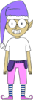
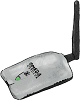
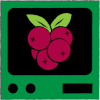

# Writeup for SANS Holiday Hack Challenge 2021 – Jack’s Back! featuring KringleCon 4: Calling Birds
## 1. KringleCon Orientation
### 1.0. Description
Difficulty: :christmas_tree:   
Get your bearings at KringleCon  
1. **Talk to Jingle Ringford**: Jingle will start you on your journey!
2. **Get your badge**: Pick up your badge
3. **Get the wifi adapter**: Pick up the wifi adapter
4. **Use the terminal**: Click the computer terminal

### 1.1. (Kind of) Solution
Da Elf:   
Da Badge:   
Da Wifi Adapter:   
Da Terminal:   

### [1.d. Da Terminal](1.d.%20Use%20the%20terminal.txt)
```bash
Welcome to the first terminal challenge!

This one is intentionally simple. All we need you to do is:

- Click in the upper pane of this terminal
- Type answer and press Enter

elf@fd25309bce3c:~$
```
```bash
Enter the answer here

> answer

Your answer: answer

Your answer is correct!
```

---
## [2. Where in the World is Caramel Santiaigo?](README.md)
## [2.1. Side Challenge - Exif Metadata](README.md)
## [3. Thaw Frost Tower's Entrance](README.md)
## [3.1. Side Challenge - Grepping for Gold](README.md)
## [4. Slot Machine Investigation](README.md)
## [4.1. Side Challenge - Logic Munchers](README.md)
## [5. Strange USB Device](README.md)
## [5.1. Side Challenge - IPv6 Sandbox](README.md)
## [6. Shellcode Primer](README.md)
## [6.1. Side Challenge - Holiday Hero](README.md)
## [7. Printer Exploitation](README.md)
## [7.0. Description](README.md)
## [8. Kerberoasting on an Open Fire](README.md)
## [8.1. Side Challenge - HoHo … No](README.md)
## [9. Splunk!](README.md)
## [9.1. Side Challenge - Yara Analysis](README.md)
## [10. Now Hiring!](README.md)
## [10.1. Side Challenge - IMDS Exploration](README.md)
## [11. Customer Complaint Analysis](README.md)
## [11.1. Side Challenge - Strace Ltrace Retrace](README.md)
## [12. Frost Tower Website Checkup](README.md)
## [12.1. Side Challenge - The Elf C0de Python Edition](README.md)
## [13. FPGA Programming](README.md)
## [13.1. Side Challenge - Frostavator](README.md)
## [14. Bonus! Blue Log4Jack](README.md)
## [15. Bonus! Red Log4Jack](README.md)
---
## [0. windovo\\thedead> whoami](../README.md)
## [1. KringleCon Orientation](01.%20KringleCon%20Orientation/README.md)
## [16. That’s how Jack came from space](../README.md#16-thats-how-jack-came-from-space)
## [17. Narrative](../README.md#17-narrative)
## [18. Conclusions](../README.md#18-conclusions)