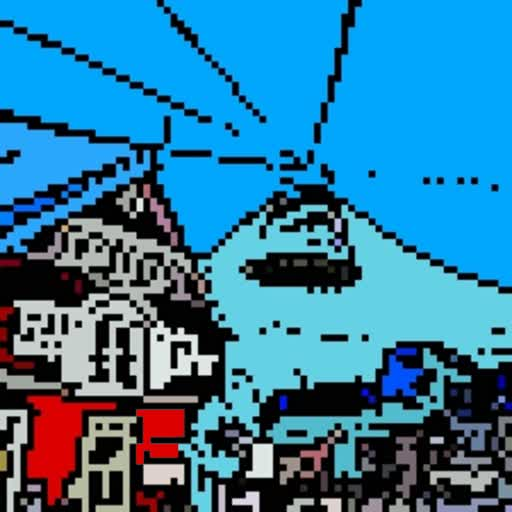

# Writeup for SANS Holiday Hack Challenge 2021 – Jack’s Back! featuring KringleCon 4: Calling Birds
## 2. Where in the World is Caramel Santiaigo?
### 2.0. Description
Difficulty: :christmas_tree::christmas_tree:  
Help Tangle Coalbox find a wayward elf in Santa's courtyard. Talk to Piney Sappington nearby for hints

### 2.1. [Side Challenge - Exif Metadata](/02.%20Where%20in%20the%20World%20is%20Caramel%20Santiaigo/02.01.%20Side%20Challenge%20-%20Exif%20Metadata)

### 2.2. Hints
**Flask Cookies** - *Piney Sappington*: “While Flask cookies can't generally be forged without the secret, they can often be decoded and read.”  
**OSINT Talk** - *Piney Sappington*: “Clay Moody is giving a talk about OSINT techniques right now!”  
**Coordinate Systems** - *Piney Sappington*: “Don't forget coordinate systems other than lat/long like MGRS and what3words.”  

### 2.3. Solution
The objective is to find where is Caramel Santiago by following the hints provided:
| **LOCATION** | **HINT** | **EXPLANATION** |
|--------------|----------|-----------------|
| Santa’s Castle | I think they left to check out the *Défilé de Noël*. | https://www.defiledenoel.com/ |
| Santa’s Castle | They called me and mentioned they were connected via *Rogers Wireless*. | Rogers Wireless Inc. is a *Canadian* wireless telephone company headquartered in Toronto. |
| Santa’s Castle | They were dressed for -3.0°C and overcast conditions. The elf got really heated about using *tabs for indents* | Possible elves: Caramel Santaigo, Morcel Nougat, Fitzy Shortstack, Piney Sappington, Ribb Bonbowford, Tinsel Upatree |
| Montréal, Canada | They said, if asked, they would describe their next location as "*staring desire frost*." | Coupled with the next hint and with available Sleigh destinations, this sentence points to *Iceland*. |
| Montréal, Canada | Having trouble typing that letter? It's *UNICODE 00ED* or *0237* on the number pad in Windows. | Í, í (i-acute) is a letter in the *Faroese, Hungarian, Icelandic, Czech, Slovak, and Tatar languages*, where it often indicates a long /i/ vowel |
| Montréal, Canada | They were dressed for 2.0°C and partly cloudy conditions. They kept checking their *Slack* app. | Possible elves: Morcel Nougat, Ribb Bonbowford |
| Reykjavík, Iceland | I'm not sure what a *hogmanay* is, but that elf wants to experience one *just after Christmas*. | Hogmanay is the Scots word for the last day of the old year and is synonymous with the *celebration of the New Year in the Scottish manner*. |
| Reykjavík, Iceland | They sent me this blurry selfie of themself or someone they met:  | N/A |
| Reykjavík, Iceland | They were dressed for 1.0°C and sunny conditions. Oh, I noticed they had a *Star Wars* themed phone case. | Possible elves: *Ribb Bonbowford* |

Ended up in **Edinburgh, Scotland** with **Ribb Bonbowford**.

### 2.4. Scraping for fun

#### 2.4.0 The spider script
I wrote a python script named ["spider.py"](spider/spider.py) to retrieve data about Locations and Hints. It plays the game, always losing, while tracking in a Sqlite DB all data and downloading images. After a certain number of games without adding anything to the DB it stops.  
The [log of the execution](spider/spider.log) and [the database](spider/caramel.db) are also available.

#### 2.4.0.0. Locations
Below all the cities a user may travel to:
| **NAME** | **DESCRIPTION** | **IMAGE** |
| -------- | --------------- | --------- |
| Santa's Castle | Newly renovated, the castle is again host to the best holiday hacker conference in the world, KringleCon. Security specialists from around the world travel here annually to enjoy each other's company, practice skills, and learn about the latest advancements in information security.|  |
| Antwerp, Belgium | Where else can you celebrate Christmas with a Ferris wheel but Antwerp? Visit the markets, go ice skating, and try the glüwein or Belgian waffles and smoutebollen.|  |
| Copenhagen, Denmark | Whether you're ice skating in Tivoli Gardens or eating Risalamande, Copenhagen, Denmark is a wonderful place to enjoy the holidays. Families count down through Christmas Eve with advent calendars and wreaths in their homes.|  |
| Edinburgh, Scotland | While Christmas hasn't always been big in Scotland, you can enjoy a full experience now. If you stick around afterwards, you'll enjoy Hogmanay: a street parade and festival to ring in the new year with FIRE.|  |
| London, England | Be sure to check out London's Regent Street, Covent Garden, and Bond Street - all lit up for the holiday. There are also several performances of The Nutcracker, castles, concerts, and seasonal eateries.|  |
| Montréal, Canada | French-Canadian city Montréal proudly hosts lovely, unique Christmas traditions. This is home to the Défilé de Noël festival, fairs, fireworks displays, and a decades-old Santa parade. You might even spot Québec City's Bonhomme de Neige.| 
| New York, USA | The United States' largest city has it all. Not only can you ice skate in Rockefeller Center and buy crafts and food at Bryant Park, but this is where Santa himself closes the annual Thanksgiving Day parade.|  |
| Prague, Czech Republic | Prague is a quintessential Christmas town with activities for nearly anyone. Visit Christmas markets (Vánoční trhy) in Old Town Square, buy some frankincense, or try a klobása sausage from a street vendor.|  |
| Reykjavík, Iceland | You can't miss the Jólasveinar (Yule Lads), the concerts, or the bells in Reykjavík at Christmas. Take it all in as you walk up Skólavörðustígur to the famous Hallgrímskirkja church.|  |
| Rovaniemi, Finland | So much like the North Pole, Lapland is where British youngsters send letters to Santa. Enjoy a reindeer sleigh ride, ice fishing, or baking lessons with Mrs. Claus.|  |
| Stuttgart, Germany | Stuttgart has been celebrating Christmas since 1692. Even the rooftops get decorated. And where else does the side of the town hall become a giant Advent calendar?|  |
| Tokyo, Japan | Tokyo is largely Buddhist and Shinto, but the cultural stamp of Christmas is all over the town. Many visitors to the world's most populous enjoy a romantic stay, enjoying the marvelous lights around the city.|  |
| Vienna, Austria | Home to Christmas markets like Christkindlmarkt and Spittelberg, holiday participants enjoy fried sausages and goulash soup, and drink hot Christmas punch.|  |

#### 2.4.0.1. Hints
Below all the hints I was able to retrieve and the explanation I found for each one:
| **HINT** | **EXPLANATION** | **SOURCE** |
| -------- | --------------- | ---------- |
| Apparently they really wanted to see what a town hall looks like when it's converted into a giant Advent calendar! | For about 20 years the quaint town of Gengenbach in Baden-Württemberg, located in the storybook Black Forest, has transformed its entire rathaus (Town Hall) into the world's largest Advent Calendar House. | https://www.tripsavvy.com/worlds-largest-advent-calendar-house-1519663 |
| Buddy, a close friend of the elves, once went on an ice skating date under their huge Christmas tree! | This points to New York | https://www.gettyimages.it/detail/fotografie-di-cronaca/people-ice-skating-next-to-a-huge-christmas-tree-fotografie-di-cronaca/830143476 |
| Having trouble typing that letter? It's UNICODE 00ED or 0237 on the number pad in Windows. | Í, í (i-acute) is a letter in the Faroese, Hungarian, Icelandic, Czech, Slovak, and Tatar languages, where it often indicates a long /i/ vowel | https://en.wikipedia.org/wiki/%C3%8D |
| I think they left to check out the Défilé de Noël. | This event is held in Canada | https://www.defiledenoel.com/ |
| I'm not sure what a hogmanay is, but that elf wants to experience one just after Christmas. | Hogmanay is the Scots word for the last day of the old year and is synonymous with the celebration of the New Year in the Scottish manner. | https://en.wikipedia.org/wiki/Hogmanay |
| I've heard that when British children put letters to Father Christmas in the fireplace, they magically end up there! | BRITAIN — Children write their letters to Father Christmas and then throw them into the fireplace so they will float up the chimney and fly to the North Pole. If the lists catch fire first, they have to rewrite them. | https://www.byerschoice.com/christmas-traditions/letters-to-santa |
| Oh, I noticed they had a Doctor Who themed phone case. | Possible elves: Caramel Santaigo, Piney Sappington, Eve Snowshoes | InterRink |
| Oh, I noticed they had a Firefly themed phone case. | Possible elves: Morcel Nougat, Fitzy Shortstack | InterRink |
| Oh, I noticed they had a Star Trek themed phone case. | Possible elves: Jingle Ringford, Jewel Loggins, Ribb Bonbowford | InterRink |
| Oh, I noticed they had a Star Wars themed phone case. | Possible elves: Jingle Ringford, Jewel Loggins, Ribb Bonbowford | InterRink |
| The elf got really heated about using spaces for indents. | Possible elves: Sparkle Redberry, Jingle Ringford, Jewel Loggins, Ginger Breddie, Noel Boetie, Eve Snowshoes | InterRink |
| The elf got really heated about using tabs for indents. | Possible elves: Caramel Santaigo, Morcel Nougat, Fitzy Shortstack, Piney Sappington, Ribb Bonbowford, Tinsel Upatree | InterRink |
| The elf mentioned something about Stack Overflow and C#. | Possible elves: Caramel Santaigo, Sparkle Redberry, Ribb Bonbowford | InterRink |
| The elf mentioned something about Stack Overflow and Golang. | Possible elves: Ginger Breddie, Piney Sappington, Eve Snowshoes | InterRink |
| The elf mentioned something about Stack Overflow and Python. | Possible elves: Jewel Loggins, Fitzy Shortstack, Tinsel Upatree | InterRink |
| The elf mentioned something about Stack Overflow and Rust. | Possible elves: Ginger Breddie, Piney Sappington, Eve Snowshoes | InterRink |
| The elf wanted to drink gløgg in Tivoli Gardens. | Gløgg is a traditional danish drink containing warm red wine with raisins and almonds and seasoned with christmas spices. Tivoli Garden is a park in Copenhagen. | https://www.tivoligardens.com/en/billetter-og-tivolikort/smagpaativoli/glogg-ableskiver, https://placeandsee.com/s?as=foto&fk=31072500730 |
| Their next waypoint was something like 51.219, 4.402 | Antwerp, Flanders, Belgium | https://www.openstreetmap.org/search?query=51.219%2C%204.402#map=6/51.221/4.395 |
| They called me and mentioned they were connected via Rogers Wireless. | This is a Canadian company | https://www.rogers.com/ |
| They just contacted us from an address in the 137.208.0.0/16 range. | This is a subnet in Austria | https://ipinfo.io/AS1776/137.208.0.0/16 | 
| They just contacted us from an address in the 80.95.128.0/20 range. | This is a subnet in Finland. | https://ipinfo.io/AS21348/80.95.128.0/20 |
| They just contacted us from an address in the 81.244.0.0/14 range. | This is a subnet in Belgium | https://ipinfo.io/AS5432/81.244.0.0/14 |
| They kept checking their Discord app. | Possible elves: Caramel Santaigo, Jewel Loggins, Noel Boetie | InterRink |
| They kept checking their Slack app.|Possible elves: Morcel Nougat, Ginger Breddie, Ribb Bonbowford | InterRink |
| They kept checking their Snapchat app. | Possible elves: Jingle Ringford, Piney Sappington, Tinsel Upatree | InterRink |
| They kept checking their Twitter app. | Possible elves: Sparkle Redberry, Fitzy Shortstack, Eve Snowshoes | InterRink |
| They said something about MGRS and 32U NU 05939 98268... | In MGRS point to the city of Stuttgart, Germany | https://legallandconverter.com/p50.html |
| They said something about NATO and 33U VR 58560 48464. /shrug | This points to Prague | http://rcn.montana.edu/Resources/Converter.aspx |
| They said they wanted to visit Christmas markets - like Christkindlmarkt and Spittelberg, enjoy fried sausages and goulash soup, and drink hot Christmas punch. | The Vienna Spittelberg, with its small, romantic lanes and the charming Biedermeier buildings is right next to the MuseumsQuartier. | https://www.wien.info/en/shopping-wining-dining/markets/spittelberg-wining-dining-359532 |
| They said, if asked, they would describe their next location as "only milder vanilla." | N/A | N/A |
| They said, if asked, they would describe their next location as "staring desire frost." | N/A | N/A |
| They said, if asked, they would describe their next location in three words as "frozen, push, and tamed." | N/A | N/A |
| They sent me this blurry selfie of themself or someone they met: | N/A | N/A |
| They sent me this blurry selfie of themself or someone they met: | N/A | N/A |
| They sent me this blurry selfie of themself or someone they met: | N/A | N/A |
| They were checking the Ofcom frequency table to see what amateur frequencies they could use while there. | Ofcom is a British company | https://www.ofcom.org.uk/spectrum/information/uk-fat |
| They were excited about checking out the Vánoční trhy. | This is a reference to Czech Republic | https://cs.wikipedia.org/wiki/V%C3%A1no%C4%8Dn%C3%AD_trh | 
| They were excited that their phone was going to work on the 1500 MHz LTE band | I believe this points out to Japan | https://www.worldtimezone.com/gsm.html |
| You just missed the elf! | I think it's just about missing the Elf | N/A | 

#### 2.4.1. Elf mapping
I mapped out the attributes of all elves:
| **ELF**              | **ELF IMAGE** | **LANGUAGE SPOKEN** | **PREFERRED SOCIAL MEDIUM** | **PREFERRED INDENTS** | **FANDOM**     | **PRONOUNCES "GIF"** |
| -------------------- | ------------- | ------------------- | --------------------------- | --------------------- | -------------- | -------------------- |
| Caramel Santaigo |  | C# | Discord | Tabs | Doctor Who | Hard "G" |
| Eve Snowshoes |  | Rust  | Twitter  | Spaces  | Doctor Who  | Hard "G"  |
| Fitzy Shortstack |   | Python  | Twitter  | Tabs  | Firefly  | Hard "G"  |
| Ginger Breddie |  | Rust  | Slack  | Spaces  | Star Trek  | Hard "G"  |
| Jewel Loggins |  | Python  | Discord  | Spaces  | Star Wars  | Hard "G"  |
| Jingle Ringford |  | Golang  | Snapchat  | Spaces  | Star Wars  | Hard "G"  |
| Morcel Nougat |  | Golang  | Slack  | Tabs  | Firefly  | Hard "G"  |
| Noel Boetie |  | Golang  | Discord  | Spaces  | Star Trek  | Hard "G"  |
| Piney Sappington |  | Rust  | Snapchat  | Tabs  | Doctor Who  | Hard "G"  |
| Ribb Bonbowford |  | C#  | Slack  | Tabs  | Star Wars  | Hard "G"  |
| Sparkle Redberry  |  | C#  | Twitter  | Spaces  | Star Trek  | Hard "G"  |
| Tinsel Upatree |  | Python  | Snapchat  | Tabs  | Star Trek  | Hard "G"  |

Shall we assume no elf uses Soft "G"s?

---
## [2. Where in the World is Caramel Santiaigo?](README.md)
## [2.1. Side Challenge - Exif Metadata](README.md)
## [3. Thaw Frost Tower's Entrance](README.md)
## [3.1. Side Challenge - Grepping for Gold](README.md)
## [4. Slot Machine Investigation](README.md)
## [4.1. Side Challenge - Logic Munchers](README.md)
## [5. Strange USB Device](README.md)
## [5.1. Side Challenge - IPv6 Sandbox](README.md)
## [6. Shellcode Primer](README.md)
## [6.1. Side Challenge - Holiday Hero](README.md)
## [7. Printer Exploitation](README.md)
## [7.0. Description](README.md)
## [8. Kerberoasting on an Open Fire](README.md)
## [8.1. Side Challenge - HoHo … No](README.md)
## [9. Splunk!](README.md)
## [9.1. Side Challenge - Yara Analysis](README.md)
## [10. Now Hiring!](README.md)
## [10.1. Side Challenge - IMDS Exploration](README.md)
## [11. Customer Complaint Analysis](README.md)
## [11.1. Side Challenge - Strace Ltrace Retrace](README.md)
## [12. Frost Tower Website Checkup](README.md)
## [12.1. Side Challenge - The Elf C0de Python Edition](README.md)
## [13. FPGA Programming](README.md)
## [13.1. Side Challenge - Frostavator](README.md)
## [14. Bonus! Blue Log4Jack](README.md)
## [15. Bonus! Red Log4Jack](README.md)
---
## [0. windovo\\thedead> whoami](/README.md)
## [1. KringleCon Orientation](/01.%20KringleCon%20Orientation/README.md)
## [16. That’s how Jack came from space](/README.md#16-thats-how-jack-came-from-space)
## [17. Narrative](/README.md#17-narrative)
## [18. Conclusions](/README.md#18-conclusions)