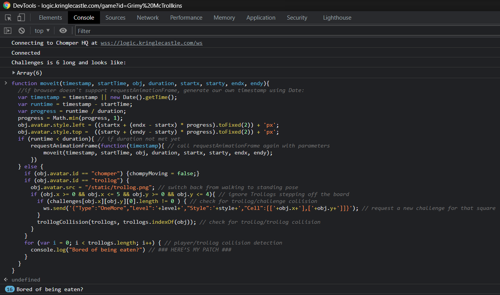

# Writeup for SANS Holiday Hack Challenge 2021 – Jack’s Back! featuring KringleCon 4: Calling Birds
# 4. Slot Machine Investigation

## 4.1. Side Challenge - Logic Munchers

## 4.2. Hints
**AND, OR, NOT, XOR** - *Noel Boetie*: “[This](http://www.natna.info/English/Teaching/CSI30-materials/Chapter1-cheat-sheet.pdf) might be a handy reference too.”  
**Boolean Logic** - *Noel Boetie*: “There are lots of special symbols for logic and set notation. [This one](http://notes.imt-decal.org/sets/cheat-sheet.html) covers AND, NOT, and OR at the bottom.”  

## 4.3. Solution
Analyzing the code of chompy.js it is possible to identify the function `moveit` that moves Chomper , the player’s avatar, the Trollogs , the bad guys, and identify their collisions, eventually calling the die function on our poor chompy Chomper.
When a Trollog moves onto a square, the square’s value changes so their movements are to be preserved in order to “munch” the maximum amount of squares.
A quick patch of the `moveit` function in the context of the game allows to prevent our Chomper from dying, and thus win the game easily:
```js
function moveit(timestamp, startTime, obj, duration, startx, starty, endx, endy){
  //if browser doesn't support requestAnimationFrame, generate our own timestamp using Date:
  var timestamp = timestamp || new Date().getTime();
  var runtime = timestamp - startTime;
  var progress = runtime / duration;
  progress = Math.min(progress, 1);
  obj.avatar.style.left = ((startx + (endx - startx) * progress).toFixed(2)) + 'px';
  obj.avatar.style.top =  ((starty + (endy - starty) * progress).toFixed(2)) + 'px';
  if (runtime < duration){ // if duration not met yet
      requestAnimationFrame(function(timestamp){ // call requestAnimationFrame again with parameters
          moveit(timestamp, startTime, obj, duration, startx, starty, endx, endy);
      })
  } else {
    if (obj.avatar.id == "chomper") {chompyMoving = false;}
    if (obj.avatar.id == "trollog") {
      obj.avatar.src = "/static/trollog.png"; // switch back from walking to standing pose
      if (obj.x >= 0 && obj.x <= 5 && obj.y >= 0 && obj.y <= 4){ // ignore Trollogs stepping off the board
        if (challenges[obj.x][obj.y][0].length != 0 ) { // check for trollog/challenge collision
          ws.send('{"Type":"OneMore","Level":'+level+',"Style":'+style+',"Cell":[['+obj.x+'],['+obj.y+']]}'); // request a new challenge for that square
        }
        trollogCollision(trollogs, trollogs.indexOf(obj)); // check for trollog/trollog collision
      }
    }
    for (var i = 0; i < trollogs.length; i++) { // player/trollog collision detection
      console.log("Bored of being eaten?") // ### HERE’S MY PATCH ###
    }
  }
}
```
Instead of letting the player die, this function just shows a message in the console:  


## 4.4. Hopefully...
If I will find the time to work on it, I would like to make chomper play without human interaction... Stay tuned and let's see how it goes :)

---
# [2. Where in the World is Caramel Santiaigo?](README.md)
# [2.1. Side Challenge - Exif Metadata](README.md)
# [3. Thaw Frost Tower's Entrance](README.md)
# [3.1. Side Challenge - Grepping for Gold](README.md)
# [4. Slot Machine Investigation](README.md)
# [4.1. Side Challenge - Logic Munchers](README.md)
# [5. Strange USB Device](README.md)
# [5.1. Side Challenge - IPv6 Sandbox](README.md)
# [6. Shellcode Primer](README.md)
# [6.1. Side Challenge - Holiday Hero](README.md)
# [7. Printer Exploitation](README.md)
# [7.0. Description](README.md)
# [8. Kerberoasting on an Open Fire](README.md)
# [8.1. Side Challenge - HoHo … No](README.md)
# [9. Splunk!](README.md)
# [9.1. Side Challenge - Yara Analysis](README.md)
# [10. Now Hiring!](README.md)
# [10.1. Side Challenge - IMDS Exploration](README.md)
# [11. Customer Complaint Analysis](README.md)
# [11.1. Side Challenge - Strace Ltrace Retrace](README.md)
# [12. Frost Tower Website Checkup](README.md)
# [12.1. Side Challenge - The Elf C0de Python Edition](README.md)
# [13. FPGA Programming](README.md)
# [13.1. Side Challenge - Frostavator](README.md)
# [14. Bonus! Blue Log4Jack](README.md)
# [15. Bonus! Red Log4Jack](README.md)
---
# [0. windovo\\thedead> whoami](../README.md)
# [1. KringleCon Orientation](01.%20KringleCon%20Orientation/README.md)
# [16. That’s how Jack came from space](../README.md#16-thats-how-jack-came-from-space)
# [17. Narrative](../README.md#17-narrative)
# [18. Conclusions](../README.md#18-conclusions)