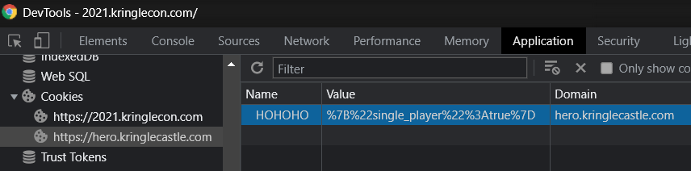
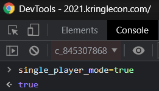

# Writeup for SANS Holiday Hack Challenge 2021 – Jack’s Back! featuring KringleCon 4: Calling Birds
## 6. [Shellcode Primer](/06.%20Shellcode%20Primer/README.md)

### 6.1. Side Challenge - Holiday Hero
The objective is to get the Santa Sleigh up and flying by smashing those notes on the keyboard!
Unfortunately it’s a lonely place there and nobody wants to play with me…

That made me so sad I had to give myself a `single_player_cookie` by the name of `HOHOHO`:  

I found myself still in lonely land, so I had to explicitly tell my imaginary friend to join:  

Finally me and my [Armadillo](https://it.wikipedia.org/wiki/Armadillo_(Zerocalcare)) were able to have some FUN getting that sleigh pumped up to 100%:  

#### 6.1.0. I don’t know why
I don’t know why I made this solution so much on the weird side, but I hope you’ll have fun reading it :)

---
## [2. Where in the World is Caramel Santiaigo?](README.md)
## [2.1. Side Challenge - Exif Metadata](README.md)
## [3. Thaw Frost Tower's Entrance](README.md)
## [3.1. Side Challenge - Grepping for Gold](README.md)
## [4. Slot Machine Investigation](README.md)
## [4.1. Side Challenge - Logic Munchers](README.md)
## [5. Strange USB Device](README.md)
## [5.1. Side Challenge - IPv6 Sandbox](README.md)
## [6. Shellcode Primer](README.md)
## [6.1. Side Challenge - Holiday Hero](README.md)
## [7. Printer Exploitation](README.md)
## [7.0. Description](README.md)
## [8. Kerberoasting on an Open Fire](README.md)
## [8.1. Side Challenge - HoHo … No](README.md)
## [9. Splunk!](README.md)
## [9.1. Side Challenge - Yara Analysis](README.md)
## [10. Now Hiring!](README.md)
## [10.1. Side Challenge - IMDS Exploration](README.md)
## [11. Customer Complaint Analysis](README.md)
## [11.1. Side Challenge - Strace Ltrace Retrace](README.md)
## [12. Frost Tower Website Checkup](README.md)
## [12.1. Side Challenge - The Elf C0de Python Edition](README.md)
## [13. FPGA Programming](README.md)
## [13.1. Side Challenge - Frostavator](README.md)
## [14. Bonus! Blue Log4Jack](README.md)
## [15. Bonus! Red Log4Jack](README.md)
---
## [0. windovo\\thedead> whoami](../README.md)
## [1. KringleCon Orientation](01.%20KringleCon%20Orientation/README.md)
## [16. That’s how Jack came from space](../README.md#16-thats-how-jack-came-from-space)
## [17. Narrative](../README.md#17-narrative)
## [18. Conclusions](../README.md#18-conclusions)