# Writeup for SANS Holiday Hack Challenge 2021 – Jack’s Back! featuring KringleCon 4: Calling Birds
# 6. Strange USB Device
## 6.0. Description
Difficulty: :christmas_tree::christmas_tree::christmas_tree:   
Complete the [Shellcode Primer](https://tracer.kringlecastle.com/) in Jack's office. According to the last challenge, what is the secret to KringleCon success? "All of our speakers and organizers, providing the gift of ____, free to the community." Talk to Chimney Scissorsticks in the NetWars area for hints.

## 6.1. [Side Challenge - Holiday Hero](/06.%20Shellcode%20Primer/06.01.%20Side%20Challenge%20-%20Holiday%20Hero/README.md)

## 6.2. Hints
**Shellcode Primer Primer** - *Chimney Scissorsticks*: “If you run into any shellcode primers at the North Pole, be sure to read the directions and the comments in the shellcode source!”  
**Debugging Shellcode** - *Chimney Scissorsticks*: “Also, troubleshooting shellcode can be difficult. Use the debugger step-by-step feature to watch values.”  
**Register Stomping** - *Chimney Scissorsticks*: “Lastly, be careful not to overwrite any register values you need to reference later on in your shellcode.”  

## 6.3. Solution
### 6.3.0. Introduction
#### 6.3.0.0. Description
Welcome to Shellcode Primer!
The goal of Shellcode Primer is to teach you how to write some basic x64 shellcode for reading a file. We'll take you through each piece of what you need, step by step, and show you what's going on.
First, let's learn the user interface a bit. There's some code below. The left is where you type code, and the right will attempt to syntax-highlight and show build errors.
For the time being, you don't need to change anything, just have a look at what it's doing - it's more or less the same type of stuff you're going to be learning.
Go ahead and execute the code (using the bottom below) and play around in the debugger. On the left, you'll see instructions executing in the order that they execute. Click on them to the state when that instruction executes!
Also, don't forget to click that hint button below! Hints don't cost you anything. :)
#### 6.3.0.1. Code
```assembly
; Set up some registers (sorta like variables) with values
; In the debugger, look how these change!
mov rax, 0
mov rbx, 1
mov rcx, 2
mov rdx, 3
mov rsi, 4
mov rdi, 5
mov rbp, 6

; Push and pop - watch how the stack changes!
push 0x12345678
pop rax

push 0x1111
push 0x2222
push 0x3333
pop rax
pop rax
pop rax

; This creates a string and references it in rax - watch the debugger!
call getstring
  db "Hello World!",0
getstring:
pop rax

; Finally, return 0x1337
mov rax, 0x1337
ret
```
#### 6.3.0.2. Execution
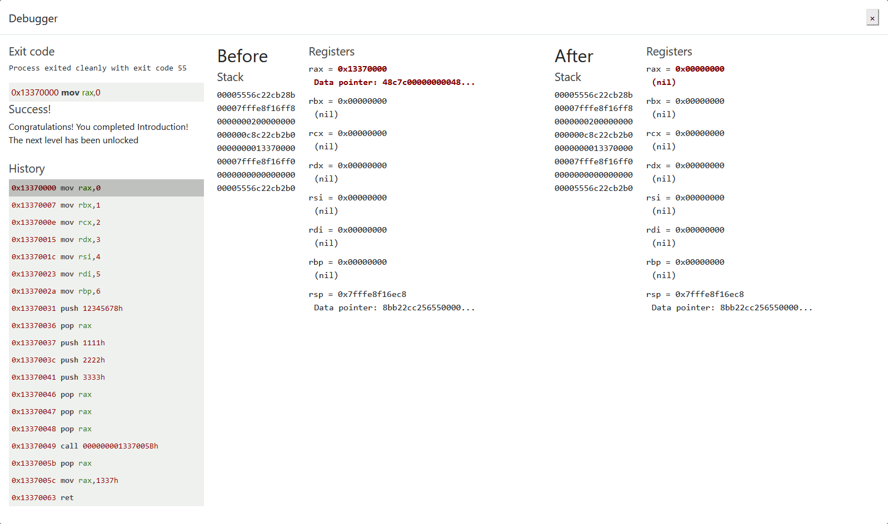

### 6.3.1. Loops
#### 6.3.1.0. Description
Although you won't have to worry about writing a loop for any of these lessons, showing how a loop works is a good demo for the debugger.
Look at the code below, then execute it (no need to change it). Watch how the same code repeats, over and over, with rax changing in each loop.
Notice how the code listing below isn't the same as what is executed in the debugger. In the History section of the debugger, the instructions will change to show what is executed to achieve what you describe in the assembly source code.

#### 6.3.1.1. Code
```assembly
; We want to loop 5 times - you can change this if you want!
mov rax, 5

; Top of the loop
top:
  ; Decrement rax
  dec rax

  ; Jump back to the top until rax is zero
  jnz top

; Cleanly return after the loop
ret
```
#### 6.3.1.2. Execution
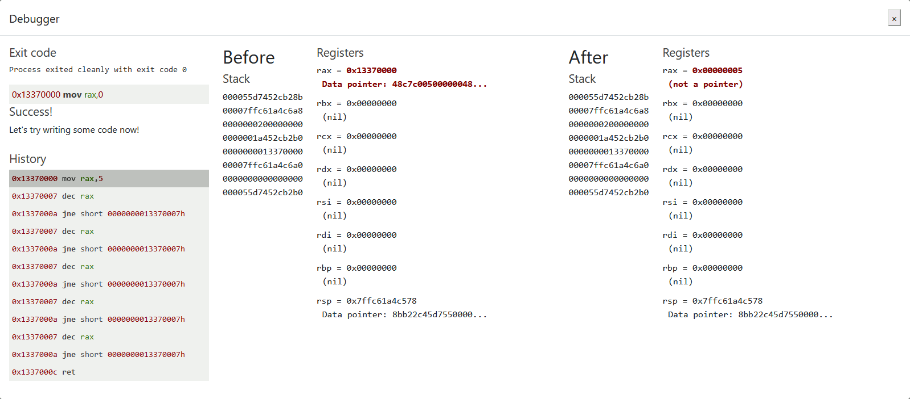

### 6.3.2. Getting Started
#### 6.3.2.0. Description
Welcome! Are you ready to learn how to write shellcode? We hope so! First, some tips:
- Comments are denoted with a semicolon (;)
- Don't forget to look at the debugger, line by line, if something is wrong
- Really, don't forget to read the error list! We check each place where you might go wrong in your code
- Your code for each level is saved in your browser, so you can leave and come back, refresh the page, and hop back to previous levels to borrow code
This level currently fails to build because it has no code. Can you add a return statement at the end? Don't worry about what it's actually returning (yet!)
Feel free to check previous levels!
#### 6.3.2.1. Code
```assembly
; This is a comment! We'll use comments to help guide your journey.
; Right now, we just need to RETurn!
;
; Enter a return statement below and hit Execute to see what happens!
ret
```
#### 6.3.2.2. Execution
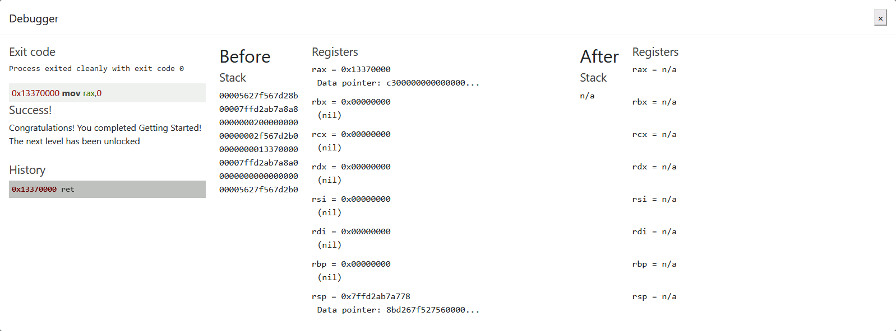

### 6.3.3. Returning a Value
#### 6.3.3.0. Description
Now that we have an empty function, we can start building some code! Let's learn what a register is.

A register is like a variable, except there are a small number of them - you have about eight general purpose 64-bit integers registers on amd64 (we won't talk about floating point or other special registers):
 - rax
 - rbx
 - rcx
 - rdx
 - rdi
 - rsi
 - rbp
 - rsp

All mathy stuff that a computer does (add, subtract, xor, etc) operates on registers, not directly on memory. So they're super important!

Specific registers have some implicit meaning, mostly by convention. For example, when a function returns, its return value is typically put in rax. Let's do that!

To move a value into a register, use the mov instruction; for example:

mov rdx, 1

In a higher-level language this would be equivalent to:

rdx = 1 —
For this level, can you return the number '1337' from your function?
That means that rax must equal 1337 when the function returns.
#### 6.3.3.1. Code
```assembly
; TODO: Set rax to 1337
mov rax, 1337

; Return, just like we did last time
ret
```
#### 6.3.3.2. Execution
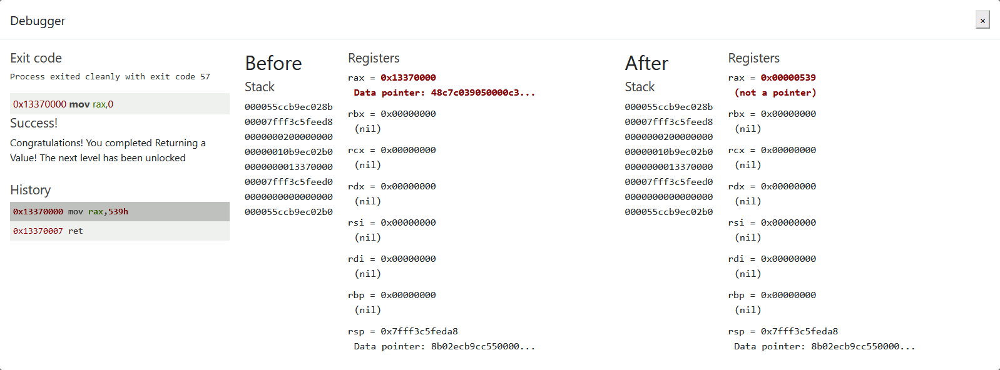

### 6.3.4 System Calls
#### 6.3.4.0. Description
If you've made it this far, I bet you're wondering how to make your shellcode do something!

If you're familiar with Python, you might know how to use the open() function. If you know C, you might know the fopen() function. But what these and similar functions have in common is one thing: they're library code. And because shellcode needs to be self contained, we don't have (easy) access to library code!

So how do we deal with that?

Linux has something called a syscall, or system call. A syscall is a request that a program makes that asks Linux - the kernel - to do something. And it turns out, at the end of the day, all of those library calls ultimately end with a syscall. Here is a list of available syscalls on x64 (alternative)

To perform a syscall:
 - The number for the desired syscall is moved into rax
 - The first parameter is moved into rdi, the second into rsi, and the third into rdx (there are others, but not many - calls need more than 3 parameters)
 - Execute the syscall instruction

The second syscall executes, Linux flips into kernel mode and we can no longer debug it. When it's finished, it returns the result in rax.

For this challenge, we're going to call sys_exit to exit the process with exit code 99.

Can you prepare rax and rdi with the correct values to exit?

As always, feel free to mess around as much as you like!
#### 6.3.4.1. Code
```assembly
; TODO: Find the syscall number for sys_exit and put it in rax
mov rax, 60
; TODO: Put the exit_code we want (99) in rdi
mov rdi, 99
; Perform the actual syscall
syscall
```
#### 6.3.4.2. Execution
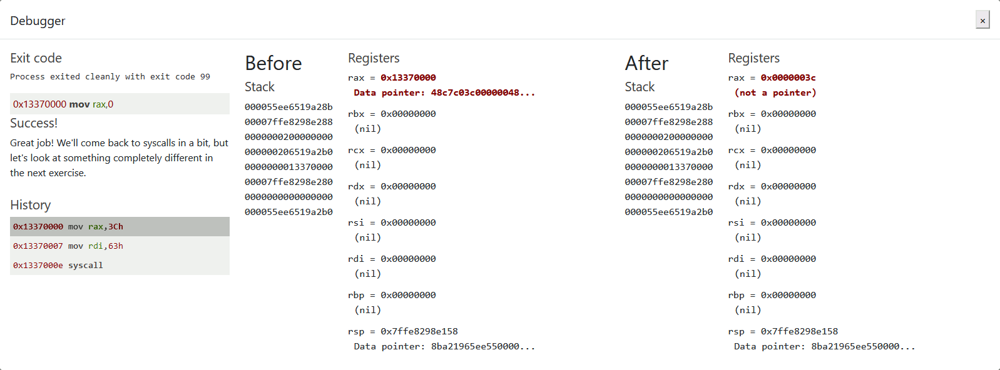

### 6.3.5. Calling Into the Void
#### 6.3.5.0. Description
Before we learn how to use the Really Good syscalls, let's try something fun: crash our shellcode on purpose!

You might think I'm mad, but there's a method to my madness. Run the code below and watch what happens! No need to modify it, unless you want to. :)

Be sure to look at the debugger to see what's going on! Especially notice the top of the stack at the ret instruction.
#### 6.3.5.1. Code
```assembly
; Push this value to the stack
push 0x12345678

; Try to return
ret
```
#### 6.3.5.2. Execution
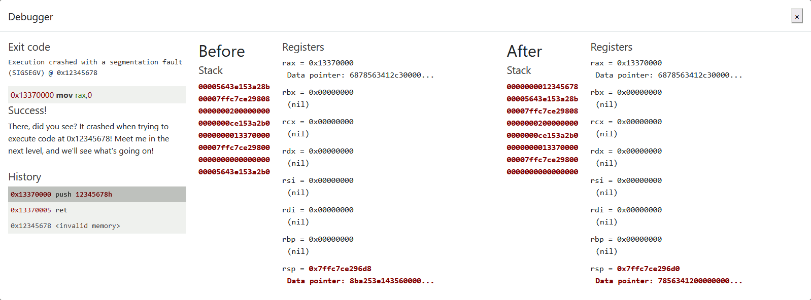

### 6.3.6. Getting RIP
#### 6.3.6.0. Description
What happened in the last exercise? Why did it crash at 0x12345678? And did you notice that 0x12345678 was on top of the stack when ret happened?

The short story is this: call pushes the return address onto the stack, and ret jumps to it. Whaaaat??

This is going to be long, but hopefully will make it all clear!

Let's back up a bit. At any given point, the instruction currently being executed is stored in a special register called the instruction pointer (rip), which you may also hear called a program counter (pc).

What is the rip value at the first line in our code? Well, since we have a debugger, we know that it's 0x13370000. But sometimes you don't know and need to find out.

The most obvious answer is to treat it like a normal register, like this:

mov rax, rip
ret

Does that work? Nope! You can't directly access rip. That means we need a trick!

When you use call in x64, the CPU doesn't care where it's calling, or whether there's a ret waiting for it. The CPU assumes that, if the author put a call in, there will naturally be a ret on the other end. Doing anything else would just be silly! So call pushes the return address onto the stack before jumping into a function. When the function complete, the ret instruction uses the return address on the stack to know where to return to.

The CPU assumes that, sometime later, a ret will execute. The ret assumes that at some point earlier a call happened, and that means that the top of the stack has the return address. The ret will retrieve the return address off the top of the stack (using pop) and jump to it.

Of course, we can execute pop too! If we pop the return address off the stack, instead of jumping to it, the address goes into a register. Hmm! Does that also sound like mov REG, rip to you?

For this exercise, can you pop the address after the call - the No Op (nop) instruction - into rax then return?

#### 6.3.6.1. Code
```assembly
; Remember, this call pushes the return address to the stack
call place_below_the_nop

; This is where the function *thinks* it is supposed to return
nop

; This is a 'label' - as far as the call knows, this is the start of a function
place_below_the_nop:

; TODO: Pop the top of the stack into rax
pop rax

; Return from our code, as in previous levels
ret
```
#### 6.3.6.2. Execution
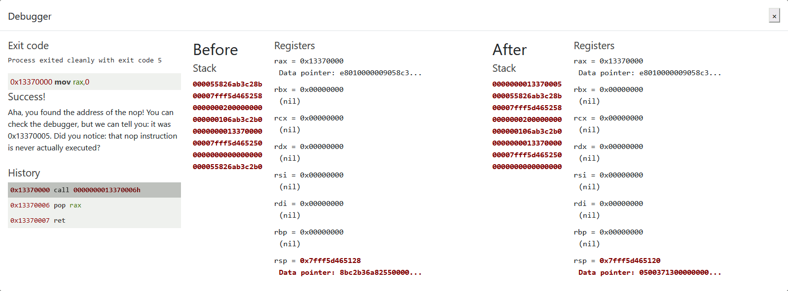

### 6.3.7. Hello, World!
#### 6.3.7.0. Description
So remember how last level, we got the address of nop and returned it?

Did you see that nop execute? Nope! We jumped right over it, but stored its address en-route. What can we do by knowing our own address?

Well, since shellcode is, by definition, self-contained, you can do other fun stuff like include data alongside the code!

What if the return address isn't an instruction at all, but a string?

For this next exercise, we include a plaintext string - 'Hello World' - as part of the code. It's just sitting there in memory. If you look at the compiled code, it's all basically Hello World, which doesn't run.

Instead of trying to run it, can you call past it, and pop its address into rax?

Don't forget to check the debugger after to see it in rax!
#### 6.3.7.1. Code
```assembly
; This would be a good place for a call
call hw

; This is the literal string 'Hello World', null terminated, as code. Except
; it'll crash if it actually tries to run, so we'd better jump over it!
db 'Hello World',0

; This would be a good place for a label and a pop
hw:
pop rax

; This would be a good place for a re... oh wait, it's already here. Hooray!
ret
```
#### 6.3.7.2. Execution
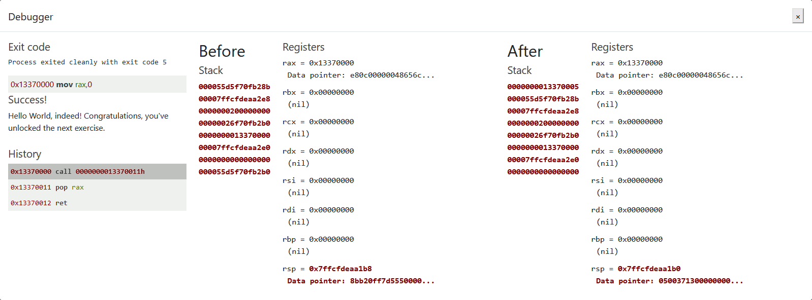

### 6.3.8. Hello, World!!
#### 6.3.7.0. Description
Remember syscalls? Earlier, we used them to call an exit. Now let's try another!

This time, instead of getting a pointer to the string Hello World, we're going to print it to standard output (stdout).

Have another look at the syscall table. Can you find sys_write, and use to to print the string Hello World! to stdout?

Note: stdout's file descriptor is 1.
#### 6.3.7.1. Code
```assembly
; TODO: Get a reference to this string into the correct register
call hw
db 'Hello World!',0

; Set up a call to sys_write
hw:
; TODO: Set rax to the correct syscall number for sys_write
mov rax, 1

; TODO: Set rdi to the first argument (the file descriptor, 1)
mov rdi, 1

; TODO: Set rsi to the second argument (buf - this is the "Hello World" string)
pop rsi

; TODO: Set rdx to the third argument (length of the string, in bytes)
mov rdx, 12

; Perform the syscall
syscall

; Return cleanly
ret
```
#### 6.3.7.2. Execution
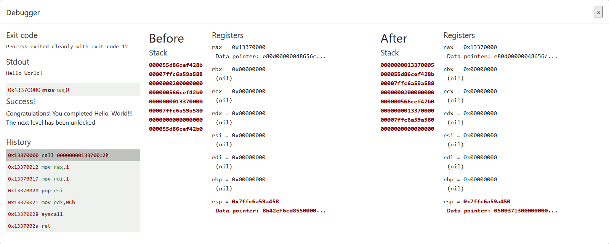

### 6.3.9. Opening a File
#### 6.3.9.0. Description
We're getting dangerously close to do something interesting! How about that?

Can you use the sys_open syscall to open /etc/passwd, then return the file handle (in rax)?

Have another look at the syscall table. Can you call sys_open on the file /etc/passwd, then return the file handle? Here's the syscall table again.
#### 6.3.9.1. Code
```assembly
call fopen
; TODO: Get a reference to this string into the correct register
db '/etc/passwd',0

fopen:
; Set up a call to sys_open
; TODO: Set rax to the correct syscall number
mov rax, 2
; TODO: Set rdi to the first argument (the filename)
pop rdi
; TODO: Set rsi to the second argument (flags - 0 is fine)
mov rsi,0
; TODO: Set rdx to the third argument (mode - 0 is also fine)
mov rdx,0
; Perform the syscall
syscall

; syscall sets rax to the file handle, so to return the file handle we don't
; need to do anything else!
ret
```
#### 6.3.9.2. Execution
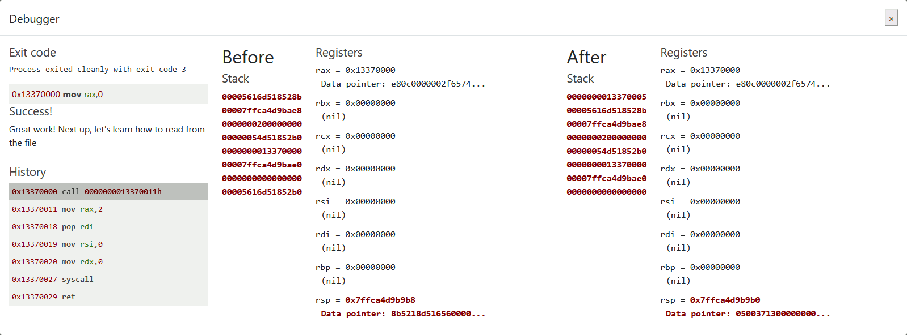

### 6.3.10. Reading a File
#### 6.3.10.0. Description
Do you feel ready to write some useful code? We hope so! You're mostly on your own this time! Don't forget that you can reference your solutions from other levels!

For this exercise, we're going to read a specific file… let's say, /var/northpolesecrets.txt… and write it to stdout. No reason for the name, but since this is Jack Frost's troll-trainer, it might be related to a top-secret mission!

Solving this is going to require three syscalls! Four if you decide to use sys_exit - you're welcome to return or exit, just don't forget to fix the stack if you return!

First up, just like last exercise, call sys_open. This time, be sure to open /var/northpolesecrets.txt.

Second, find the sys_read entry on the syscall table, and set up the call. Some tips:
 - The file descriptor is returned by sys_open
 - The buffer for reading the file can be any writeable memory - rsp is a great option, temporary storage is what the stack is meant for
 - You can experiment to find the right count, but if it's a bit too high, that's perfectly fine

Third, find the sys_write entry, and use it to write to stdout. Some tips on that:
 - The file descriptor for stdout is always 1
 - The best value for count is the return value from sys_read, but you can experiment with that as well (if it's too long, you might get some garbage after; that's okay!)

Finally, if you use rsp as a buffer, you won't be able to ret - you're going to overwrite the return address and ret will crash. That's okay! You remember how to sys_exit, right? :)

(For an extra challenge, you can also subtract from rsp, use it, then add to rsp to protect the return address. That's how typical applications do it.)

Good luck!
#### 6.3.10.1. Code
```assembly
call fopen
; TODO: Get a reference to this
db '/var/northpolesecrets.txt',0

fopen:
	mov rax, 2
	pop rdi
	mov rsi,0
	mov rdx,0
	syscall

; TODO: Call sys_read on the file handle and read it into rsp
mov rdi, rax
mov rax, 0
mov rsi, rsp
mov rdx, 136
syscall

; TODO: Call sys_write to write the contents from rsp to stdout (1)
mov rax, 1
mov rdi, 1
mov rsi, rsp
syscall

; TODO: Call sys_exit
exit:
	mov rax, 60
	syscall
```
#### 6.3.10.2. Execution
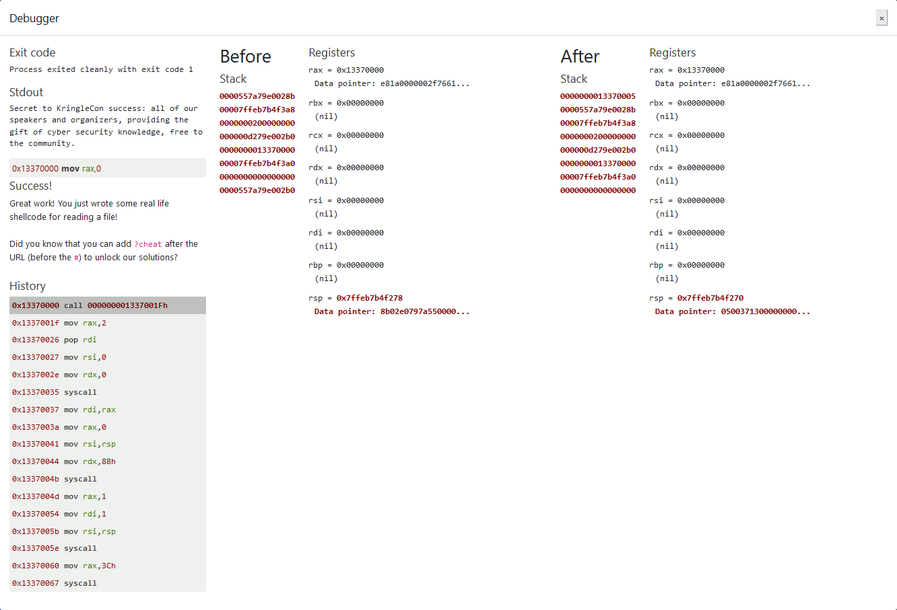

---
# [2. Where in the World is Caramel Santiaigo?](README.md)
# [2.1. Side Challenge - Exif Metadata](README.md)
# [3. Thaw Frost Tower's Entrance](README.md)
# [3.1. Side Challenge - Grepping for Gold](README.md)
# [4. Slot Machine Investigation](README.md)
# [4.1. Side Challenge - Logic Munchers](README.md)
# [5. Strange USB Device](README.md)
# [5.1. Side Challenge - IPv6 Sandbox](README.md)
# [6. Shellcode Primer](README.md)
# [6.1. Side Challenge - Holiday Hero](README.md)
# [7. Printer Exploitation](README.md)
# [7.0. Description](README.md)
# [8. Kerberoasting on an Open Fire](README.md)
# [8.1. Side Challenge - HoHo … No](README.md)
# [9. Splunk!](README.md)
# [9.1. Side Challenge - Yara Analysis](README.md)
# [10. Now Hiring!](README.md)
# [10.1. Side Challenge - IMDS Exploration](README.md)
# [11. Customer Complaint Analysis](README.md)
# [11.1. Side Challenge - Strace Ltrace Retrace](README.md)
# [12. Frost Tower Website Checkup](README.md)
# [12.1. Side Challenge - The Elf C0de Python Edition](README.md)
# [13. FPGA Programming](README.md)
# [13.1. Side Challenge - Frostavator](README.md)
# [14. Bonus! Blue Log4Jack](README.md)
# [15. Bonus! Red Log4Jack](README.md)
---
# [0. windovo\\thedead> whoami](../README.md)
# [1. KringleCon Orientation](01.%20KringleCon%20Orientation/README.md)
# [16. That’s how Jack came from space](../README.md#16-thats-how-jack-came-from-space)
# [17. Narrative](../README.md#17-narrative)
# [18. Conclusions](../README.md#18-conclusions)