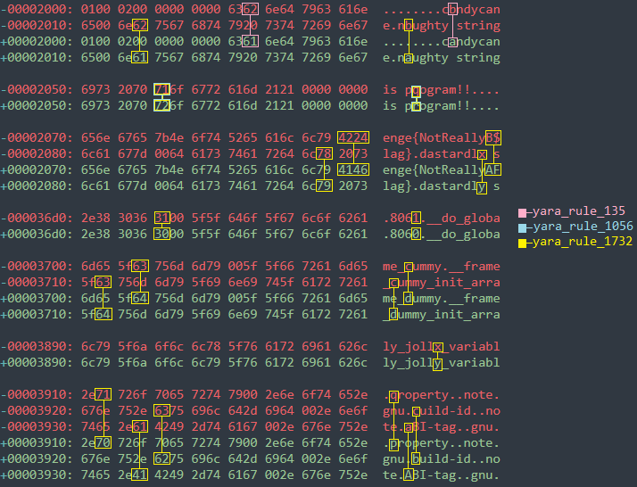

# Writeup for SANS Holiday Hack Challenge 2021 – Jack’s Back! featuring KringleCon 4: Calling Birds
## 9. [Splunk!](/09.%20Splunk!/README.md)

### 9.1. Side Challenge - Yara Analysis
The objective is to allow execution of `the_critical_elf_app` even though it triggers some predefined Yara rules.

The motd of this terminal is:
```bash
HELP!!!

This critical application is supposed to tell us the sweetness levels of our candy
manufacturing output (among other important things), but I can't get it to run.

It keeps saying something something yara. Can you take a look and see if you
can help get this application to bypass Sparkle Redberry's Yara scanner?

If we can identify the rule that is triggering, we might be able change the program
to bypass the scanner.

We have some tools on the system that might help us get this application going:
vim, emacs, nano, yara, and xxd

The children will be very disappointed if their candy won't even cause a single cavity.
```

#### 9.1.0. yara_rule_135
The first rules that triggers is `yara_rule_135`:
```bash
snowball2@2b442252ab9b:~$ ./the_critical_elf_app 
yara_rule_135 ./the_critical_elf_app
```
The rule searches for the string `candycane`:
```bash
rule yara_rule_135 {
   meta:
      description = "binaries - file Sugar_in_the_machinery"
      author = "Sparkle Redberry"
      reference = "North Pole Malware Research Lab"
      date = "1955-04-21"
      hash = "19ecaadb2159b566c39c999b0f860b4d8fc2824eb648e275f57a6dbceaf9b488"
   strings:
      $s = "candycane"
   condition:
      $s
}
```
It is possible to find the string and replace it in a hex editor:
```bash
00002000: 0100 0200 0000 0000 6361 6e64 7963 616e  ........candycan
00002010: 6500 6e61 7567 6874 7920 7374 7269 6e67  e.naughty string
```
```bash
00002000: 0100 0200 0000 0000 6362 6e64 7963 616e  ........cbndycan
00002010: 6500 6e61 7567 6874 7920 7374 7269 6e67  e.naughty string
```

#### 9.1.1. yara_rule_1056
The second rules that triggers is `yara_rule_1056`:
```bash
snowball2@2b442252ab9b:~$ ./the_critical_elf_app 
yara_rule_1056 ./the_critical_elf_app
```
This rule searches for the hex sequence `6c 6962 632e 736f 2e36` and `726f 6772 616d 2121`:
```bash
rule yara_rule_1056 {
   meta: 
        description = "binaries - file frosty.exe"
        author = "Sparkle Redberry"
        reference = "North Pole Malware Research Lab"
        date = "1955-04-21"
        hash = "b9b95f671e3d54318b3fd4db1ba3b813325fcef462070da163193d7acb5fcd03"
    strings:
        $s1 = {6c 6962 632e 736f 2e36}
        $hs2 = {726f 6772 616d 2121}
    condition:
        all of them
}
```
It is possible to find the strings:
```bash
snowball2@ad2b9bc1bb62:~$ xxd the_critical_elf_app | grep "2e36" -A 1 -B 1
00000450: 0000 0000 0000 0000 006c 6962 632e 736f  .........libc.so
00000460: 2e36 005f 5f63 7861 5f66 696e 616c 697a  .6.__cxa_finaliz
00000470: 6500 5f5f 6c69 6263 5f73 7461 7274 5f6d  e.__libc_start_m

snowball2@ad2b9bc1bb62:~$ xxd the_critical_elf_app | grep "726f 6772" -A 1 -B 1
00002040: 2065 7865 6375 7469 6f6e 206f 6620 7468   execution of th
00002050: 6973 2070 726f 6772 616d 2121 0000 0000  is program!!....
00002060: 486_f 6c69 6461 7948 6163 6b43 6861 6c6c  HolidayHackChall
```

As I didn't feel too safe altering a `libc` reference I modified the second string:
```bash
00002040: 2065 7865 6375 7469 6f6e 206f 6620 7468   execution of th
00002050: 6973 2070 726f 6772 616d 2121 0000 0000  is program!!....
00002060: 486_f 6c69 6461 7948 6163 6b43 6861 6c6c  HolidayHackChall
```
```bash
00002040: 2065 7865 6375 7469 6f6e 206f 6620 7468   execution of th
00002050: 6973 2070 716f 6772 616d 2121 0000 0000  is pqogram!!....
00002060: 486f 6c69 6461 7948 6163 6b43 6861 6c6c  HolidayHackChall
```

#### 9.1.2. yara_rule_1732
The third rules that triggers is `yara_rule_1732`:
```bash
snowball2@ad2b9bc1bb62:~$ ./the_critical_elf_app
yara_rule_1732 ./the_critical_elf_app
```
This rule searches for at least 10 strings within a set of 20 strings in files beginning with `0x02464c45` and that are less than 50KB in size:
```bash
rule yara_rule_1732 {
   meta:
      description = "binaries - alwayz_winter.exe"
      author = "Santa"
      reference = "North Pole Malware Research Lab"
      date = "1955-04-22"
      hash = "c1e31a539898aab18f483d9e7b3c698ea45799e78bddc919a7dbebb1b40193a8"
   strings:
      $s1 = "This is critical for the execution of this program!!" fullword ascii
      $s2 = "__frame_dummy_init_array_entry" fullword ascii
      $s3 = ".note.gnu.property" fullword ascii
      $s4 = ".eh_frame_hdr" fullword ascii
      $s5 = "__FRAME_END__" fullword ascii
      $s6 = "__GNU_EH_FRAME_HDR" fullword ascii
      $s7 = "frame_dummy" fullword ascii
      $s8 = ".note.gnu.build-id" fullword ascii
      $s9 = "completed.8060" fullword ascii
      $s10 = "_IO_stdin_used" fullword ascii
      $s11 = ".note.ABI-tag" fullword ascii
      $s12 = "naughty string" fullword ascii
      $s13 = "dastardly string" fullword ascii
      $s14 = "__do_global_dtors_aux_fini_array_entry" fullword ascii
      $s15 = "__libc_start_main@@GLIBC_2.2.5" fullword ascii
      $s16 = "GLIBC_2.2.5" fullword ascii
      $s17 = "its_a_holly_jolly_variable" fullword ascii
      $s18 = "__cxa_finalize" fullword ascii
      $s19 = "HolidayHackChallenge{NotReallyAFlag}" fullword ascii
      $s20 = "__libc_csu_init" fullword ascii
   condition:
      uint32(1) == 0x02464c45 and filesize < 50KB and
      10 of them
}
```
With the same approach, I solved the challenge modifiyng the hex content of the file manually with `vim`, trying not to break its execution.

#### 9.1.4. Summary of changes
Below the diff between the original file (green) and the tampered one (red):  


#### 9.1.5. Execution
Finally the app was able to execute:
```bash
snowball2@94dc8af0fac8:~$ ./the_critical_elf_app 
Machine Running.. 
Toy Levels: Very Merry, Terry
Naughty/Nice Blockchain Assessment: Untampered
Candy Sweetness Gauge: Exceedingly Sugarlicious
Elf Jolliness Quotient: 4a6f6c6c7920456e6f7567682c204f76657274696d6520417070726f766564
```

---
## Back to main challenge 9. [Splunk!](/09.%20Splunk!/README.md)
---
## 10. [Now Hiring!](/10.%20Now%20Hiring!/README.md)
### 10.1. [Side Challenge - IMDS Exploration](/10.%20Now%20Hiring!/10.01%20IMDS%20Exploration/README.md)
## 11. [Customer Complaint Analysis](/11.%20Customer%20Complaint%20Analysis/README.md)
### 11.1. [Side Challenge - Strace Ltrace Retrace](/11.%20Customer%20Complaint%20Analysis/11.01%20Side%20Challenge%20-%20Strace%20Ltrace%20Retrace/README.md)
## 12. [Frost Tower Website Checkup](/12.%20Frost%20Tower%20Website%20Checkup/README.md)
### 12.1. [Side Challenge - The Elf C0de Python Edition](/12.%20Frost%20Tower%20Website%20Checkup/12.01.%20Side%20Challenge%20-%20The%20Elf%20C0de%20Python%20Edition/README.md)
## 13. [FPGA Programming](/13.%20FPGA%20Programming/README.md)
### 13.1. [Side Challenge - Frostavator](/13.%20FPGA%20Programming/13.01.%20Side%20Challenge%20-%20Frostavator/README.md)
## 14. [Bonus! Blue Log4Jack](/14.%20Bonus!%20Blue%20Log4Jack/README.md)
## 15. [Bonus! Red Log4Jack](/15.%20Bonus!%20Red%20Log4Jack/README.md)
## 16. [That’s how Jack came from space](/README.md#16-thats-how-jack-came-from-space)
## 17. [Narrative](/README.md#17-narrative)
## 18. [Conclusions](/README.md#18-conclusions)
---
## 0. [windovo\\thedead> whoami](/README.md)
## 1. [KringleCon Orientation](/01.%20KringleCon%20Orientation/README.md)
## 2. [Where in the World is Caramel Santiaigo?](/02.%20Where%20in%20the%20World%20is%20Caramel%20Santiaigo/README.md)
### 2.1. [Side Challenge - Exif Metadata](/02.%20Where%20in%20the%20World%20is%20Caramel%20Santiaigo/02.01.%20Side%20Challenge%20-%20Exif%20Metadata/README.md)
## 3. [Thaw Frost Tower's Entrance](/03.%20Thaw%20Frost%20Tower's%20Entrance/README.md)
### 3.1. [Side Challenge - Grepping for Gold](/03.%20Thaw%20Frost%20Tower's%20Entrance/03.01.%20Grepping%20for%20Gold/README.md)
## 4. [Slot Machine Investigation](/04.%20Slot%20Machine%20Investigation/README.md)
### 4.1. [Side Challenge - Logic Munchers](/04.%20Slot%20Machine%20Investigation/04.01.%20Side%20Challenge%20-%20Logic%20Munchers/README.md)
## 5. [Strange USB Device](/05.%20Strange%20USB%20Device/README.md)
### 5.1. [Side Challenge - IPv6 Sandbox](/05.%20Strange%20USB%20Device/05.01.%20Side%20Challenge%20-%20IPv6%20Sandbox/README.md)
## 6. [Shellcode Primer](/06.%20Shellcode%20Primer/README.md)
### 6.1. [Side Challenge - Holiday Hero](/06.%20Shellcode%20Primer/06.01.%20Side%20Challenge%20-%20Holiday%20Hero/README.md)
## 7. [Printer Exploitation](/07.%20Printer%20Exploitation/README.md)
## 8. [Kerberoasting on an Open Fire](/08.%20Kerberoasting%20on%20an%20Open%20Fire/README.md)
### 8.1. [Side Challenge - HoHo … No](/08.%20Kerberoasting%20on%20an%20Open%20Fire/08.01.%20Side%20Challenge%20-%20HoHo%20…%20No/README.md)