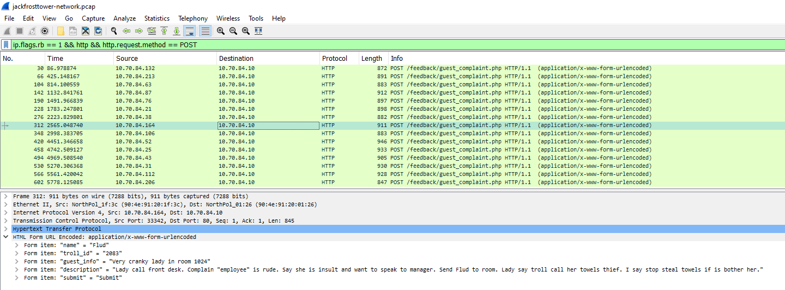
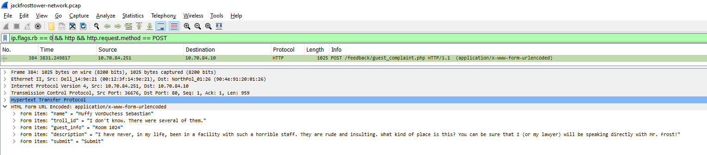
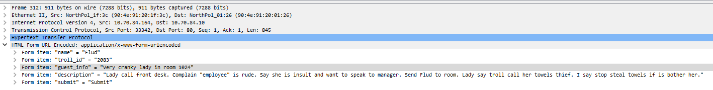
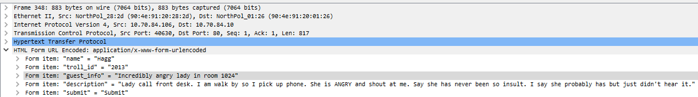
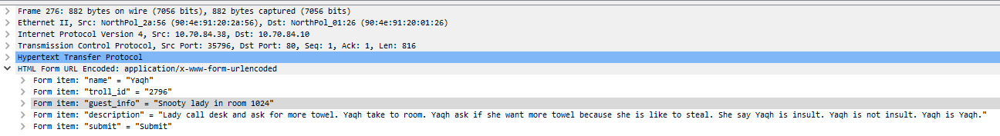

# Writeup for SANS Holiday Hack Challenge 2021 – Jack’s Back! featuring KringleCon 4: Calling Birds
## 11. Customer Complaint Analysis
### 11.0. Description
Difficulty: :christmas_tree::christmas_tree:  
A human has accessed the Jack Frost Tower network with a non-compliant host. [Which three trolls complained about the human](https://downloads.holidayhackchallenge.com/2021/jackfrosttower-network.zip)? Enter the troll names in alphabetical order separated by spaces. Talk to Tinsel Upatree in the kitchen for hints.

### 11.1. Side Challenge - Strace Ltrace Retrace

### 11.2. Hints
**Wireshark Display Filters** - *Tinsel Upatree*: “Different from BPF capture filters, Wireshark's [display filters](https://wiki.wireshark.org/DisplayFilters) can find text with the contains keyword - and evil bits with ip.flags.rb.”
**Evil Bit RFC** - *Tinsel Upatree*: “[RFC3514](https://datatracker.ietf.org/doc/html/rfc3514) defines the usage of the "Evil Bit" in IPv4 headers.”

#### 11.3. Solution
Considering the “Evil Bit” RFC it is meant to inform security platforms to inspect the packet when it is set to 1, therefore it makes sense that most packets have it enabled. Only one packet has the “Evil Bit” set to 0:  

The packet contains a complaint against “several” trolls from someone named “Muffy VonDuchess Sebastian” with the reference “Room 1024”: “I have never, in my life, been in a facility with such a horrible staff. They are rude and insulting. What kind of place is this? You can be sure that I (or my lawyer) will be speaking directly with Mr. Frost!”:

Three trolls complained about a woman in Room 1024: Flud, Hagg and Yaqh.  
  
  
  

---
## [2. Where in the World is Caramel Santiaigo?](README.md)
## [2.1. Side Challenge - Exif Metadata](README.md)
## [3. Thaw Frost Tower's Entrance](README.md)
## [3.1. Side Challenge - Grepping for Gold](README.md)
## [4. Slot Machine Investigation](README.md)
## [4.1. Side Challenge - Logic Munchers](README.md)
## [5. Strange USB Device](README.md)
## [5.1. Side Challenge - IPv6 Sandbox](README.md)
## [6. Shellcode Primer](README.md)
## [6.1. Side Challenge - Holiday Hero](README.md)
## [7. Printer Exploitation](README.md)
## [7.0. Description](README.md)
## [8. Kerberoasting on an Open Fire](README.md)
## [8.1. Side Challenge - HoHo … No](README.md)
## [9. Splunk!](README.md)
## [9.1. Side Challenge - Yara Analysis](README.md)
## [10. Now Hiring!](README.md)
## [10.1. Side Challenge - IMDS Exploration](README.md)
## [11. Customer Complaint Analysis](README.md)
## [11.1. Side Challenge - Strace Ltrace Retrace](README.md)
## [12. Frost Tower Website Checkup](README.md)
## [12.1. Side Challenge - The Elf C0de Python Edition](README.md)
## [13. FPGA Programming](README.md)
## [13.1. Side Challenge - Frostavator](README.md)
## [14. Bonus! Blue Log4Jack](README.md)
## [15. Bonus! Red Log4Jack](README.md)
---
## [0. windovo\\thedead> whoami](../README.md)
## [1. KringleCon Orientation](01.%20KringleCon%20Orientation/README.md)
## [16. That’s how Jack came from space](../README.md#16-thats-how-jack-came-from-space)
## [17. Narrative](../README.md#17-narrative)
## [18. Conclusions](../README.md#18-conclusions)