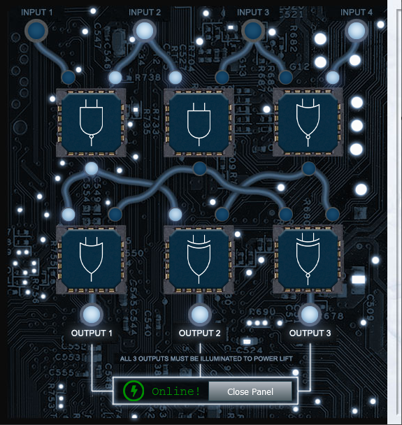

# Writeup for SANS Holiday Hack Challenge 2021 – Jack’s Back! featuring KringleCon 4: Calling Birds
# 11. Customer Complaint Analysis

## 13.1. Side Challenge - Frostavator
The objective is to put the logic gates in the right position to move the Frostavator again.

### 13.1.0. Hints
**Logic Gate Iconography** - *Grody Goiterson*: “[This](https://www.geeksforgeeks.org/introduction-of-logic-gates/)”

### 13.1.1. Solution
Below a working configuration for the Frostavator:  

---
# [2. Where in the World is Caramel Santiaigo?](README.md)
# [2.1. Side Challenge - Exif Metadata](README.md)
# [3. Thaw Frost Tower's Entrance](README.md)
# [3.1. Side Challenge - Grepping for Gold](README.md)
# [4. Slot Machine Investigation](README.md)
# [4.1. Side Challenge - Logic Munchers](README.md)
# [5. Strange USB Device](README.md)
# [5.1. Side Challenge - IPv6 Sandbox](README.md)
# [6. Shellcode Primer](README.md)
# [6.1. Side Challenge - Holiday Hero](README.md)
# [7. Printer Exploitation](README.md)
# [7.0. Description](README.md)
# [8. Kerberoasting on an Open Fire](README.md)
# [8.1. Side Challenge - HoHo … No](README.md)
# [9. Splunk!](README.md)
# [9.1. Side Challenge - Yara Analysis](README.md)
# [10. Now Hiring!](README.md)
# [10.1. Side Challenge - IMDS Exploration](README.md)
# [11. Customer Complaint Analysis](README.md)
# [11.1. Side Challenge - Strace Ltrace Retrace](README.md)
# [12. Frost Tower Website Checkup](README.md)
# [12.1. Side Challenge - The Elf C0de Python Edition](README.md)
# [13. FPGA Programming](README.md)
# [13.1. Side Challenge - Frostavator](README.md)
# [14. Bonus! Blue Log4Jack](README.md)
# [15. Bonus! Red Log4Jack](README.md)
---
# [0. windovo\\thedead> whoami](../README.md)
# [1. KringleCon Orientation](01.%20KringleCon%20Orientation/README.md)
# [16. That’s how Jack came from space](../README.md#16-thats-how-jack-came-from-space)
# [17. Narrative](../README.md#17-narrative)
# [18. Conclusions](../README.md#18-conclusions)