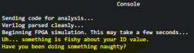

# Writeup for SANS Holiday Hack Challenge 2021 – Jack’s Back! featuring KringleCon 4: Calling Birds
# 13. FPGA Programming
## 13.0. Description
Difficulty: :christmas_tree::christmas_tree::christmas_tree::christmas_tree:  
Write your first FPGA program to make a doll sing. You might get some suggestions from Grody Goiterson, near Jack's elevator.

## 13.1. Side Challenge - Frostavator

## 13.2. Hints
**FPGA Talk** - *Grody Goiterson*: “Prof. Qwerty Petabyte is giving [a lesson](https://www.youtube.com/watch?v=GFdG1PJ4QjA) about Field Programmable Gate Arrays (FPGAs).”
**FPGA for Fun** - *Grody Goiterson*: “There are [FPGA enthusiast sites](https://www.fpga4fun.com/MusicBox.html).”

### 13.3. Solution
Below the code I used to make the doll sing:
```verilog
`timescale 1ns/1ns
module tone_generator (input clk, input rst, input [31:0] freq, output wave_out);
    parameter clk_speed = 125000000;
    real floor = $floor(clk_speed/freq*100)/2 - 1;
    real ceil = $ceil(clk_speed/freq*100)/2 - 1;
    real precise = $rtoi(clk_speed/freq*100)/2 - 1;
    real freq_floor = floor - precise;
    real freq_ceil = precise - ceil;
    real counter;

    reg waver;    
    assign wave_out = waver;
    
    always @(posedge clk or posedge rst)
        begin
            if (rst == 1)
                begin
                    counter <= 0;
                    waver <= 0;
                end
            else
                begin
                    if (counter <= 0)
                        begin
                            if (clk_speed % (freq*100) == 0)
                                begin
                                    counter <= precise;
                                end
                            else
                                begin
                                    if (freq_floor > freq_ceil)
                                        begin
                                            counter <= ceil;
                                        end
                                    else
                                        begin 
                                            counter <= ceil;
                                        end
                                end
                            waver <= ~waver;
                        end
                    else
                        begin
                            counter <= counter - 1;
                        end
                end
        end
endmodule
```

This code doesn’t always work (or basically doesn't work most of the times :) ), but it is enough to pass the challenge with an input frequency of 1504.08:
```bash
Sending code for analysis...
Verilog parsed cleanly...
Beginning FPGA simulation. This may take a few seconds...
Random target frequency: 1504.08
Using a clock frequency of 125MHz, the closest you could get to the target frequency is 1504.0670
Simulation results indicate a frequency of: 1504.2118Hz
Your square wave's frequency is within -0.009627% of the best-fit value
```


## 13.4. Kudos!
### 13.4.0. Floor on the ceiling, @John_r2
Thanks to @John_r2 for checking if my logic of using ceil and floor function made sense.
### 13.4.1. Local-ion, Local-ion, Local-ion, @i81b4u
Thanks to @i81b4u for helping me fix the local storage issue that was preventing me from submitting any code.
I was facing this error:  


When using curl and manually populating the uuid value it worked:  


Turns out the local storage for the page was polluted:

 
Once I cleaned the local storage, the page worked fine.

### 13.4.2. Same it bro, @i81b4u
Thanks to @i81b4u for the discussion and the help by performing a same-value test with me :)

---
# [2. Where in the World is Caramel Santiaigo?](README.md)
# [2.1. Side Challenge - Exif Metadata](README.md)
# [3. Thaw Frost Tower's Entrance](README.md)
# [3.1. Side Challenge - Grepping for Gold](README.md)
# [4. Slot Machine Investigation](README.md)
# [4.1. Side Challenge - Logic Munchers](README.md)
# [5. Strange USB Device](README.md)
# [5.1. Side Challenge - IPv6 Sandbox](README.md)
# [6. Shellcode Primer](README.md)
# [6.1. Side Challenge - Holiday Hero](README.md)
# [7. Printer Exploitation](README.md)
# [7.0. Description](README.md)
# [8. Kerberoasting on an Open Fire](README.md)
# [8.1. Side Challenge - HoHo … No](README.md)
# [9. Splunk!](README.md)
# [9.1. Side Challenge - Yara Analysis](README.md)
# [10. Now Hiring!](README.md)
# [10.1. Side Challenge - IMDS Exploration](README.md)
# [11. Customer Complaint Analysis](README.md)
# [11.1. Side Challenge - Strace Ltrace Retrace](README.md)
# [12. Frost Tower Website Checkup](README.md)
# [12.1. Side Challenge - The Elf C0de Python Edition](README.md)
# [13. FPGA Programming](README.md)
# [13.1. Side Challenge - Frostavator](README.md)
# [14. Bonus! Blue Log4Jack](README.md)
# [15. Bonus! Red Log4Jack](README.md)
---
# [0. windovo\\thedead> whoami](../README.md)
# [1. KringleCon Orientation](01.%20KringleCon%20Orientation/README.md)
# [16. That’s how Jack came from space](../README.md#16-thats-how-jack-came-from-space)
# [17. Narrative](../README.md#17-narrative)
# [18. Conclusions](../README.md#18-conclusions)