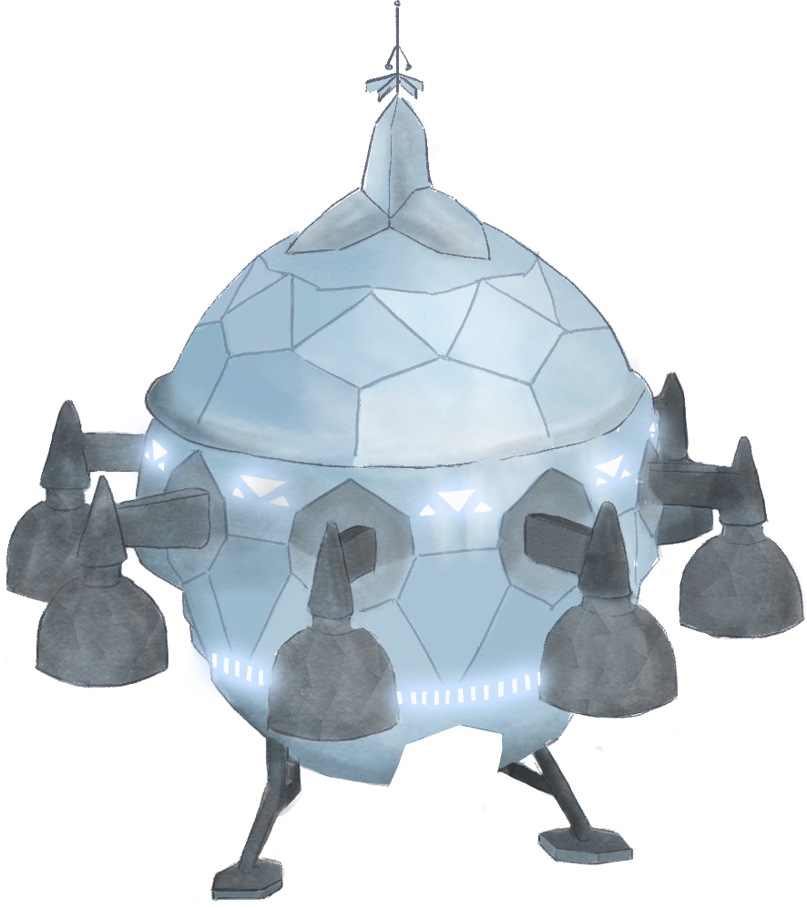
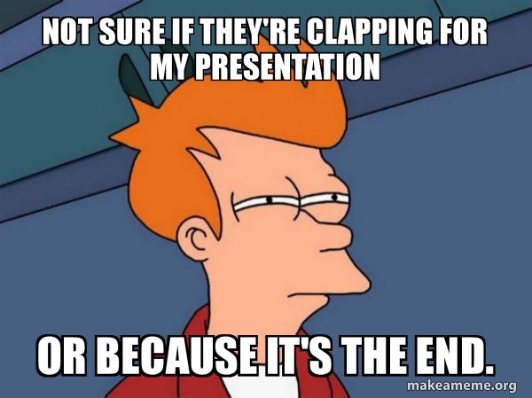
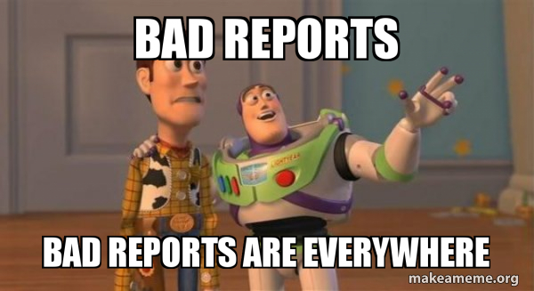

# Writeup for SANS Holiday Hack Challenge 2021 – Jack’s Back! featuring KringleCon 4: Calling Birds
## 0. windovo\thedead> whoami
```powershell
PS C:\Users\TheDead> whoami

Andrea Lamonato
windovo\TheDead
System Security Specialist

mailto: lamonato.andrea@gmail.com

Github:   https://github.com/LamonatoAndrea
Linkedin: https://www.linkedin.com/in/andrea-lamonato/


This is the first year I use a Windows PC for KringleCon:
                     _  _     ____________.--.
                  |\|_|//_.-"" .'    \   /|  |
                  |.-"""-.|   /       \_/ |  |
                  \  ||  /| __\_____________ |
                  _\_||_/_| .-""            ""-.  __
                .' '.    \//                    ".\/
                ||   '. >()_                     |()<
                ||__.-' |/\ \                    |/\
                   |   / "|  \__________________/.""
                  /   //  | / \ "-.__________/  /\
               ___|__/_|__|/___\___".______//__/__\
              /|\     [____________] \__/         |\
             //\ \     |  |=====| |   /\\         |\\
            // |\ \    |  |=====| |   | \\        | \\       
          .//__| \ \   |  |=====| |   | |\\       |--\\---
_____....-//___|  \_\  |  |=====| |   |_|_\\      |___\\  
 .      .//-.__|_______|__|_____|_|_____[__\\_____|__.-\\ 
        //        //        /          \ `-_\\/         \\
  -... //     .  / /       /____________\    \\       .  \ \ 
      //   .. .-/_/-.                 .       \\        .-\_\-.                 
     / /      '-----'           .             \ \      '._____.'         
  .-/_/-.         .                          .-\_\-.                          
 '._____.'                            .     '._____.'                   
```
### 0.0. [The ship source](https://www.asciiart.eu/space/spaceships)
# [1. KringleCon Orientation](01.%20KringleCon%20Orientation/README.md)
# [2. Where in the World is Caramel Santiaigo?](README.md)
# [2.1. Side Challenge - Exif Metadata](README.md)
# [3. Thaw Frost Tower's Entrance](README.md)
# [3.1. Side Challenge - Grepping for Gold](README.md)
# [4. Slot Machine Investigation](README.md)
# [4.1. Side Challenge - Logic Munchers](README.md)
# [5. Strange USB Device](README.md)
# [5.1. Side Challenge - IPv6 Sandbox](README.md)
# [6. Shellcode Primer](README.md)
# [6.1. Side Challenge - Holiday Hero](README.md)
# [7. Printer Exploitation](README.md)
# [7.0. Description](README.md)
# [8. Kerberoasting on an Open Fire](README.md)
# [8.1. Side Challenge - HoHo … No](README.md)
# [9. Splunk!](README.md)
# [9.1. Side Challenge - Yara Analysis](README.md)
# [10. Now Hiring!](README.md)
# [10.1. Side Challenge - IMDS Exploration](README.md)
# [11. Customer Complaint Analysis](README.md)
# [11.1. Side Challenge - Strace Ltrace Retrace](README.md)
# [12. Frost Tower Website Checkup](README.md)
# [12.1. Side Challenge - The Elf C0de Python Edition](README.md)
# [13. FPGA Programming](README.md)
# [13.1. Side Challenge - Frostavator](README.md)
# [14. Bonus! Blue Log4Jack](README.md)
# [15. Bonus! Red Log4Jack](README.md)

# 16. That’s how Jack came from space
This chapter is here just to embed a huge spaceship image!


# 17. Narrative
Listen children to a story that was written in the cold

'Bout a Kringle and his castle hosting hackers, meek and bold

Then from somewhere came another, built his tower tall and proud

Surely he, our Frosty villain hides intentions 'neath a shroud

So begins Jack's reckless mission: gather trolls to win a war

Build a con that's fresh and shiny, has this yet been done before?

Is his Fest more feint than folly? Some have noticed subtle clues

Running 'round and raiding repos, stealing Santa's Don'ts and Do's

Misdirected, scheming, grasping, Frost intends to seize the day

Funding research with a gift shop, can Frost build the better sleigh?

Lo, we find unlikely allies: trolls within Jack's own command

Doubting Frost and searching motive, questioning his dark demand

Is our Jack just lost and rotten - one more outlaw stomping toes?

Why then must we piece together cludgy, wacky radios?

With this object from the heavens, Frost must know his cover's blown

Hearkening from distant planet! We the heroes should have known

Go ahead and hack your neighbor, go ahead and phish a friend

Do it in the name of holidays, you can justify it at year's end

There won't be any retweets praising you, come disclosure day

But on the snowy evening after? Still Kris Kringle rides the sleigh

# 18. Conclusions
I have kind of a feeling that this report is bad, so here you have some bad report meme:

https://makeameme.org/meme/not-sure-if-dad47be475


https://makeameme.org/meme/bad-reports-bad